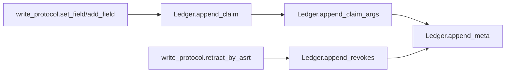
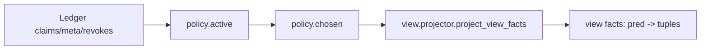
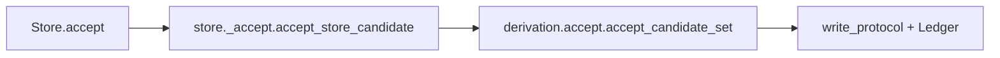

# Core Architecture Overview (factpy_kernel)

- Scope: `src/factpy_kernel/core`
- Last updated: 2026-02-23
- Code baseline: after `core/adapters` split; `Store` phase-1 decomposition complete; `Ledger` in-memory indexing complete
- Audience: developers who need to understand core semantics, navigate the codebase, and continue core development

## 1. Scope and Positioning

This document covers only the **semantic core layer (`core`)**. It does **not** describe implementation details of:

- `src/factpy_kernel/adapters/souffle` (engine/export adapter)
- `src/factpy_kernel/sdk` (developer-friendly Python facade)
- `src/factpy_kernel/authoring` (DSL/preflight/workflow)
- `src/factpy_kernel/audit` (audit query/UI/DTO)

The responsibility of `core` is to provide a **semantically stable kernel**: fact representation, schema constraints, append-only evidence ledger, policy/view semantics, Python-path rule evaluation, candidate generation/materialization, and mapping resolution.

## 2. Current Directory Structure (core)

```text
src/factpy_kernel/core/
  __init__.py              # core public API facade (stable entrypoints)
  protocol/                # typed tuple / idref / digest protocols
  schema/                  # SchemaIR validation, canonicalization, digest
  store/                   # Ledger + Store facade + private store modules
  evidence/                # append-only write protocol (set/add/retract/replace)
  policy/                  # active/chosen/policy_ir
  view/                    # Python-side business view projection
  rules/                   # where Python evaluation + RuleSpec/RuleRegistry
  derivation/              # CandidateSet + accept materialization
  mapping/                 # mapping conflict resolution and tie-break
```

## 3. Module Responsibility Map (Read This First)

| Module | Main Responsibility | Key Entrypoints | Main Dependencies |
|---|---|---|---|
| `protocol.tup_v1` | canonical typed tuple encoding, claim_arg reconstruction | `canonical_bytes_tup_v1`, `claim_args_from_rest_terms` | none (base protocol) |
| `protocol.idref_v1` | stable entity reference (`idref`) encoding | `encode_idref_v1` | `protocol.digests` |
| `schema.schema_ir` | SchemaIR validation, canonicalization, digest | `ensure_schema_ir`, `schema_digest` | `protocol.digests` |
| `store.ledger` | append-only in-memory ledger + indexed queries | `append_*`, `find_*`, `rebuild_indexes` | core data classes |
| `evidence.write_protocol` | append-only write/retract/replace protocol, ingest_key idempotency | `set_field`, `add_field`, `retract_by_asrt`, `replace_field` | `Ledger`, `protocol.*` |
| `policy.active/chosen` | active checks and chosen selection (deterministic tie-break) | `is_active`, `compute_chosen_for_predicate` | `Ledger`, `write_protocol` |
| `view.projector` | project business-view facts from ledger (including temporal current) | `project_view_facts` | `policy`, `Ledger` |
| `rules.where_eval` | Python interpreter for where-subset | `evaluate_where` | view facts |
| `rules.rule_ir` | RuleSpec/RuleRegistry/RuleRef execution and cycle safety | `run_rule` | `where_eval`, `Store` |
| `derivation.candidates` | candidate set and key digest | `CandidateSet`, `make_candidate` | `protocol` |
| `derivation.accept` | accept candidates and materialize into ledger | `accept_candidate_set` | `Ledger`, `write_protocol` |
| `mapping.canon` | mapping conflict resolution and tie-break | `resolve_mapping_predicate` | `Ledger`, `policy` |
| `store.api` | `Store` facade + engine evaluator registration point | `Store`, `register_engine_evaluator` | `store._*` |
| `store._evaluate` | `Store.evaluate` main flow (Python/engine dispatch) | `evaluate_store` | `view`, `where_eval`, `store._builders` |
| `store._accept` | `Store.accept` main flow | `accept_store_candidate` | `policy_ir`, `derivation.accept` |
| `store._builders` | candidate construction, record materialization spec, value coercion | helper functions | `protocol`, `derivation` |
| `store._queries` | explain/conflicts/resolve_mapping | `explain_fact`, `conflicts`, `resolve_mapping` | `policy`, `mapping` |

## 4. Core Data Model (Semantic Foundation)

`Ledger` maintains the following append-only structures (`src/factpy_kernel/core/store/ledger.py`):

- `Claim`
  - Assertion primary row: `asrt_id`, `pred_id`, `e_ref`, `rest_terms`
- `ClaimArg`
  - Row-form expanded arguments for `Claim` (useful for projection/export/audit)
- `MetaRow`
  - Metadata attached to assertion/retraction actions (`kind` in `str/num/bool/time/json`)
- `Revokes`
  - Revocation edge: `revoker_asrt_id -> revoked_asrt_id`

Design principles:

- **append-only**: add rows, do not mutate facts in place
- **explicit revocation**: invalidation is modeled with `Revokes`, not by mutating `Claim`
- **metadata travels with assertions**: `ingested_at`, `run_id`, `materialize_id`, etc. attach via `MetaRow`
- **auditability**: history and revocation paths remain available for explanation and replay

## 5. Current Ledger Index Structures (Performance)

`Ledger` keeps original append-only lists as the source of truth, and maintains derived in-memory indexes (caches):

- `claims` indexes
  - `_claim_by_asrt_id`
  - `_claims_by_pred_id`
  - `_claims_by_e_ref`
  - `_claims_by_pred_e_ref`
- `claim_args` index
  - `_claim_args_by_asrt_id`
- `meta` indexes
  - `_meta_by_asrt_id`
  - `_meta_by_key`
  - `_meta_by_kind`
  - `_meta_by_asrt_id_key`
  - `_meta_by_asrt_id_key_kind`
- `revokes` indexes
  - `_revoked_asrt_ids`
  - `_first_revoker_by_revoked_asrt_id`

Notes:

- Indexes are updated in `append_*` methods
- If tests/debug code directly mutate private lists (e.g. `ledger._meta_rows`), call `ledger.rebuild_indexes()` to re-sync indexes

## 6. Core Runtime Flows (Most Useful During Development)

### 6.1 Write Flow (append-only)



Key points:

- `write_protocol` handles input validation, ingest_key idempotency, retract/replace semantics
- `Ledger` handles storage and indexes, not business policy decisions

### 6.2 View Flow (policy + projector)



Key points:

- `functional`: chosen selection via `ingested_at` + `asrt_id`
- `multi`: all active assertions are visible
- `temporal`: supports `record/current` view semantics (Python path)

### 6.3 Rule + Candidate Flow (Python path)


### 6.4 Materialization Flow (accept)



### 6.5 Engine Flow Boundary (core vs adapter)

`core` does not statically import `adapters`. `Store.evaluate(mode='engine')` uses a registration-based injection point:

- core side: `register_engine_evaluator(...)` (`store/api.py`)
- adapter side: `adapters/souffle/__init__.py` auto-registers `evaluate_store_engine` on import

This guarantees:

- `core` can be imported and tested independently
- engine implementations are replaceable (not hard-wired to Souffle)

## 7. Store Structure (Current Decomposition)

`Store` has been split from a single large class-file into a facade plus private implementation modules:

- `store/api.py`
  - `Store` facade
  - `register_engine_evaluator`
  - small compatibility entrypoints (e.g. `evaluate_dummy`)
- `store/_evaluate.py`
  - `Store.evaluate(...)` main flow (Python branch, mode dispatch, record/fact branches)
- `store/_accept.py`
  - `Store.accept(...)` logic (digest preparation + delegate)
- `store/_builders.py`
  - `CandidateSet` construction, record materialization spec, type coercion, etc.
- `store/_queries.py`
  - `explain_fact/conflicts/resolve_mapping/meta_subset`

Maintenance rules:

- Public API remains on `Store`
- Complex logic moves into `store/_*.py`
- Private helpers can evolve; `Store` method signatures should remain stable unless necessary

## 8. Core Invariants (Must Understand Before Changing Code)

These constraints should not be broken casually:

1. `Store.__init__` must validate `SchemaIR`
   - currently done via `ensure_schema_ir(...)` at initialization time
2. `Ledger` is append-only
   - do not introduce direct mutation/overwrite write APIs for claims/meta/revokes
3. `revokes` represents invalidation; `active` is policy-derived
   - do not persist an “active” flag back onto claims
4. `chosen` must be deterministic
   - tie-break uses `ingested_at` + `asrt_id` lexical order
5. `core` must not statically import `adapters`
   - engine behavior must come through registration
6. `Ledger` indexes are derived caches
   - index inconsistencies can be repaired with `rebuild_indexes()`; indexes are not the source of truth

## 9. Developer Extension Guide (Common Changes)

### 9.1 Add a new `type_domain`

At minimum review these places:

- `protocol/tup_v1.py` (encoding/validation)
- `store/_builders.py` (`coerce_value_for_tag`)
- `adapters/souffle` (representation/export/compiler if engine path needs it)
- tests (Python evaluate, view/export parity)

### 9.2 Add/change `cardinality`

At minimum review:

- `policy/chosen.py`
- `view/projector.py`
- `schema/schema_ir.py` (validation)
- `adapters/souffle/souffle_view_gen.py` (engine view generation)

### 9.3 Add a where operator (Python semantics is the baseline)

- define semantics and validation in `core/rules/where_eval.py` first
- then mirror in `adapters/souffle/where_compile.py`
- add parity tests (Python vs engine)

### 9.4 Add a new Store capability

Placement guidance:

- query/diagnostic behavior: `store/_queries.py`
- candidate/build logic: `store/_builders.py`
- evaluation orchestration: `store/_evaluate.py`
- accept/materialization orchestration: `store/_accept.py`
- `api.py` should remain a facade + registration point

## 10. Debugging and Test Entry Points

Useful test files:

- `src/factpy_kernel/tests/test_core_store_boundary_v1.py`
  - validates no static adapter imports in core and engine evaluator registration behavior
- `src/factpy_kernel/tests/test_ledger_indexes_v1.py`
  - validates Ledger index query semantics and first-revoker semantics
- `src/factpy_kernel/tests/test_view_projector_v1.py`
- `src/factpy_kernel/tests/test_write_protocol_v1.py`

Full regression command:

```bash
python -m unittest discover -s src/factpy_kernel/tests -p 'test_*.py'
```

Core path benchmark script:

```bash
python tools/benchmarks/bench_core_ledger_paths.py --rows 3000 --rounds 3
```

## 11. Known Caveats (Avoid Common Pitfalls)

- If a test directly mutates `ledger._meta_rows` (or other private lists), call `ledger.rebuild_indexes()` afterward; otherwise indexes and raw rows diverge
- `Store.evaluate(mode='engine')` will raise an “engine evaluator not registered” error until an adapter is imported
- In core changes, semantic correctness comes before speed; index optimizations must preserve append-only and query semantics exactly
