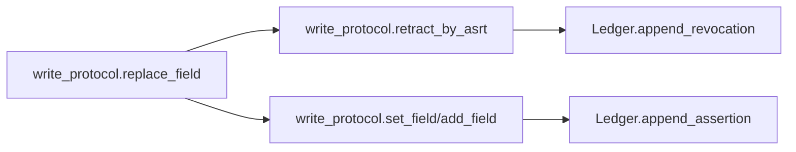
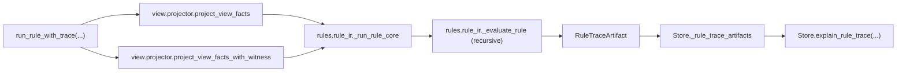
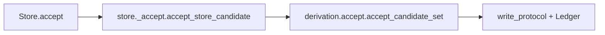

# Core Architecture Overview (factpy_kernel)

- Scope: `src/factpy_kernel/core`
- Last updated: 2026-03-17
- Code baseline: `Store.evaluate` supports only `native|souffle|problog`; `Ledger` is a SQLite write-through cache; `ProjectorAudit` is v2
- Audience: developers who need to understand core semantic boundaries, key entrypoints, and extension points

## 1. Document Boundary

This document describes only the `core` semantic kernel. It does not cover implementation details of:

- `src/factpy_kernel/adapters` (engine adapters and export)
- `src/factpy_kernel/sdk` (higher-level Python API)
- `src/factpy_kernel/authoring` (compile and workflow)
- `src/factpy_kernel/service` (HTTP/BFF routes and DTOs)

Additional boundary notes:

- `authoring/sdk` currently use a unified declaration metadata contract: `version / description / tags`
- those fields are declaration and management metadata, not core runtime semantics
- core may carry descriptive fields compiled from upper layers, but does not change `evaluate/chosen/accept` behavior because of them

## 2. Current Directory Structure (core)

```text
src/factpy_kernel/core/
  __init__.py              # stable core public facade
  protocol/                # typed tuple / digest / idref encoding protocols
  schema/                  # SchemaIR validation and digest
  store/                   # Store facade + ledger + evaluate/query/builders
  evidence/                # append-only write protocol (set/add/retract/replace)
  policy/                  # active/chosen/policy_ir
  view/                    # view projection (facts + display + audit)
  rules/                   # where AST/validator + evaluator + RuleRef execution
  derivation/              # CandidateSet generation/accept (including batch accept_many)
  mapping/                 # mapping conflict resolution and decisions
```

## 3. Module Responsibility Map

| Module | Main Responsibility | Key Entrypoints |
|---|---|---|
| `protocol.tup_v1` | canonical typed tuple encoding and claim argument reconstruction | `canonical_bytes_tup_v1`, `claim_args_from_rest_terms` |
| `protocol.idref_v1` | `idref_v1` encoding | `encode_idref_v1` |
| `schema.schema_ir` | SchemaIR validation, canonicalization, digest | `ensure_schema_ir`, `schema_digest` |
| `store.ledger` | append-only SQLite ledger and in-memory index cache | `append_assertion`, `append_revocation`, `find_*` |
| `evidence.write_protocol` | write/retract/replace and ingest-key idempotency | `set_field`, `add_field`, `retract_by_asrt`, `replace_field` |
| `policy.active/chosen` | active checks and chosen selection | `is_active`, `compute_chosen_for_predicate` |
| `view.projector` | core fact projection and audit statistics | `project_view_facts`, `project_view_facts_with_audit`, `project_display_facts` |
| `rules.where_ast*` | where AST parsing and validation | `parse_where_ir_to_ast`, `validate_where_ast` |
| `rules.where_eval` | where interpreter for the native path | `evaluate_where` |
| `rules.rule_ir` | RuleSpec/RuleRegistry/RuleRef execution | `run_rule`, `run_rule_with_trace` |
| `rules._trace` | rule runtime trace carrier and serialization | `RuleTraceArtifact`, `RuleRunResult`, `rule_trace_artifact_to_dict` |
| `derivation.candidates` | candidate structure and digest/key computation | `CandidateSet`, `make_candidate` |
| `derivation.accept` | candidate accept and batch accept_many | `accept_candidate_set`, `accept_many_candidate_sets` |
| `mapping.canon` | mapping conflict resolution and tie-break | `resolve_mapping_predicate` |
| `store._artifact_sidecar` | file-backed durable explain carrier, capture-time retention metadata, and rule-trace TTL GC maintenance | `FileArtifactSidecar`, `GCResult`, `FileArtifactSidecar.gc_rule_trace` |
| `store.runtime` | `Store` facade, engine registration, and default in-process / optional sidecar-backed explain readback / backref lookup | `Store`, `register_engine_evaluator`, `Store.explain_support`, `Store.explain_rule_trace`, `Store.get_candidate_support_digest`, `Store.get_candidate_support_kind` |
| `store.evaluation` | public `Store.evaluate` entrypoint | `evaluate_store` |
| `store.queries` | explain/conflicts/resolve_mapping queries | `explain_fact`, `conflicts`, `resolve_mapping` |
| `store.builders` | candidate building, head/entity parsing, value coercion | `candidates_from_bindings`, `entity_candidates_from_bindings` |
| `store.api` | compatibility shim for old import paths | `Store`, `register_engine_evaluator` |

## 4. Core Data Model (Ledger)

`src/factpy_kernel/core/store/ledger.py` defines the append-only data structures:

- `Claim`: primary assertion row (`asrt_id`, `pred_id`, `e_ref`, `rest_terms`)
- `ClaimArg`: row-expanded arguments (`idx`, `val_atom`, `tag`)
- `MetaRow`: metadata rows (`kind` in `str/int/float/bool/time/json`)
- `Revokes`: revocation edge (`revoker_asrt_id -> revoked_asrt_id`)
- `AppendResult`: atomic write result (`asrt_id`, `written`)

Persistence notes:

- SQLite tables are the truth: `claims/claim_args/meta_rows/revokes/ingest_keys/ledger_meta`
- in-memory indexes are read caches: loaded at startup and maintained after commits
- both `Ledger(path=":memory:")` and `Ledger(path="...")` are supported

## 5. Key Runtime Flows

### 5.1 Write Flow (append-only)



### 5.2 Evaluate Flow

Current `Store.evaluate(...)` modes:

- `native`: core executes `project_view_facts -> evaluate_where -> builders`
- `souffle` / `problog`: delegate to registered engine evaluators
- `python` / `engine`: removed; calls raise `ValueError`

Evaluate now also records a lightweight candidate explain backref after candidate construction:

- `candidate_id -> (support_digest, support_kind)`
- native candidates write `support_kind="native_binding_v1"` and can continue to `Store.explain_support(...)`
- engine candidates now explicitly write `support_kind="engine_no_witness_v1"` plus the zero-digest placeholder:
  - this is a no-witness degraded explain state, not an artifact-missing error
  - service `explain_ref(kind="candidate")` returns `witness_status="degraded"` for this path
- `Store.get_candidate_support_digest(candidate_id)` and `Store.get_candidate_support_kind(candidate_id)` both recover only this first hop inside the current `Store` instance
- when `Store(..., artifact_sidecar=...)` is configured, only the native `support_digest -> SupportArtifact` second hop can be re-read from later `Store` instances sharing the same sidecar root


### 5.3 Rule Runtime Flow

`run_rule(...)` and `Store.evaluate(...)` are separate execution paths:

- `run_rule(...)`: keeps the legacy `list[tuple]` contract
- `run_rule_with_trace(...)`: captures a `RuleTraceArtifact` without breaking old callers
- `Store.explain_rule_trace(rule_run_id)`: by default dereferences the captured trace in-process; with `artifact_sidecar` configured it can also read back from later `Store` instances sharing the same sidecar root

Current trace semantics:

- both `original_where` and `rewritten_where` are retained
- `RuleRef` relationships are captured per call site and explicitly marked with `memo_hit`
- `ruleref_links` explicitly connect each `ruleref` atom in `where` to the child invocation that actually occurred; on memo hits the link points to the memo-hit invocation, and clients can then follow `memo_source_invocation_id` to the primary invocation
- `non_fact_steps.status` now writes `negated` for `not` and `evaluated` for other non-`pred` steps
- `original_where`, `rewritten_where`, and `non_fact_steps.details.atom` remain opaque payloads; the typed contract only promises their surrounding fields
- `T1` temporal checks do not add new trace-carrier fields: fact-backed temporal anchors still surface through `pred_witnesses`, and scalar comparison bindings stay in `non_fact_steps.details.binding`
- Scenario A threshold-bearing uncertainty checks follow the same rule: measurement/threshold assertions surface through `pred_witnesses`, and scalar comparison bindings stay in `non_fact_steps.details.binding`
- `RuleTraceArtifact` remains separate from derivation `SupportArtifact`



### 5.4 Accept Flow



Additional note: `Store.accept_many(...)` goes through `accept_many_candidate_sets(...)` and supports:

- `mode='atomic'`: failure rolls back the batch by revoking written assertions
- `mode='best_effort'`: local failures do not block unrelated items
- dependency topological ordering and cycle detection (`CANDIDATE_DEPENDENCY_CYCLE`)

## 6. View and Policy Semantics (current)

### 6.1 chosen rules

- `cardinality='single'`: choose one assertion per key group
- `cardinality='multi'`: keep all active assertions
- `single` tie-break: descending `ingested_at`, then lexical `asrt_id`

### 6.2 ProjectorAudit (v2)

`project_view_facts_with_audit(...)` returns `(facts, ProjectorAudit)` with the current shape:

- `contract_version` (fixed to `2`)
- `predicate_count`
- `active_claim_count`
- `selected_claim_count`
- `selected_by_pred`
- `dropped_by_policy_count`

Note: current core projection APIs no longer expose `temporal_view` or `legacy_record_visibility`.

### 6.3 Declaration Metadata Boundary

When integrating with `authoring/sdk`, distinguish between two different kinds of "meta":

- assertion write metadata: stored via `MetaRow`, participates in write/audit/temporal paths
- declaration metadata: `version / description / tags` on schema/rule/derivation assets

Under the current contract, declaration metadata does not participate in:

- where validation
- chosen/policy decisions
- candidate generation
- accept/accept_many write semantics

## 7. Rule Validation Gate (where AST)

Before execution, `rules.where_eval.evaluate_where(...)` attempts:

- `parse_where_ir_to_ast(...)`
- `validate_where_ast(..., mode='python', capabilities={'allow_ruleref': False})`

Environment variable:

- `FACTPY_WHERE_AST_VALIDATE=0|false|False|off|OFF` disables the gate
- default is enabled

## 8. Store and Adapter Boundary

`core` does not statically depend on `adapters`. Engines are attached through registration:

- register: `register_engine_evaluator(evaluator, name)`
- lookup: `get_engine_evaluator(name)`
- run: `Store.evaluate(mode='souffle'|'problog')`

Current adapter-side behavior:

- importing `factpy_kernel.adapters.souffle` registers `souffle`
- importing `factpy_kernel.adapters.problog` registers `problog`

Additional note:

- `Store` now maintains two separate in-process explain registries:
  - `_support_artifacts` for derivation-native support capture
  - `_rule_trace_artifacts` for `run_rule_with_trace(...)`
- `Store` also maintains a session-scoped candidate explain backref index:
  - `_candidate_support_index`: `candidate_id -> support_digest`
  - `_candidate_support_kind_index`: `candidate_id -> support_kind`
  - this index does not go to sidecar; both native and engine degraded candidate explain rely on this first hop
- they intentionally remain separate at the carrier layer for now.
- when `artifact_sidecar` is configured, lookup misses rehydrate these registries from the sidecar into the current in-memory dicts; without it, the behavior remains purely in-process.
- `FileArtifactSidecar` now writes sidecar-adjacent `.meta.json` files on first durable write:
  - `support/sha256/<hex>.meta.json`
  - `rule_trace/<rule_run_id>.meta.json`
- the first metadata slice carries only `captured_at_ns` and does not change artifact payload canonical bytes.
- the only maintenance surface in this slice is `FileArtifactSidecar.gc_rule_trace(ttl_ns, dry_run=False)`:
  - it applies age-only TTL GC only to `RuleTraceArtifact`
  - `SupportArtifact` remains write-and-retain
  - payload orphans are reported and skipped, while metadata orphans may be cleaned up

## 9. Invariants That Must Hold

1. `Store.__init__` must call `ensure_schema_ir(...)`
2. `Ledger` must remain append-only (revocation is expressed through `revokes`)
3. `chosen` decisions must be deterministic
4. `core` must not statically import `adapters`
5. SQLite tables are the truth; in-memory indexes are caches
6. `ClaimArg` indexes must remain contiguous because projection and policy depend on that

## 10. Current Compatibility Surface

- `store/api.py`: compatibility for old import paths only
- `Store.evaluate_dummy(...)`: deprecated, kept only for historical compatibility
- `store/_evaluate.py`, `store/_queries.py`, `store/_builders.py`, `store/_accept.py`: implementation modules behind public entrypoints
