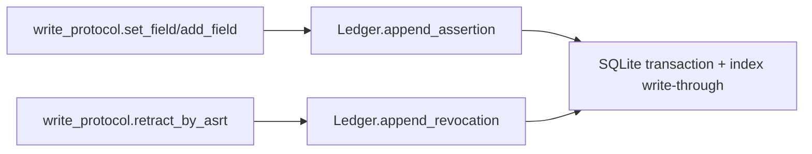
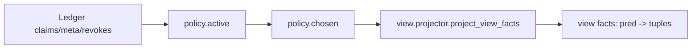

# Core 架构总览（factpy_kernel）

- 适用范围：`src/factpy_kernel/core`
- 最后更新：2026-02-28
- 代码基线：`Store` 已收口到 `runtime/evaluation/queries/builders` 公共模块；`Ledger` 已完成 SQLite write-through cache 持久化
- 目标读者：需要理解核心语义、定位代码、继续开发 `core` 的开发者

## 1. 文档边界与定位

本文档只描述 **语义核心层（core）**，不覆盖以下模块的具体实现：

- `src/factpy_kernel/adapters/souffle`（引擎/导出适配）
- `src/factpy_kernel/sdk`（上游 Python 友好封装）
- `src/factpy_kernel/authoring`（DSL/预检/工作流）
- `src/factpy_kernel/audit`（审计查询/UI/DTO）

`core` 的职责是：定义事实表示、Schema 约束、append-only 证据账本、policy/view 语义、规则（Python 路径）求值、候选生成与物化、映射解析等 **可独立演进的语义内核**。

## 2. 当前目录结构（core）

```text
src/factpy_kernel/core/
  __init__.py              # core 公共 API 门面（稳定入口）
  protocol/                # typed tuple / idref / digest 协议
  schema/                  # SchemaIR 校验、规范化、digest
  store/                   # Ledger + Store runtime + evaluation/query/builders 入口
  evidence/                # append-only 写协议（set/add/retract/replace）
  policy/                  # active/chosen/policy_ir
  view/                    # Python 侧业务视图投影
  rules/                   # where Python 求值 + RuleSpec/RuleRegistry
  derivation/              # CandidateSet + accept 物化
  mapping/                 # mapping 冲突解析与 tie-break
```

## 3. 模块职责总览（建议先读）

| 模块 | 主要职责 | 关键入口 | 主要依赖 |
|---|---|---|---|
| `protocol.tup_v1` | 规范化 typed tuple 编码、claim_arg 还原 | `canonical_bytes_tup_v1`, `claim_args_from_rest_terms` | 无（基础协议） |
| `protocol.idref_v1` | 实体引用（idref）稳定编码 | `encode_idref_v1` | `protocol.digests` |
| `schema.schema_ir` | SchemaIR 校验、canonicalize、digest | `ensure_schema_ir`, `schema_digest` | `protocol.digests` |
| `store.ledger` | append-only SQLite 账本 + 内存读缓存 | `append_assertion`, `append_revocation`, `find_*` | 基础数据类 |
| `evidence.write_protocol` | 写入/撤销/替换协议、幂等 ingest_key | `set_field`, `add_field`, `retract_by_asrt`, `replace_field` | `Ledger`, `protocol.*` |
| `policy.active/chosen` | 活跃性判断、chosen 决策（确定性 tie-break） | `is_active`, `compute_chosen_for_predicate` | `Ledger`, `write_protocol` |
| `view.projector` | 从账本投影业务视图事实（含 temporal current）与可选审计统计 | `project_view_facts`, `project_view_facts_with_audit` | `policy`, `Ledger`, `record_staging` |
| `record_staging` | record staging marker 常量、解析与冲突判定（accept/projector 共用） | `read_record_stage_status`, `resolve_record_stage_status` | `Ledger` |
| `rules.where_ast` | where 语义 AST（round-trip / 结构化语义中枢雏形） | `parse_where_ir_to_ast`, `lower_ast_to_where_ir` | 现有 where IR |
| `rules.where_ast_validate` | where AST 结构/数据流校验（治理层，PR-2） | `validate_where_ast` | `rules.where_ast` |
| `rules.where_eval` | where 子集 Python 解释执行 | `evaluate_where` | `view/projector` 产物 |
| `rules.rule_ir` | RuleSpec/RuleRegistry/RuleRef 执行与循环防护 | `run_rule` | `where_eval`, `Store` |
| `derivation.candidates` | 候选集合与 key digest | `CandidateSet`, `make_candidate` | `protocol` |
| `derivation.accept` | 候选接受并物化写入 ledger | `accept_candidate_set` | `Ledger`, `write_protocol` |
| `mapping.canon` | mapping 谓词冲突解析与 tie-break | `resolve_mapping_predicate` | `Ledger`, `policy` |
| `store.runtime` | `Store` 运行时门面 + engine evaluator 注册点 | `Store`, `register_engine_evaluator` | `store.evaluation`, `store.queries`, `store._accept` |
| `store.api` | `store.runtime` 的兼容 shim | `Store`, `register_engine_evaluator` | `store.runtime` |
| `store.evaluation` | `Store.evaluate` 主流程公共入口 | `evaluate_store` | `view`, `where_eval`, `store.builders` |
| `store._accept` | `Store.accept` 主流程 | `accept_store_candidate` | `policy_ir`, `derivation.accept` |
| `store.builders` | 候选构建、record 物化 spec、值 coercion 公共入口 | 多个 helper | `protocol`, `derivation` |
| `store.queries` | explain/conflicts/resolve_mapping 公共入口 | `explain_fact`, `conflicts`, `resolve_mapping` | `policy`, `mapping` |

## 4. 核心数据模型（语义基础）

`Ledger` 维护以下 append-only 数据结构（`src/factpy_kernel/core/store/ledger.py`）：

- `Claim`
  - 一个断言主记录：`asrt_id`, `pred_id`, `e_ref`, `rest_terms`
- `ClaimArg`
  - `Claim` 参数展开后的行式表示（便于投影、导出、审计）
- `MetaRow`
  - 断言/撤销行为相关元数据（`kind` in `str/num/bool/time/json`）
- `Revokes`
  - 撤销关系：`revoker_asrt_id -> revoked_asrt_id`

设计原则：

- **append-only**：新增行，不原地覆盖事实
- **撤销显式化**：通过 `Revokes` 表示失效，而不是修改原 `Claim`
- **元数据伴随事实**：`ingested_at`, `run_id`, `materialize_id` 等通过 `MetaRow` 关联 `asrt_id`
- **可审计**：保留历史与撤销路径，便于解释和重放
- **持久化真相**：SQLite 表是真相，内存索引是读缓存

## 5. Ledger 当前索引结构（性能相关）

`Ledger` 当前采用 **SQLite write-through cache**：

- SQLite 表是持久化真相（`claims / claim_args / meta_rows / revokes / ingest_keys / ledger_meta`）
- 内存索引是读缓存，由启动加载和提交后写透维护
- `Ledger(path=":memory:")` 仍可作为默认内存模式

内存索引结构包括：

- `claims` 索引
  - `_claim_by_asrt_id`
  - `_claims_by_pred_id`
  - `_claims_by_e_ref`
  - `_claims_by_pred_e_ref`
- `claim_args` 索引
  - `_claim_args_by_asrt_id`
- `meta` 索引
  - `_meta_by_asrt_id`
  - `_meta_by_key`
  - `_meta_by_kind`
  - `_meta_by_asrt_id_key`
  - `_meta_by_asrt_id_key_kind`
- `revokes` 索引
  - `_revoked_asrt_ids`
  - `_first_revoker_by_revoked_asrt_id`

注意：

- SQLite 提交成功后才更新内存索引，避免双边状态漂移
- `rebuild_indexes()` 现在是兼容 no-op，不再承担修复职责
- 测试若需要强制改 meta，应使用 `ledger._force_replace_meta_rows(...)`

## 6. 核心运行链路（开发时最常看）

### 6.1 写入链路（append-only）



关键点：

- `write_protocol` 负责输入校验、幂等 ingest_key、撤销与替换语义
- `Ledger` 负责事务边界、持久化与索引维护，不负责业务 policy 决策

### 6.2 视图链路（policy + projector）



关键点：

- `functional`：按 `ingested_at` + `asrt_id` 决定 chosen
- `multi`：所有 active 都可见
- `temporal`：支持 `record/current` 两种视图语义（Python 路径）
- record 物化可见性 gating（当前已落地）
  - `staging status != committed`（含 `aborted/conflict`）时，整组 record 隐藏
  - `committed` 且 `roles_count_expected` 存在但不匹配时，整组 record 隐藏
  - legacy record（无 `record_digest`）默认兼容可见（迁移期策略）

### 6.2.1 Record Staging 语义（accept / projector 共用）

`core/record_staging.py` 定义 record 级 staging marker 协议与统一冲突判定，避免 `accept` 与 `projector` 对同一账本状态产生不同解释。

- marker predicate：`__factpy_internal:record_stage`
- stage 值：`begin | roles_written | committed | aborted`
- 关键 marker meta：
  - `materialize_id`
  - `record_digest`（record 级 role digest）
  - `roles_count_expected`（用于 projector 的低成本完整性校验）

统一冲突判定（`resolve_record_stage_status(...)`）示例：

- `multi_committed` -> conflict
- `committed_and_aborted` -> conflict
- `multi_aborted` -> conflict
- `committed_and_inflight_mismatch` -> conflict
- inflight 多 digest（且无 committed/aborted 冲突）-> warning（不影响 projector，因为 projector 只认 committed）

### 6.2.2 Projector 审计统计（P1，已落地）

新增并行 API（不改变默认 `project_view_facts(...)` 返回形状）：

- `project_view_facts_with_audit(...) -> (facts, ProjectorAudit)`
- `project_view_facts(..., legacy_record_visibility="allow"|"audit"|"deny")`
  - 默认 `allow`：保持历史兼容（legacy record 可见）
  - `audit`：与 `allow` 行为一致，仅用于显式表达“观测模式”（不改变事实集合）
  - `deny`：仅隐藏 **legacy record 组**（无 `record_digest` 的 record），不影响非 record materialize

`ProjectorAudit`（`contract_version=1`）当前包含：

- `legacy_record_total` / `legacy_record_by_pred`
- `legacy_exists_without_roles_total` / `legacy_exists_without_roles_by_pred`
- `marker_conflict_total` / `marker_conflict_by_reason`
- `committed_hidden_count_mismatch_total` / `committed_hidden_count_mismatch_by_pred`

统计口径说明（重要）：

- 以 **record 组（按 record key / staging key）** 为计数单位，而不是按 claim 行计数
- `legacy_record_*` 以 `exists` claim 为计数单位（无 `record_digest` 的 legacy record）
- `committed_hidden_count_mismatch_*` 仅统计 “committed 且 `roles_count_expected` 存在但不匹配” 导致的隐藏

### 6.3 规则与候选链路（Python 路径）


补充（当前状态）：

- `where` 语义 AST（`rules.where_ast` / `rules.where_ast_validate`）已作为增量治理层落地
- 当前已在 `where_eval` 与 `adapters.souffle.where_compile` 入口接入 `parse->validate(AST)` 前置校验 gate
- 执行/编译逻辑仍继续使用原 where IR（tuple/list），因此对外行为保持兼容
- 环境变量 `FACTPY_WHERE_AST_VALIDATE` 用于控制 AST 前置校验 gate（默认开启）
  - `0 / false / False / off / OFF` 关闭 gate，回退到旧路径独立兜底校验（兼容/回归用）
  - 日常开发与 CI 默认保持开启（gate on）
- 已开始去重阶段：低风险的重复结构检查，以及部分纯 arity/type shape 检查（不涉及绑定/数据流）已从旧路径删除；语义/数据流校验仍保留在旧路径与 AST validator 双层保障中

补充（profile / strict，当前状态）：

- `BackendProfile` 是显式能力矩阵载体；`PROFILE_DEFAULT` 等价当前行为（不收紧）
- opt-in 收紧仅在 `mode="souffle"` 且显式传入非默认 profile 时生效
  - `ruleref_policy=require_resolved|forbid`（默认 `allow`）
  - `not_body_policy=forbid_or|forbid`（默认 `allow`）
- authoring compile 入口 `compile_authoring_rule_v1(profile=..., strict=...)` 支持显式 profile
  - `strict=True` 等价 `profile=PROFILE_SOUFFLE_STRICT`
  - 当前 `PROFILE_SOUFFLE_STRICT` 预设组合：`ruleref_policy=require_resolved` + `not_body_policy=forbid_or`

### 6.4 物化链路（accept）


补充（record accept，当前状态）：

- record 物化采用 staging marker（`begin -> roles_written -> committed`）表达进度
- 冲突路径可写 `aborted` marker 并通过 diagnostics 显式返回冲突后果
- 与 `projector` 共用 `record_staging` 判定语义，保证“可写/可见/冲突”的一致解释

### 6.5 Engine 链路边界（core 与 adapter 的关系）

`core` 不静态依赖 `adapters`。`Store.evaluate(mode='engine')` 的执行通过注册机制注入：

- `core` 侧：`register_engine_evaluator(...)`（`store/runtime.py`，`store/api.py` 仅兼容转发）
- `adapter` 侧：`adapters/souffle/__init__.py` import 时自动注册 `evaluate_store_engine`

这保证：

- `core` 可以独立导入与测试
- 引擎实现可替换（不仅限于 Souffle）

## 7. Store 结构（当前拆分状态）

`Store` 已从“超大单文件”收口为 **公共入口 + 兼容 shim + 少量私有实现**：

- `store/runtime.py`
  - `Store` 门面
  - `register_engine_evaluator`
  - 少量保留兼容入口（`evaluate_dummy`）
- `store/evaluation.py`
  - `Store.evaluate(...)` 主流程公共入口
- `store/queries.py`
  - `explain_fact/conflicts/resolve_mapping/meta_subset` 公共入口
- `store/builders.py`
  - `CandidateSet` 构建、record materialize spec、type coercion 公共入口
- `store/api.py`
  - `store.runtime` 的兼容 shim（旧导入路径保留）
- `store/_evaluate.py`
  - `store.evaluation` 背后的兼容实现模块
- `store/_accept.py`
  - `Store.accept(...)` 逻辑（digest 准备 + 委托）
- `store/_builders.py`
  - `store.builders` 背后的兼容实现模块
- `store/_queries.py`
  - `store.queries` 背后的兼容实现模块

维护原则：

- 对外 API 保持在 `Store`
- 新代码优先从 `runtime/evaluation/queries/builders` 进入
- 旧 `api.py` / `_*.py` 保留兼容，但不再建议作为新增依赖入口

## 8. core 的关键不变量（必须理解）

这些是不应轻易破坏的语义约束：

1. `Store.__init__` 必须校验 `SchemaIR`
   - 当前已在初始化阶段调用 `ensure_schema_ir(...)`
2. `Ledger` 是 append-only 账本
   - 不应引入“直接覆盖 claim/meta/revokes”的写接口
3. `revokes` 表达撤销，`active` 由 policy 决定
   - 不要把“active 状态”写回 claim 本身
4. `chosen` 必须确定性
   - tie-break 使用 `ingested_at` + `asrt_id` 字典序
5. `core` 不静态 import `adapters`
   - engine 行为通过注册机制接入
6. `Ledger` 的 SQLite 表是真相，内存索引是缓存
   - 不应绕过写入入口直接改 SQLite 与缓存
   - 测试专用修复入口是 `_force_replace_meta_rows(...)`，不是 `rebuild_indexes()`

## 9. 开发者扩展指南（常见改动路径）

### 9.1 新增 `type_domain`

至少检查这些位置：

- `protocol/tup_v1.py`（编码/校验）
- `store/builders.py`（`coerce_value_for_tag`）
- `adapters/souffle`（导出/编译表示，如果 engine 路径需要）
- 对应测试（Python evaluate、view/export parity）

### 9.2 新增/调整 `cardinality`

至少检查：

- `policy/chosen.py`
- `view/projector.py`
- `record_staging.py`
- `schema/schema_ir.py`（校验）
- `adapters/souffle/souffle_view_gen.py`（引擎视图生成）

### 9.3 新增 where 操作符（Python 语义基准）

- `core/rules/where_eval.py` 先定义语义与校验
- 再同步 `adapters/souffle/where_compile.py`
- 增加 parity 测试（Python vs engine）

### 9.4 给 Store 增加新能力

优先放置规则：

- 查询/诊断类：`store/queries.py`
- 候选/构建类：`store/builders.py`
- 评估主流程：`store/evaluation.py`
- 接收/落库主流程：`store/_accept.py`
- `runtime.py` 保留门面方法和注册点
- `api.py` 仅保留兼容转发

## 10. 调试与测试入口（建议）

常用测试文件：

- `src/factpy_kernel/tests/test_core_store_boundary_v1.py`
  - 检查 `core` 不静态 import adapter、engine evaluator 注册行为
- `src/factpy_kernel/tests/test_ledger_indexes_v1.py`
  - 检查 `Ledger` 索引查询语义与 `find_revoker` 首匹配语义
- `src/factpy_kernel/tests/test_view_projector_v1.py`
- `src/factpy_kernel/tests/test_view_projector_audit_v1.py`
- `src/factpy_kernel/tests/test_write_protocol_v1.py`

标准回归命令（FactPy kernel，避免误扫仓库根目录 `test.py`）：

```bash
python -m unittest discover -s src/factpy_kernel/tests -p 'test_*.py'
```

兼容兜底路径回归（where AST gate off）：

```bash
FACTPY_WHERE_AST_VALIDATE=0 python -m unittest discover -s src/factpy_kernel/tests -p 'test_*.py'
```

CI 建议：

- 显式使用 `-p 'test_*.py'`
- 至少跑两步：gate on（默认）与 gate off（兼容兜底）

性能基准脚本（核心路径）：

```bash
python tools/benchmarks/bench_core_ledger_paths.py --rows 3000 --rounds 3
```

## 11. 已知注意事项（避免踩坑）

- 测试中若需要强制替换 meta，使用 `ledger._force_replace_meta_rows(...)`；不要依赖 `rebuild_indexes()`
- `Store.evaluate(mode='engine')` 在未导入 adapter 前会报“engine evaluator not registered”
- `core` 的正确性优先于性能；所有索引优化必须保持 append-only 与查询语义不变
