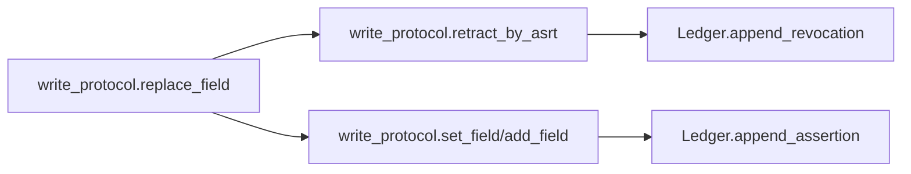
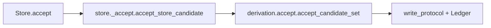

# Core 架构总览（factpy_kernel）

- 适用范围：`src/factpy_kernel/core`
- 最后更新：2026-03-10
- 代码基线：`Store.evaluate` 仅支持 `native|souffle|problog`；`Ledger` 为 SQLite write-through cache；`ProjectorAudit` 为 v2 结构
- 目标读者：需要理解 core 语义边界、关键入口与扩展点的开发者

## 1. 文档边界

本文只描述 `core` 语义内核，不覆盖以下模块的具体实现细节：

- `src/factpy_kernel/adapters`（引擎适配与导出）
- `src/factpy_kernel/sdk`（上层 Python API）
- `src/factpy_kernel/authoring`（编译与工作流）
- `src/factpy_kernel/service`（HTTP/BFF 路由与 DTO）

补充边界：

- `authoring/sdk` 侧当前统一声明元数据为 `version / description / tags`
- 这些字段属于声明与管理信息，不属于 core 运行时语义
- core 可以承载由上层编译带下来的说明性字段，但不会据此改变 `evaluate/chosen/accept` 行为

## 2. 当前目录结构（core）

```text
src/factpy_kernel/core/
  __init__.py              # core 对外稳定入口
  protocol/                # typed tuple / digest / idref 编码协议
  schema/                  # SchemaIR 校验与 digest
  store/                   # Store 运行时门面 + ledger + evaluate/query/builders
  evidence/                # append-only 写协议（set/add/retract/replace）
  policy/                  # active/chosen/policy_ir
  view/                    # 视图投影（facts + display + audit）
  rules/                   # where AST/validator + evaluator + RuleRef 执行
  derivation/              # CandidateSet 生成/接受（含 batch accept_many）
  mapping/                 # mapping 冲突解析与决策
```

## 3. 模块职责总览

| 模块 | 主要职责 | 关键入口 |
|---|---|---|
| `protocol.tup_v1` | typed tuple 规范编码与 claim 参数还原 | `canonical_bytes_tup_v1`, `claim_args_from_rest_terms` |
| `protocol.idref_v1` | `idref_v1` 编码 | `encode_idref_v1` |
| `schema.schema_ir` | SchemaIR 校验、规范化、digest | `ensure_schema_ir`, `schema_digest` |
| `store.ledger` | append-only SQLite 账本与内存索引缓存 | `append_assertion`, `append_revocation`, `find_*` |
| `evidence.write_protocol` | 写入、撤销、替换、幂等 ingest_key | `set_field`, `add_field`, `retract_by_asrt`, `replace_field` |
| `policy.active/chosen` | active 判断与 chosen 决策 | `is_active`, `compute_chosen_for_predicate` |
| `view.projector` | 核心事实投影与审计统计 | `project_view_facts`, `project_view_facts_with_audit`, `project_display_facts` |
| `rules.where_ast*` | where AST 解析与校验 | `parse_where_ir_to_ast`, `validate_where_ast` |
| `rules.where_eval` | where 解释执行（native 路径） | `evaluate_where` |
| `rules.rule_ir` | RuleSpec/RuleRegistry/RuleRef 执行 | `run_rule` |
| `derivation.candidates` | 候选结构与 digest/key 计算 | `CandidateSet`, `make_candidate` |
| `derivation.accept` | candidate accept 与 batch accept_many | `accept_candidate_set`, `accept_many_candidate_sets` |
| `mapping.canon` | mapping 冲突解析与 tie-break | `resolve_mapping_predicate` |
| `store.runtime` | `Store` 门面、engine 注册点 | `Store`, `register_engine_evaluator` |
| `store.evaluation` | `Store.evaluate` 公共入口 | `evaluate_store` |
| `store.queries` | explain/conflicts/resolve_mapping 查询 | `explain_fact`, `conflicts`, `resolve_mapping` |
| `store.builders` | 候选构建、head/entity 解析、值 coercion | `candidates_from_bindings`, `entity_candidates_from_bindings` |
| `store.api` | 旧导入路径兼容 shim | `Store`, `register_engine_evaluator` |

## 4. 核心数据模型（Ledger）

`src/factpy_kernel/core/store/ledger.py` 定义 append-only 数据结构：

- `Claim`：断言主记录（`asrt_id`, `pred_id`, `e_ref`, `rest_terms`）
- `ClaimArg`：参数行式展开（`idx`, `val_atom`, `tag`）
- `MetaRow`：元数据（`kind` in `str/int/float/bool/time/json`）
- `Revokes`：撤销关系（`revoker_asrt_id -> revoked_asrt_id`）
- `AppendResult`：原子写结果（`asrt_id`, `written`）

持久化实现要点：

- SQLite 表为真相：`claims/claim_args/meta_rows/revokes/ingest_keys/ledger_meta`
- 内存索引为读缓存：启动加载 + 提交后写透维护
- `Ledger(path=":memory:")` 与 `Ledger(path="...")` 均可用

## 5. 关键运行链路

### 5.1 写入链路（append-only）



### 5.2 Evaluate 链路

`Store.evaluate(...)` 当前模式：

- `native`：core 内部执行 `project_view_facts -> evaluate_where -> builders`
- `souffle` / `problog`：委托已注册的 engine evaluator
- `python` / `engine`：已移除，调用会抛 `ValueError`


### 5.3 Accept 链路



补充：`Store.accept_many(...)` 走 `accept_many_candidate_sets(...)`，支持：

- `mode='atomic'`：失败触发批次回滚（写入断言会被撤销）
- `mode='best_effort'`：局部失败不阻塞无依赖项
- 候选依赖拓扑排序 + 环检测（`CANDIDATE_DEPENDENCY_CYCLE`）

## 6. 视图与策略语义（当前）

### 6.1 chosen 规则

- `cardinality='single'`：每组 key 选一个 chosen
- `cardinality='multi'`：所有 active 断言都保留
- `single` tie-break：`ingested_at` 降序，再按 `asrt_id` 字典序稳定决策

### 6.2 ProjectorAudit（v2）

`project_view_facts_with_audit(...)` 返回 `(facts, ProjectorAudit)`，当前结构：

- `contract_version`（固定 `2`）
- `predicate_count`
- `active_claim_count`
- `selected_claim_count`
- `selected_by_pred`
- `dropped_by_policy_count`

注意：当前 core 投影接口不再包含 `temporal_view` 与 `legacy_record_visibility` 参数。

### 6.3 声明元数据边界

对接 `authoring/sdk` 时，需要区分两类“meta”：

- 断言写入元数据：走 `MetaRow`，参与事实写入与时态/审计链路
- 声明元数据：如 `version / description / tags`，属于 schema/rule/derivation 资产说明

当前口径下，后者不参与：

- where 校验
- chosen/policy 决策
- candidate 生成
- accept/accept_many 写入语义

## 7. 规则校验 gate（where AST）

`rules.where_eval.evaluate_where(...)` 在执行前会尝试：

- `parse_where_ir_to_ast(...)`
- `validate_where_ast(..., mode='python', capabilities={'allow_ruleref': False})`

环境变量：

- `FACTPY_WHERE_AST_VALIDATE=0|false|False|off|OFF` 可关闭该 gate
- 默认开启

## 8. Store 与 adapter 的边界

`core` 不静态依赖 `adapters`。engine 通过注册机制接入：

- 注册：`register_engine_evaluator(evaluator, name)`
- 查询：`get_engine_evaluator(name)`
- 运行：`Store.evaluate(mode='souffle'|'problog')`

适配器侧（当前）：

- `factpy_kernel.adapters.souffle` import 时注册 `souffle`
- `factpy_kernel.adapters.problog` import 时注册 `problog`

## 9. 必须维持的不变量

1. `Store.__init__` 必须先 `ensure_schema_ir(...)`
2. `Ledger` 必须保持 append-only（撤销通过 `revokes` 表达）
3. `chosen` 决策必须确定性
4. `core` 不得静态 import `adapters`
5. SQLite 表是真相，内存索引是缓存
6. `ClaimArg` 索引必须连续，投影和 policy 依赖该约束

## 10. 当前兼容面（仍保留）

- `store/api.py`：仅兼容旧导入路径
- `Store.evaluate_dummy(...)`：已标记 deprecated，仅用于历史调用兼容
- `store/_evaluate.py`, `store/_queries.py`, `store/_builders.py`, `store/_accept.py`：作为公共模块背后的实现层
