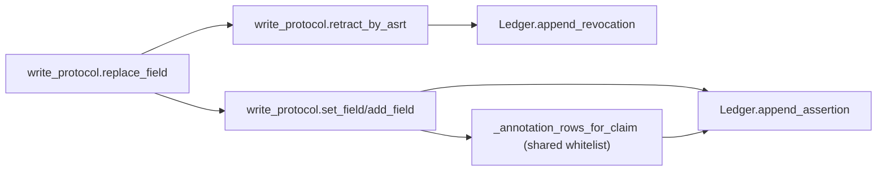
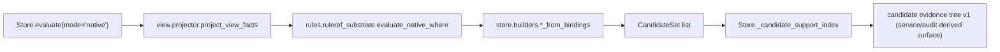
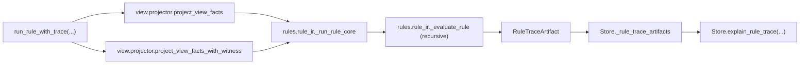
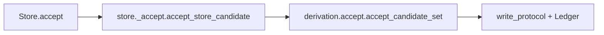

# Core 架构总览（factpy_kernel）

- 适用范围：`src/factpy_kernel/core`
- 最后更新：2026-03-26
- 代码基线：`Store.evaluate` 支持 `native|souffle|problog|pyreason`；`Ledger` 为 SQLite write-through cache + `annotation_rows`（Annotation Store）；`ProjectorAudit` 为 v2 结构
- 目标读者：需要理解 core 语义边界、关键入口与扩展点的开发者

## 1. 文档边界

本文只描述 `core` 语义内核，不覆盖以下模块的具体实现细节：

- `src/factpy_kernel/adapters`（引擎适配与导出）
- `src/factpy_kernel/sdk`（上层 Python API）
- `src/factpy_kernel/authoring`（编译与工作流）
- `src/factpy_kernel/service`（HTTP/BFF 路由与 DTO）

补充边界：

- `authoring/sdk` 侧当前声明元数据边界为：
  - schema / derivation：`version / description / tags`
  - rule：`version / description / tags`，外加 version-scoped `condition_weights`
- 这些字段属于声明与管理信息，不属于 core 运行时语义
- core 可以承载由上层编译带下来的说明性字段，但不会据此改变 `evaluate/chosen/accept` 行为

## 2. 当前目录结构（core）

```text
src/factpy_kernel/core/
  __init__.py              # core 对外稳定入口
  protocol/                # typed tuple / digest / idref 编码协议
  schema/                  # SchemaIR 校验与 digest
  store/                   # Store 运行时门面 + ledger + evaluate/query/builders
  evidence/                # append-only 写协议（set/add/retract/replace）
  policy/                  # active/chosen/policy_ir
  view/                    # 视图投影（facts + display + audit）
  rules/                   # where AST/validator + plain evaluator + shared RuleRef substrate + rule runtime
  derivation/              # CandidateSet 生成/接受（含 batch accept_many）
  mapping/                 # mapping 冲突解析与决策
  annotation/              # internal prototype annotation kernel（A/C workload slice）
```

## 3. 模块职责总览

| 模块 | 主要职责 | 关键入口 |
|---|---|---|
| `protocol.tup_v1` | typed tuple 规范编码与 claim 参数还原 | `canonical_bytes_tup_v1`, `claim_args_from_rest_terms` |
| `protocol.idref_v1` | `idref_v1` 编码 | `encode_idref_v1` |
| `schema.schema_ir` | SchemaIR 校验、规范化、digest | `ensure_schema_ir`, `schema_digest` |
| `store.ledger` | append-only SQLite 账本与内存索引缓存 | `append_assertion`, `append_revocation`, `find_*` |
| `evidence.write_protocol` | 写入、撤销、替换、幂等 ingest_key | `set_field`, `add_field`, `retract_by_asrt`, `replace_field` |
| `policy.active/chosen` | active 判断与 chosen 决策 | `is_active`, `compute_chosen_for_predicate` |
| `view.projector` | 核心事实投影与审计统计 | `project_view_facts`, `project_view_facts_with_audit`, `project_display_facts` |
| `rules.where_ast*` | where AST 解析与校验 | `parse_where_ir_to_ast`, `validate_where_ast` |
| `rules.where_eval` | where 解释执行（native 路径） | `evaluate_where` |
| `rules.ruleref_substrate` | `query + derivation` 共享 native `RuleRef` 执行 substrate | `evaluate_native_where` |
| `rules.rule_ir` | RuleSpec/RuleRegistry/RuleRef 执行 | `run_rule`, `run_rule_with_trace` |
| `rules._trace` | rule runtime trace carrier、序列化与 summary derivation | `RuleTraceArtifact`, `RuleRunResult`, `rule_trace_artifact_to_dict`, `summarize_rule_trace_artifact_dict` |
| `rules._trace_narrative` | rule-run summary 上的 deterministic narrative rendering | `render_rule_run_narrative` |
| `rules._trace_nl` | summary+narrative 上的 deterministic NL explain rendering | `render_rule_run_nl_explain` |
| `store._candidate_evidence_tree_summary` | candidate evidence tree 上的 deterministic summary derivation | `summarize_candidate_evidence_tree_dict` |
| `store._candidate_evidence_tree_narrative` | candidate tree summary 上的 deterministic narrative rendering | `render_candidate_evidence_tree_narrative` |
| `store._candidate_evidence_tree_nl` | candidate tree summary+narrative 上的 deterministic NL explain rendering | `render_candidate_evidence_tree_nl_explain` |
| `derivation.candidates` | 候选结构与 digest/key 计算 | `CandidateSet`, `make_candidate` |
| `derivation.accept` | candidate accept 与 batch accept_many | `accept_candidate_set`, `accept_many_candidate_sets` |
| `mapping.canon` | mapping 冲突解析与 tie-break | `resolve_mapping_predicate` |
| `annotation._min_max` | internal prototype 的 min-max 路径置信度传播 | `derive_min_max_path_confidence` |
| `annotation._evidence` | internal prototype 的 Workload C 证据展开 / provenance 重建 / max 聚合 helper | `build_direct_evidence_candidates_proto`, `build_max_evidence_provenance`, `apply_max_evidence_aggregation` |
| `annotation._certainty` | internal prototype 的 certainty lane condition-weight impact derivation + salience ranking | `derive_certainty_summary`, `rank_certainty_conditions`, `RankedCondition` |
| `store._confidence_kind_resolver` | create-time `confidence_kind` routing protocol、certainty resolver 与 shared artifact eligibility helper | `RuleSpecReader`, `ConfidenceKindResolver`, `CertaintyConfidenceKindResolver`, `check_certainty_artifact_eligibility` |
| `store._certainty_materializer` | service-neutral certainty 物化（从 pre-resolved condition_weights 派生 certainty_summary dict） | `materialize_certainty_summary`, `extract_single_referenced_support_tree`, `certainty_summary_to_dict` |
| `store._artifact_sidecar` | explain artifact 的 file-backed durable carrier、capture-time retention metadata、rule-trace TTL GC maintenance | `FileArtifactSidecar`, `GCResult`, `FileArtifactSidecar.gc_rule_trace` |
| `store.runtime` | `Store` 门面、engine 注册点，以及默认 in-process / 可选 sidecar explain readback / backref lookup | `Store`, `register_engine_evaluator`, `Store.explain_support`, `Store.explain_rule_trace`, `Store.get_candidate_support_digest`, `Store.get_candidate_support_kind`, `Store.get_candidate_confidence_kind`, `Store.list_candidate_ids` |
| `store.evaluation` | `Store.evaluate` 公共入口 | `evaluate_store` |
| `store.queries` | explain/conflicts/resolve_mapping 查询 | `explain_fact`, `conflicts`, `resolve_mapping` |
| `store.builders` | 候选构建、head/entity 解析、值 coercion | `candidates_from_bindings`, `entity_candidates_from_bindings` |
| `store.api` | 旧导入路径兼容 shim | `Store`, `register_engine_evaluator` |

## 4. 核心数据模型（Ledger）

`src/factpy_kernel/core/store/ledger.py` 定义 append-only 数据结构：

- `Claim`：断言主记录（`asrt_id`, `pred_id`, `e_ref`, `rest_terms`）
- `ClaimArg`：参数行式展开（`idx`, `val_atom`, `tag`）
- `MetaRow`：元数据（`kind` in `str/int/float/bool/time/json`）— **legacy compatibility layer**
- `AnnotationRow`：assertion-level annotation（`asrt_id`, `namespace`, `category`, `key`, `kind`, `value`, `origin`, `derivation`）— **canonical annotation carrier**（2026-03-26 新增）
- `Revokes`：撤销关系（`revoker_asrt_id -> revoked_asrt_id`）
- `AppendResult`：原子写结果（`asrt_id`, `written`）

### 4.1 四层数据架构（updated 2026-03-26）

Ledger 的持久化表现在对应四层数据架构（详见 [Assertion Annotation Store Decision](../../../docs/blueprints/active/2026-03-26_assertion-annotation-store-decision.md)）：

| 层 | SQLite 表 | 职责 |
|----|----------|------|
| **Claim Store** | `claims` + `claim_args` | 事实本身：pred_id + args |
| **Annotation Store** | `annotation_rows` | 关于事实的所有附加语义：来源、引擎真值、派生摘要、操作状态 |
| **Legacy Compat** | `meta_rows` | 旧 consumer 兼容层；新数据同时写入 annotation_rows 和 meta_rows |
| **Provenance Store** | audit package JSONL | 推理过程（proof tree / event log） |

`AnnotationRow` 按 `namespace` + `category` 组织：

- `namespace`：`shared | pyreason | problog | souffle`
- `category`：`source | semantic | derived | operational`
- `origin`：`observed | derived`

`meta_rows` 保留为 legacy compatibility layer。旧 consumer 继续读 `meta_rows`，新 consumer 应读 `annotation_rows`。

### 4.2 持久化实现要点

- SQLite 表为真相：`claims/claim_args/meta_rows/annotation_rows/revokes/ingest_keys/ledger_meta`
- 内存索引为读缓存：启动加载 + 提交后写透维护
- `annotation_rows` 具有 `UNIQUE(asrt_id, namespace, category, key)` 约束，支持 upsert 语义
- `Ledger(path=":memory:")` 与 `Ledger(path="...")` 均可用

## 5. 关键运行链路

### 5.1 写入链路（append-only, updated 2026-03-26）



`write_protocol` 现在在写入时做**双写**：白名单 meta key 同时投影到 `annotation_rows`（canonical）和 `meta_rows`（legacy）。

白名单（`_SHARED_ANNOTATION_WHITELIST`）：
- `shared/source`：`source`, `source_loc`, `trace_id`, `approved_by`, `note`
- `shared/derived`：`confidence`（`origin="derived"`，`derivation` 来自 `meta["confidence_source"]`，缺省回退 `meta:confidence`）

未在白名单中的自定义 meta key 继续只写 `meta_rows`。`retract_by_asrt(...)` 现在与 `set_field(...)` 一样，对传入的白名单 meta 做 shared annotation 双写；未传 meta 时仍不会生成 annotation。

### 5.2 Evaluate 链路

`Store.evaluate(...)` 当前模式：

- `native`：core 内部执行 `project_view_facts -> ruleref_substrate.evaluate_native_where -> builders`
- `souffle` / `problog` / `pyreason`：委托已注册的 engine evaluator
- `python` / `engine`：已移除，调用会抛 `ValueError`

共享 evaluate dispatch 还支持 call-time `engine_options`：

- 仅 engine 路径消费，shared core 只校验 `dict | None` 并负责转发
- `mode="native"` + 非空 `engine_options` 会显式报错
- 支持哪些 key、默认值与归一化方式，都由对应 adapter 负责

definition-time 引擎语义则统一走 `engine_ext`：

- shared core 只承认 `EngineExtBase` 子类并负责转发，不解释字段含义
- `engine_ext` 不进入 authoring payload / Ledger / audit artifact
- `pyreason` 当前用 `PyReasonRuleExt`
- `problog` 当前用 `ProbLogRuleExt(branch_probabilities=...)`
  - 语义是 normalized `where` OR-branch weighting
  - 旧的 `body_confidences` 只剩 authoring/SDK/runtime compatibility bridge，不再是 shared evaluate 参数

native `RuleRef` 语义的当前边界：

- plain `rules.where_eval.evaluate_where(...)` 仍只负责无 registry 的基础 where 求值，不单独承诺 `RuleRef`
- `query + derivation` 若要执行 `RuleRef`，必须经由 `rules.ruleref_substrate.evaluate_native_where(...)`
- 当 `registry is None` 且 where 中包含 `ruleref` 时，shared substrate 会 fail fast
- 当提供 `registry` 时，shared substrate 会先做 `allow_ruleref=True` AST 校验，再做 expose/arity 校验、cycle guard 与 per-evaluation memo，然后把 direct `RuleRef` rewrite 成 internal overlay predicates 交回 plain `evaluate_where(...)`

evaluate 结束后现在会登记一层轻量 candidate explain backref：

- `candidate_id -> (support_digest, support_kind)`
- `candidate_id -> confidence_kind`
- native candidates 写入 `support_kind="native_binding_v1"`，并可继续串联 `Store.explain_support(...)`
- Souffle first-round partial witness 现在可写入 `support_kind="souffle_witness_v1"`：
  - carrier 继续复用 `SupportArtifact`
  - 当前只承诺 native 子集：
    - `binding`
    - `pred_witnesses`
    - minimal `non_fact_steps`
    - `rule_ref_edges=[]`
  - witness 通过 adapter-level Datalog rewriting 产出，不是 Soufflé 官方 provenance proof tree
  - 同一 final binding 若在多个 OR branch 上都有 witness row，则 adapter 侧采用 `source-order wins`
- engine provenance 现在走单独的 candidate explain lane：
  - `pyreason` 可写入 `support_kind="pyreason_provenance_v1"`
  - `problog` 可写入 `support_kind="problog_provenance_v1"`
  - `support_digest` 不再是 zero placeholder，而是 per-candidate `ProvenanceEnvelope` digest
  - `Store` 会在 in-process registry 中保留 `support_digest -> ProvenanceEnvelope`
  - service `explain_ref(kind="candidate")` 可直接返回 engine-native provenance envelope
- 仍没有 provenance 的 engine candidate 继续写 `support_kind="engine_no_witness_v1"` + zero digest placeholder：
  - 这不是 artifact miss，而是 no-witness 降级语义
  - service `explain_ref(kind="candidate")` 会返回 `witness_status="degraded"`
- `CandidateSet` 当前保留窄 `confidence: float | None`，并新增 additive `confidence_kind` value-semantics 标注：
  - `none`
  - `probability`
  - `certainty`
  - deterministic Souffle 路径当前写 `confidence_kind="none"`
  - native 路径默认仍是 `none`，但 runtime native derivation 现在可在 create-time 通过 `ConfidenceKindResolver` 自动写入 `certainty`
    - 当前 v1 resolver 只覆盖 single resolved child-rule edge + child rule payload 含非空 `condition_weights` 的场景
    - SDK parity 当前 deferred；未注入 resolver 的路径继续保持 `none`
  - ProbLog 路径在写入 `candidate.confidence` 时同时写 `confidence_kind="probability"`
  - `confidence_kind` 不进入 `candidate_key` / `candidate_id` / `support_digest` 计算，也不改变 evaluate / accept / chosen 行为
- `Store.get_candidate_support_digest(candidate_id)`、`Store.get_candidate_support_kind(candidate_id)` 与 `Store.get_candidate_confidence_kind(candidate_id)` 都只在当前 `Store` 实例内回取第一跳
- 若 `Store(..., artifact_sidecar=...)` 已配置，只有 native `support_digest -> SupportArtifact` 第二跳可在共享 sidecar root 的后续 `Store` 实例中被重新解引用
- 在此基础上，service/audit 现在已能把 candidate explain 组装成当前 `candidate_evidence_tree`：
  - 入口仍是 `candidate_id`
  - native proof substrate 仍是既有 `SupportArtifact`
  - 当前 tree 采用 sectioned shape：
    - `candidate_result`
    - `support_section`
    - optional `rule_ref_section`
    - `predicate_witness_group` / `non_fact_check` / `assertion_fact` / `rule_ref` / `degraded_support`
    - recursive child layer:
      - `referenced_support`
      - `unresolved_support`
      - `recursion_boundary`
  - 这仍是 candidate-first consumer surface，不是 full engine parity、graph UI、或更细 provenance contract
  - `node_kind` 是 carrier-level provenance-role taxonomy（冻结 contract）：
    - **structural**：`candidate_result`, `support_section`, `rule_ref_section` — 纯结构容器，不自身承载来源语义
    - **witness**：`predicate_witness_group`, `assertion_fact` — 直接见证 ledger 中的事实
    - **constraint**：`non_fact_check` — 非事实约束检查（eq/ne/gt/not/ruleref/...）
    - **rule_chain**：`rule_ref`, `referenced_support` — 规则引用及递归证明展开
    - **terminal**：`unresolved_support`, `recursion_boundary` — 遍历终止或证据不可用
    - **degraded**：`degraded_support` — Engine 路径无 witness artifact
  - first-round 不新增 `source_kind` / `provenance_kind` 字段；`node_kind` 本身即为 provenance-role carrier
  - deeper assertion-origin taxonomy（direct write / derivation accept / import）deferred；若需要，未来在 `assertion_fact` 节点上扩展
  - native `SupportArtifact` 现在同时保留：
    - legacy `rule_refs` summary
    - structured `rule_ref_edges`
  - `rule_ref_edges` 按 `ruleref_atom_key` 记录 per-occurrence child proof edge，并携带：
    - `rule_ref_id`
    - `rule_ref_version`
    - `child_support_digest | unresolved_reason`
  - child support 继续复用既有 `support_digest -> SupportArtifact` readback；内部 child row proof 通过 `root_result_kind="row"` 的 native support artifact 表达
  - native support capture 现已在 artifact 生成时做 winning-branch narrowing：
    - `pred_witnesses`
    - `non_fact_steps`
    - `rule_ref_edges`
    只保留 adopted branch 的 proof body
  - 若多个 branch 对同一 final binding 都满足，则采用 `source-order wins`
  - selected branch identity 继续通过现有 `b{branch}.a{atom}:...` key namespace recoverable，不新增 top-level branch 字段
  - native candidate proof tree 的 unresolved / boundary taxonomy 现已冻结为正式 contract：
    - `unresolved_support`
      - `child_support_unavailable`
        - capture / substrate-owned
      - `artifact_missing`
        - support lookup / readback-owned
    - `recursion_boundary`
      - `cycle`
      - `depth_limit`
        - 两者都属于 traversal-owned boundary reason
  - runtime / audit / static 继续共享同一组 raw terminal reason enum，不引入 consumer-specific 翻译层
  - richer taxonomy 只适用于 structured `rule_ref_edges` path；只有 legacy `rule_refs` 的旧 artifact 继续回退到 flat `rule_ref` 节点，不进入 recursive terminal taxonomy
  - engine degraded candidate 现在也有合法 tree surface：
    - 顶层 envelope 仍是 `candidate_evidence_tree`
    - first-round shape 固定为：
      - `candidate_result`
      - `support_section`
      - `degraded_support`
    - `degraded_support` 最小字段为：
      - `support_kind`
      - `witness_status="degraded"`
      - `children=[]`
    - `degraded_support` 不复用 `unresolved_support` / `recursion_boundary`
    - node 本体不暴露 `support_digest`；当前 zero digest 仍只作为顶层兼容 placeholder
    - legacy `"none"` 与 `engine_no_witness_v1` 在 tree surface 上同构
  - runtime 当前将 `{"native_binding_v1", "souffle_witness_v1"}` 统一视为 tree-bearing candidate support kind：
    - `Store.explain_support(...)` 可直接回放 flat support
    - `candidate_evidence_tree` 可继续复用既有 native tree builder
    - audit/static 对 `souffle_witness_v1` 仍 deferred，当前不承诺离线消费
  - `{"pyreason_provenance_v1", "problog_provenance_v1"}` 走 `Store.explain_provenance(...)`：
    - 当前只承诺 runtime `explain_ref(kind="candidate")` flat surface
    - 不强制转成 `SupportArtifact`
    - `candidate_evidence_tree` / summary / narrative / NL / runtime candidate HTML 当前都不支持这两类 support kind
  - 在 raw tree 之上，candidate explain 现在也已有 deterministic derived layers：
    - `candidate_evidence_tree_summary`
      - 由 `store._candidate_evidence_tree_summary` 从 raw tree 纯派生
      - first-round 为 provenance-role-first 的 12 字段 core set：
        - `candidate_id`
        - `support_kind`
        - `is_degraded`
        - `root_result_kind`
        - `node_count_by_role`
        - `witness_assertion_count`
        - `rule_ref_count`
        - `recursive_depth`
        - `has_unresolved`
        - `has_boundary`
        - `unresolved_reasons`
        - `boundary_reasons`
    - `candidate_evidence_tree_narrative`
      - 由 `store._candidate_evidence_tree_narrative` 从 summary 纯派生；runtime certainty lane 可选再附加 additive certainty section
      - 基础 shape：
        - `headline`
        - `overview_lines`
        - `evidence_lines`
        - `rule_chain_lines`
        - `terminal_lines`
        - `drilldown_lines`
      - runtime first-round 还允许附加可选 `certainty_lines`
    - `candidate_evidence_tree_nl_explain`
      - 由 `store._candidate_evidence_tree_nl` 只从 summary + narrative 纯派生
      - 基础 shape：
        - `headline`
        - `paragraphs`
      - runtime candidate narrative 含 `certainty_lines` 时，NL 允许追加第 5 段 certainty paragraph
    - service runtime `explain-summary(kind="candidate")` 现在还可附加 response-level `certainty_summary`：
      - 不属于 core 12 字段 summary set
      - 只在 `Store.get_candidate_confidence_kind(candidate_id) == "certainty"` 时尝试派生
      - runtime native derivation 现在会在 candidate 创建时做 certainty routing；不再依赖测试/调用侧 patch
      - 当前只消费 single structured `rule_ref_edge` 指向的唯一 `referenced_support` subtree
      - `condition_weights` 由 service 通过 `support.rule_ref_edges -> registry rule payload` 查询
      - 多 rule、nested referenced_support、unresolved child support、或 registry 链路缺失时统一降级为 `null`
      - runtime `explain-narrative(kind="candidate")` 与 `explain-nl(kind="candidate")` 现在复用同一 certainty derivation helper：
        - narrative 仅在 certainty 可派生时附加 `certainty_lines`
        - NL 仅在 narrative 含 `certainty_lines` 时追加 certainty paragraph
      - audit / static 也消费同一 certainty delivery：
        - `export_package` 在 export time 通过 `materialize_certainty_summary` 预计算，写入 `certainty_summaries.jsonl`
        - `AuditQuery.get_candidate_evidence_tree_narrative` 传入物化 certainty_summary，产出含 `certainty_lines` 的 narrative
        - static site candidate evidence page 渲染 certainty section
        - `condition_weights` 只在 registry filesystem 可用，离线 audit 不做 query-time 计算
    - **Known gap — fact-level confidence carrier**：
      - `write_protocol.py` 已支持 `meta={"confidence": 0.9}` 写入，值存在 ledger `meta_rows` 表
      - 但 `_runtime_assertion_detail_for_tree()` 读取 assertion 时**跳过所有 meta**
      - 导致 `assertion_fact` 和 `predicate_witness_group` 节点不携带 confidence
      - `_condition_confidence(node)` 始终返回 `None`，impact 退化为 `weight × 1.0`
      - 修复路径：assertion detail → tree node → condition_confidence 三处接线
      - 不影响计算模型（`derive_certainty_summary` 已正确消费 confidence 字段）
      - 不影响 chain/recursive propagation 的后续开放（正交关切）
  - 这三层继续遵循与 `rule_run` 相同的 4-layer explain pattern：
    - raw tree
    - summary
    - narrative
    - NL explain
  - delivery matrix 保持收窄：
    - runtime：summary + narrative + NL
    - audit：summary + narrative
    - static：narrative block
    - audit/static 第一轮不单独交付 candidate NL DTO



### 5.3 Rule Runtime 链路

`run_rule(...)` 与 `Store.evaluate(...)` 是分开的规则执行路径：

- `run_rule(...)`：保持兼容，只返回 `list[tuple]`
- `run_rule_with_trace(...)`：在不破坏旧调用面的前提下，同步捕获 `RuleTraceArtifact`
- `Store.explain_rule_trace(rule_run_id)`：默认在当前进程内解引用 trace artifact；若已配置 `artifact_sidecar`，也可在共享 sidecar root 的后续 `Store` 实例中回读

当前 trace 语义要点：

- `original_where` 与 `rewritten_where` 同时保留
- `RuleRef` 关系第一轮按 call-site invocation capture，并显式标记 `memo_hit`
- `ruleref_links` 显式把 `where` 中的 `ruleref` atom 连接到实际发生的 child invocation；命中 memo 时链接到 memo-hit invocation，再由 `memo_source_invocation_id` 跳到 primary invocation
- `non_fact_steps.status` 第一轮统一写为 `negated`（`not`）或 `evaluated`（其余 non-`pred` steps）
- `original_where`、`rewritten_where` 与 `non_fact_steps.details.atom` 继续保持 opaque payload；typed contract 只承诺其外围字段存在
- `T1` temporal checks 不新增 trace carrier 字段：fact-backed temporal anchors 仍走 `pred_witnesses`，比较步骤的时间绑定值继续走 `non_fact_steps.details.binding`
- `Scenario A` threshold-bearing uncertainty checks 同样不新增 trace carrier 字段：测量值/阈值 assertion 进入 `pred_witnesses`，比较绑定值继续走 `non_fact_steps.details.binding`
- deterministic NL explain 位于 summary/narrative 之上，只消费这两层 structured DTO，不直接读取 raw trace payload
- `RuleTraceArtifact` 与 derivation `SupportArtifact` 保持分离
- `rule_run_summary` 之上的 deterministic narrative 由 `rules._trace_narrative` 统一拥有；presentation 层不应各自复制 narrative 模板



### 5.4 Accept 链路



补充：`Store.accept_many(...)` 走 `accept_many_candidate_sets(...)`，支持：

- `mode='atomic'`：失败触发批次回滚（写入断言会被撤销）
- `mode='best_effort'`：局部失败不阻塞无依赖项
- 候选依赖拓扑排序 + 环检测（`CANDIDATE_DEPENDENCY_CYCLE`）

## 6. 视图与策略语义（当前）

### 6.1 chosen 规则

- `cardinality='single'`：每组 key 选一个 chosen
- `cardinality='multi'`：所有 active 断言都保留
- `single` tie-break：`ingested_at` 降序，再按 `asrt_id` 字典序稳定决策

### 6.2 ProjectorAudit（v2）

`project_view_facts_with_audit(...)` 返回 `(facts, ProjectorAudit)`，当前结构：

- `contract_version`（固定 `2`）
- `predicate_count`
- `active_claim_count`
- `selected_claim_count`
- `selected_by_pred`
- `dropped_by_policy_count`

注意：当前 core 投影接口不再包含 `temporal_view` 与 `legacy_record_visibility` 参数。

### 6.3 声明元数据边界

对接 `authoring/sdk` 时，需要区分两类“meta”：

- 断言写入元数据：走 `MetaRow`，参与事实写入与时态/审计链路
- 声明元数据：如 `version / description / tags`，以及 rule asset 的 `condition_weights`，属于 schema/rule/derivation 资产说明

当前口径下，后者不参与：

- where 校验
- chosen/policy 决策
- candidate 生成
- accept/accept_many 写入语义

## 7. 规则校验 gate（where AST / RuleRef substrate）

plain `rules.where_eval.evaluate_where(...)` 在执行前仍会尝试：

- `parse_where_ir_to_ast(...)`
- `validate_where_ast(..., mode='python', capabilities={'allow_ruleref': False})`

补充当前边界：

- 这个 plain evaluator 仍不是 `RuleRef` 的正式入口
- `query + derivation` 的 native `RuleRef` 路径必须走 `rules.ruleref_substrate.evaluate_native_where(...)`
- shared substrate 会：
  - 在 `registry is None` 且存在 `ruleref` 时直接 fail fast
  - 在有 `registry` 时先用 `allow_ruleref=True` 做 AST 校验
  - 通过共享 helper 统一做 target lookup、`expose=True` gate、arity 校验
  - 在当前 first-round 内执行 recursion/cycle guard 与 per-evaluation memo
  - 然后再调用 plain `evaluate_where(...)` 执行 rewritten where

环境变量：

- `FACTPY_WHERE_AST_VALIDATE=0|false|False|off|OFF` 可关闭该 gate
- 默认开启

## 8. Store 与 adapter 的边界

`core` 不静态依赖 `adapters`。engine 通过注册机制接入：

- 注册：`register_engine_evaluator(evaluator, name)`
- 查询：`get_engine_evaluator(name)`
- 运行：`Store.evaluate(mode='souffle'|'problog'|'pyreason')`

适配器侧（当前）：

- `factpy_kernel.adapters.souffle` import 时注册 `souffle`
- `factpy_kernel.adapters.problog` import 时注册 `problog`
- `factpy_kernel.adapters.pyreason` import 时注册 `pyreason`

补充：

- `Store` 当前维护三个分离的 in-process explain registry：
  - `_support_artifacts`：derivation native support capture
  - `_provenance_envelopes`：engine-native candidate provenance envelope
  - `_rule_trace_artifacts`：`run_rule_with_trace(...)` 产出的 rule runtime trace
- `Store` 还维护 candidate explain 的 session-scoped backref index：
  - `_candidate_support_index`: `candidate_id -> support_digest`
  - `_candidate_support_kind_index`: `candidate_id -> support_kind`
  - 该索引不进 sidecar；engine degraded explain 与 native explain 都依赖这一跳
- 三者当前只在 readback 协议层并列存在，不共享底层 carrier：
  - native / Souffle witness → `SupportArtifact`
  - engine provenance → `ProvenanceEnvelope`
  - rule runtime trace → `RuleTraceArtifact`
- 若 `Store` 配置了 `artifact_sidecar`，可 durably readback 的 registry 会在 lookup miss 时从 sidecar 读回并 rehydrate 到当前内存 dict；未配置时仍保持纯 in-process 语义。
- 当前只有 `SupportArtifact` / `RuleTraceArtifact` 进入 sidecar；`ProvenanceEnvelope` 仍是 session-scoped in-process registry。
- `FileArtifactSidecar` 当前在 payload `.json` 之外，还会为首次 durable write 写入 sidecar-adjacent `.meta.json`：
  - `support/sha256/<hex>.meta.json`
  - `rule_trace/<rule_run_id>.meta.json`
- `.meta.json` 第一轮只承载 `captured_at_ns`，不改变 artifact payload canonical bytes。
- 当前 only maintenance surface 是 `FileArtifactSidecar.gc_rule_trace(ttl_ns, dry_run=False)`：
  - 只对 `RuleTraceArtifact` 做 age-only TTL GC
  - `SupportArtifact` 继续保持 write-and-retain
  - payload orphan 只记录并跳过，metadata orphan 可被清理

## 8.1 Annotation Prototype Boundary

`src/factpy_kernel/core/annotation/` 当前是 internal / prototype 落点。

其中 **certainty v1 已冻结**（详见 `annotation/docs/README.md` §5）：

- `derive_certainty_summary(..., aggregation="bottleneck"|"additive")`
- `rank_certainty_conditions(...)`
- `CertaintyConfidenceKindResolver` create-time routing
- evidence tree carrier：`assertion_fact.confidence` + `predicate_witness_group.condition_confidence`
- delivery chain：runtime summary/narrative/NL（双策略）→ audit/static（固定 bottleneck）

**certainty 语义改动属于 contract change，必须经 blueprint。** 后续只接受 bug fix / performance / docs clarification。

其余 annotation 能力（`_min_max.py`、`_evidence.py`）仍为 prototype 状态：

- 第一轮只承接 benchmark 已验证的 `Workload A + C` annotation 能力
- 不扩张 `CandidateSet`、SDK、service 的稳定接口
- `tools/benchmarks/workload_*_reference.py` 继续作为 oracle；`core/annotation/*` 作为独立 prototype 实现

## 9. 必须维持的不变量

1. `Store.__init__` 必须先 `ensure_schema_ir(...)`
2. `Ledger` 必须保持 append-only（撤销通过 `revokes` 表达）
3. `chosen` 决策必须确定性
4. `core` 不得静态 import `adapters`
5. SQLite 表是真相，内存索引是缓存
6. `ClaimArg` 索引必须连续，投影和 policy 依赖该约束

## 10. 当前兼容面（仍保留）

- `store/api.py`：仅兼容旧导入路径
- `Store.evaluate_dummy(...)`：已标记 deprecated，仅用于历史调用兼容
- `store/_evaluate.py`, `store/_queries.py`, `store/_builders.py`, `store/_accept.py`：作为公共模块背后的实现层
