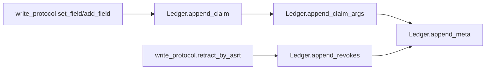
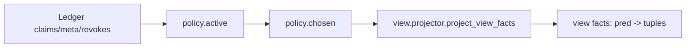
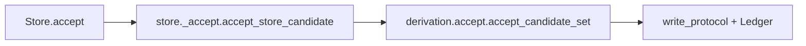

# Core 架构总览（factpy_kernel）

- 适用范围：`src/factpy_kernel/core`
- 最后更新：2026-02-23
- 代码基线：目录重构为 `core/adapters` 后；`Store` 已完成第一阶段拆分；`Ledger` 已完成内存索引优化
- 目标读者：需要理解核心语义、定位代码、继续开发 `core` 的开发者

## 1. 文档边界与定位

本文档只描述 **语义核心层（core）**，不覆盖以下模块的具体实现：

- `src/factpy_kernel/adapters/souffle`（引擎/导出适配）
- `src/factpy_kernel/sdk`（上游 Python 友好封装）
- `src/factpy_kernel/authoring`（DSL/预检/工作流）
- `src/factpy_kernel/audit`（审计查询/UI/DTO）

`core` 的职责是：定义事实表示、Schema 约束、append-only 证据账本、policy/view 语义、规则（Python 路径）求值、候选生成与物化、映射解析等 **可独立演进的语义内核**。

## 2. 当前目录结构（core）

```text
src/factpy_kernel/core/
  __init__.py              # core 公共 API 门面（稳定入口）
  protocol/                # typed tuple / idref / digest 协议
  schema/                  # SchemaIR 校验、规范化、digest
  store/                   # Ledger + Store facade + store 私有实现模块
  evidence/                # append-only 写协议（set/add/retract/replace）
  policy/                  # active/chosen/policy_ir
  view/                    # Python 侧业务视图投影
  rules/                   # where Python 求值 + RuleSpec/RuleRegistry
  derivation/              # CandidateSet + accept 物化
  mapping/                 # mapping 冲突解析与 tie-break
```

## 3. 模块职责总览（建议先读）

| 模块 | 主要职责 | 关键入口 | 主要依赖 |
|---|---|---|---|
| `protocol.tup_v1` | 规范化 typed tuple 编码、claim_arg 还原 | `canonical_bytes_tup_v1`, `claim_args_from_rest_terms` | 无（基础协议） |
| `protocol.idref_v1` | 实体引用（idref）稳定编码 | `encode_idref_v1` | `protocol.digests` |
| `schema.schema_ir` | SchemaIR 校验、canonicalize、digest | `ensure_schema_ir`, `schema_digest` | `protocol.digests` |
| `store.ledger` | append-only 内存账本 + 索引查询 | `append_*`, `find_*`, `rebuild_indexes` | 基础数据类 |
| `evidence.write_protocol` | 写入/撤销/替换协议、幂等 ingest_key | `set_field`, `add_field`, `retract_by_asrt`, `replace_field` | `Ledger`, `protocol.*` |
| `policy.active/chosen` | 活跃性判断、chosen 决策（确定性 tie-break） | `is_active`, `compute_chosen_for_predicate` | `Ledger`, `write_protocol` |
| `view.projector` | 从账本投影业务视图事实（含 temporal current） | `project_view_facts` | `policy`, `Ledger` |
| `rules.where_eval` | where 子集 Python 解释执行 | `evaluate_where` | `view/projector` 产物 |
| `rules.rule_ir` | RuleSpec/RuleRegistry/RuleRef 执行与循环防护 | `run_rule` | `where_eval`, `Store` |
| `derivation.candidates` | 候选集合与 key digest | `CandidateSet`, `make_candidate` | `protocol` |
| `derivation.accept` | 候选接受并物化写入 ledger | `accept_candidate_set` | `Ledger`, `write_protocol` |
| `mapping.canon` | mapping 谓词冲突解析与 tie-break | `resolve_mapping_predicate` | `Ledger`, `policy` |
| `store.api` | `Store` 门面 + engine evaluator 注册点 | `Store`, `register_engine_evaluator` | `store._*` |
| `store._evaluate` | `Store.evaluate` 主流程（Python/engine 调度） | `evaluate_store` | `view`, `where_eval`, `store._builders` |
| `store._accept` | `Store.accept` 主流程 | `accept_store_candidate` | `policy_ir`, `derivation.accept` |
| `store._builders` | 候选构建、record 物化 spec、值 coercion | 多个 helper | `protocol`, `derivation` |
| `store._queries` | explain/conflicts/resolve_mapping | `explain_fact`, `conflicts`, `resolve_mapping` | `policy`, `mapping` |

## 4. 核心数据模型（语义基础）

`Ledger` 维护以下 append-only 数据结构（`src/factpy_kernel/core/store/ledger.py`）：

- `Claim`
  - 一个断言主记录：`asrt_id`, `pred_id`, `e_ref`, `rest_terms`
- `ClaimArg`
  - `Claim` 参数展开后的行式表示（便于投影、导出、审计）
- `MetaRow`
  - 断言/撤销行为相关元数据（`kind` in `str/num/bool/time/json`）
- `Revokes`
  - 撤销关系：`revoker_asrt_id -> revoked_asrt_id`

设计原则：

- **append-only**：新增行，不原地覆盖事实
- **撤销显式化**：通过 `Revokes` 表示失效，而不是修改原 `Claim`
- **元数据伴随事实**：`ingested_at`, `run_id`, `materialize_id` 等通过 `MetaRow` 关联 `asrt_id`
- **可审计**：保留历史与撤销路径，便于解释和重放

## 5. Ledger 当前索引结构（性能相关）

`Ledger` 在保留原始 append-only 列表的同时，维护若干内存索引（派生缓存，不是事实源）：

- `claims` 索引
  - `_claim_by_asrt_id`
  - `_claims_by_pred_id`
  - `_claims_by_e_ref`
  - `_claims_by_pred_e_ref`
- `claim_args` 索引
  - `_claim_args_by_asrt_id`
- `meta` 索引
  - `_meta_by_asrt_id`
  - `_meta_by_key`
  - `_meta_by_kind`
  - `_meta_by_asrt_id_key`
  - `_meta_by_asrt_id_key_kind`
- `revokes` 索引
  - `_revoked_asrt_ids`
  - `_first_revoker_by_revoked_asrt_id`

注意：

- 索引在 `append_*` 时同步维护
- 若测试或调试代码直接修改 `ledger._meta_rows` / `ledger._claims` 等私有列表，必须调用 `ledger.rebuild_indexes()` 重新同步索引

## 6. 核心运行链路（开发时最常看）

### 6.1 写入链路（append-only）



关键点：

- `write_protocol` 负责输入校验、幂等 ingest_key、撤销与替换语义
- `Ledger` 负责存储与索引维护，不负责业务 policy 决策

### 6.2 视图链路（policy + projector）



关键点：

- `functional`：按 `ingested_at` + `asrt_id` 决定 chosen
- `multi`：所有 active 都可见
- `temporal`：支持 `record/current` 两种视图语义（Python 路径）

### 6.3 规则与候选链路（Python 路径）


### 6.4 物化链路（accept）



### 6.5 Engine 链路边界（core 与 adapter 的关系）

`core` 不静态依赖 `adapters`。`Store.evaluate(mode='engine')` 的执行通过注册机制注入：

- `core` 侧：`register_engine_evaluator(...)`（`store/api.py`）
- `adapter` 侧：`adapters/souffle/__init__.py` import 时自动注册 `evaluate_store_engine`

这保证：

- `core` 可以独立导入与测试
- 引擎实现可替换（不仅限于 Souffle）

## 7. Store 结构（当前拆分状态）

`Store` 已从“超大单文件”拆为门面 + 私有实现模块：

- `store/api.py`
  - `Store` 门面
  - `register_engine_evaluator`
  - 少量保留兼容入口（`evaluate_dummy`）
- `store/_evaluate.py`
  - `Store.evaluate(...)` 主流程（Python 分支、mode 分发、record/fact 分支）
- `store/_accept.py`
  - `Store.accept(...)` 逻辑（digest 准备 + 委托）
- `store/_builders.py`
  - `CandidateSet` 构建、record materialize spec、type coercion 等
- `store/_queries.py`
  - `explain_fact/conflicts/resolve_mapping/meta_subset`

维护原则：

- 对外 API 保持在 `Store`
- 复杂实现下沉到 `store/_*.py`
- 私有 helper 可演进，但 `Store` 方法签名尽量稳定

## 8. core 的关键不变量（必须理解）

这些是不应轻易破坏的语义约束：

1. `Store.__init__` 必须校验 `SchemaIR`
   - 当前已在初始化阶段调用 `ensure_schema_ir(...)`
2. `Ledger` 是 append-only 账本
   - 不应引入“直接覆盖 claim/meta/revokes”的写接口
3. `revokes` 表达撤销，`active` 由 policy 决定
   - 不要把“active 状态”写回 claim 本身
4. `chosen` 必须确定性
   - tie-break 使用 `ingested_at` + `asrt_id` 字典序
5. `core` 不静态 import `adapters`
   - engine 行为通过注册机制接入
6. `Ledger` 索引是派生缓存
   - 索引错误可通过 `rebuild_indexes()` 修复，不应成为唯一真相

## 9. 开发者扩展指南（常见改动路径）

### 9.1 新增 `type_domain`

至少检查这些位置：

- `protocol/tup_v1.py`（编码/校验）
- `store/_builders.py`（`coerce_value_for_tag`）
- `adapters/souffle`（导出/编译表示，如果 engine 路径需要）
- 对应测试（Python evaluate、view/export parity）

### 9.2 新增/调整 `cardinality`

至少检查：

- `policy/chosen.py`
- `view/projector.py`
- `schema/schema_ir.py`（校验）
- `adapters/souffle/souffle_view_gen.py`（引擎视图生成）

### 9.3 新增 where 操作符（Python 语义基准）

- `core/rules/where_eval.py` 先定义语义与校验
- 再同步 `adapters/souffle/where_compile.py`
- 增加 parity 测试（Python vs engine）

### 9.4 给 Store 增加新能力

优先放置规则：

- 查询/诊断类：`store/_queries.py`
- 候选/构建类：`store/_builders.py`
- 评估主流程：`store/_evaluate.py`
- 接收/落库主流程：`store/_accept.py`
- `api.py` 只保留门面方法和注册点

## 10. 调试与测试入口（建议）

常用测试文件：

- `src/factpy_kernel/tests/test_core_store_boundary_v1.py`
  - 检查 `core` 不静态 import adapter、engine evaluator 注册行为
- `src/factpy_kernel/tests/test_ledger_indexes_v1.py`
  - 检查 `Ledger` 索引查询语义与 `find_revoker` 首匹配语义
- `src/factpy_kernel/tests/test_view_projector_v1.py`
- `src/factpy_kernel/tests/test_write_protocol_v1.py`

全量回归命令：

```bash
python -m unittest discover -s src/factpy_kernel/tests -p 'test_*.py'
```

性能基准脚本（核心路径）：

```bash
python tools/benchmarks/bench_core_ledger_paths.py --rows 3000 --rounds 3
```

## 11. 已知注意事项（避免踩坑）

- 测试中若直接改 `ledger._meta_rows` 等私有列表，需手动 `ledger.rebuild_indexes()`；否则索引与底层列表不一致
- `Store.evaluate(mode='engine')` 在未导入 adapter 前会报“engine evaluator not registered”
- `core` 的正确性优先于性能；所有索引优化必须保持 append-only 与查询语义不变
