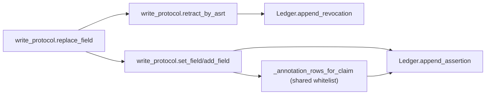
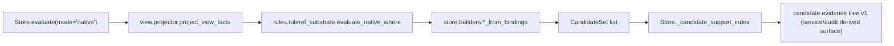
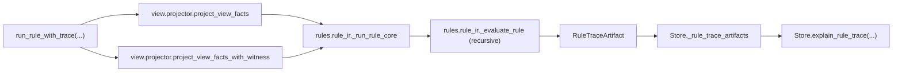
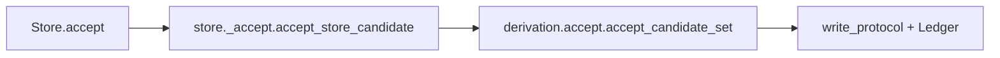

# Core Architecture Overview (kernel)

- Scope: `src/kernel/core`
- Last updated: 2026-05-05
- Code baseline: `Store.evaluate` supports `native|souffle|problog|pyreason`; `Ledger` is a SQLite write-through cache + `annotation_rows` (Annotation Store); `ProjectorAudit` is v2
- Audience: developers who need to understand core semantic boundaries, key entrypoints, and extension points

## 1. Document Boundary

This document describes only the `core` semantic kernel. It does not cover implementation details of:

- `src/kernel/adapters` (engine adapters and export)
- `src/kernel/sdk` (higher-level Python API)
- `src/kernel/authoring` (compile and workflow)
- HTTP/BFF delivery layer (routes and DTOs)

Additional boundary notes:

- `authoring/sdk` currently use the following declaration metadata boundary:
  - schema / derivation: `version / description / tags`
  - rule: `version / description / tags`, plus version-scoped `condition_weights`
- `condition_weights` is certainty/explain projection input, not an
  engine adapter parameter and not `where` execution semantics. Future
  runtime configuration for this lane belongs in
  `SemanticsProfile.certainty_projection`.
- those fields are declaration and management metadata; they do not
  change core `where` evaluation or adapter rule syntax
- core may carry descriptive fields compiled from upper layers, but does not change `evaluate/chosen/accept` behavior because of them

## 2. Current Directory Structure (core)

```text
src/kernel/core/
  __init__.py              # stable core public facade
  protocol/                # typed tuple / digest / idref encoding protocols
  schema/                  # SchemaIR validation and digest
  store/                   # Store facade + ledger + evaluate/query/builders
  evidence/                # append-only write protocol (set/add/retract/replace)
  policy/                  # active/chosen/policy_ir
  view/                    # view projection (facts + display + audit)
  rules/                   # where AST/validator + plain evaluator + shared RuleRef substrate + rule runtime
  derivation/              # CandidateSet generation/accept (including batch accept_many)
  mapping/                 # mapping conflict resolution and decisions
  annotation/              # internal prototype annotation kernel (A/C workload slice)
```

## 3. Module Responsibility Map

| Module | Main Responsibility | Key Entrypoints |
|---|---|---|
| `protocol.tup_v1` | canonical typed tuple encoding and claim argument reconstruction | `canonical_bytes_tup_v1`, `claim_args_from_rest_terms` |
| `protocol.idref_v1` | `idref_v1` encoding | `encode_idref_v1` |
| `schema.schema_ir` | SchemaIR validation, canonicalization, digest | `ensure_schema_ir`, `schema_digest` |
| `store.ledger` | append-only SQLite ledger and in-memory index cache | `append_assertion`, `append_revocation`, `find_*` |
| `evidence.write_protocol` | write/retract/replace and ingest-key idempotency | `set_field`, `add_field`, `retract_by_asrt`, `replace_field` |
| `policy.active/chosen` | active checks and chosen selection | `is_active`, `compute_chosen_for_predicate` |
| `view.projector` | core fact projection and audit statistics | `project_view_facts`, `project_view_facts_with_audit`, `project_display_facts` |
| `rules.where_ast*` | where AST parsing and validation | `parse_where_ir_to_ast`, `validate_where_ast` |
| `rules.where_eval` | where interpreter for the native path | `evaluate_where` |
| `rules.ruleref_substrate` | shared native `RuleRef` execution substrate for `query + derivation` | `evaluate_native_where` |
| `rules.frontier` | native evaluator aggregate frontier trace; reports failed branch locators/counts without changing the normal evaluate surface | `evaluate_native_where_frontier`, `NativeWhereFrontierEvaluation`, `NativeWhereFrontierRow` |
| `rules.rule_ir` | RuleSpec/RuleRegistry/RuleRef execution | `run_rule`, `run_rule_with_trace` |
| `rules._trace` | rule runtime trace carrier, serialization, and summary derivation | `RuleTraceArtifact`, `RuleRunResult`, `rule_trace_artifact_to_dict`, `summarize_rule_trace_artifact_dict` |
| `rules._trace_narrative` | deterministic narrative rendering on top of rule-run summary | `render_rule_run_narrative` |
| `rules._trace_nl` | deterministic NL explain rendering on top of summary+narrative | `render_rule_run_nl_explain` |
| `store._candidate_evidence_tree_summary` | deterministic summary derivation on candidate evidence tree | `summarize_candidate_evidence_tree_dict` |
| `store._candidate_evidence_tree_narrative` | deterministic narrative rendering on candidate tree summary | `render_candidate_evidence_tree_narrative` |
| `store._candidate_evidence_tree_nl` | deterministic NL explain rendering on candidate tree summary+narrative | `render_candidate_evidence_tree_nl_explain` |
| `derivation.candidates` | candidate structure and digest/key computation | `CandidateSet`, `make_candidate` |
| `derivation.accept` | candidate accept and batch accept_many | `accept_candidate_set`, `accept_many_candidate_sets` |
| `mapping.canon` | mapping conflict resolution and tie-break | `resolve_mapping_predicate` |
| `annotation._min_max` | internal prototype min-max path confidence propagation | `derive_min_max_path_confidence` |
| `annotation._evidence` | internal prototype Workload C evidence expansion / provenance reconstruction / max aggregation helpers | `build_direct_evidence_candidates_proto`, `build_max_evidence_provenance`, `apply_max_evidence_aggregation` |
| `annotation._certainty` | internal prototype certainty-lane condition-weight impact derivation + salience ranking | `derive_certainty_summary`, `rank_certainty_conditions`, `RankedCondition` |
| `store._confidence_kind_resolver` | create-time `confidence_kind` routing protocol, certainty resolver, and shared artifact eligibility helper | `RuleSpecReader`, `ConfidenceKindResolver`, `CertaintyConfidenceKindResolver`, `check_certainty_artifact_eligibility` |
| `store._certainty_materializer` | service-neutral certainty materialization (derives certainty_summary dict from pre-resolved condition_weights) | `materialize_certainty_summary`, `extract_single_referenced_support_tree`, `certainty_summary_to_dict` |
| `store._artifact_sidecar` | file-backed durable explain carrier, capture-time retention metadata, and rule-trace TTL GC maintenance | `FileArtifactSidecar`, `GCResult`, `FileArtifactSidecar.gc_rule_trace` |
| `store.runtime` | `Store` facade, engine registration, and default in-process / optional sidecar-backed explain readback / backref lookup | `Store`, `register_engine_evaluator`, `Store.explain_support`, `Store.explain_rule_trace`, `Store.get_candidate_support_digest`, `Store.get_candidate_support_kind`, `Store.get_candidate_confidence_kind`, `Store.list_candidate_ids` |
| `store.evaluation` | public `Store.evaluate` entrypoint | `evaluate_store` |
| `store.queries` | explain/conflicts/resolve_mapping queries | `explain_fact`, `conflicts`, `resolve_mapping` |
| `store.builders` | candidate building, head/entity parsing, value coercion | `candidates_from_bindings`, `entity_candidates_from_bindings` |
| `store.api` | compatibility shim for old import paths | `Store`, `register_engine_evaluator` |

## 4. Core Data Model (Ledger)

`src/kernel/core/store/ledger.py` defines the append-only data structures:

- `Claim`: primary assertion row (`asrt_id`, `pred_id`, `e_ref`, `rest_terms`)
- `ClaimArg`: row-expanded arguments (`idx`, `val_atom`, `tag`)
- `MetaRow`: metadata rows (`kind` in `str/int/float/bool/time/json`) — SDK selection / review mirror
- `AnnotationRow`: assertion-level annotation (`asrt_id`, `namespace`, `category`, `key`, `kind`, `value`, `origin`, `derivation`) — **canonical annotation carrier** (new 2026-03-26)
- `Revokes`: revocation edge (`revoker_asrt_id -> revoked_asrt_id`)
- `AppendResult`: atomic write result (`asrt_id`, `written`)

### 4.1 Four-Layer Data Architecture (updated 2026-03-26)

The Ledger's persistence now corresponds to a four-layer data architecture:

| Layer | SQLite Table | Responsibility |
|-------|-------------|----------------|
| **Claim Store** | `claims` + `claim_args` | The fact itself: pred_id + args |
| **Annotation Store** | `annotation_rows` | All additional semantics: source, engine truth, derived summary, operational status |
| **Legacy Compat** | `meta_rows` | Backward-compatible layer; new data is dual-written to both annotation_rows and meta_rows |
| **Provenance Store** | audit package JSONL | Reasoning process (proof tree / event log) |

`AnnotationRow` is organized by `namespace` + `category`:

- `namespace`: `shared | pyreason | problog | souffle`
- `category`: `source | semantic | derived | operational`
- `origin`: `observed | derived`

`meta_rows` is retained as a selection / review mirror for SDK ergonomics. Canonical semantic consumers should read `annotation_rows`.

### 4.2 Persistence Notes

- SQLite tables are the truth: `claims/claim_args/meta_rows/annotation_rows/revokes/ingest_keys/ledger_meta`
- in-memory indexes are read caches: loaded at startup and maintained after commits
- `annotation_rows` has a `UNIQUE(asrt_id, namespace, category, key)` constraint with upsert semantics
- both `Ledger(path=":memory:")` and `Ledger(path="...")` are supported

## 5. Key Runtime Flows

### 5.1 Write Flow (append-only)



`write_protocol` performs **dual-write**: whitelisted meta keys are projected to both `annotation_rows` (canonical semantic copy) and `meta_rows` (selection / review mirror).

Whitelist (`_SHARED_ANNOTATION_WHITELIST`):
- `shared/source`: `source`, `source_loc`, `trace_id`, `approved_by`, `note`
- `shared/derived`: `confidence` (`origin="derived"`, `derivation` from `meta["confidence_source"]`, fallback `meta:confidence`)
- `shared/semantic`: `raw_kind` (`origin="observed"`) and `bound` (`origin="observed"`) as the canonical raw uncertainty lane

Raw uncertainty notes:

- user-authored raw uncertainty is written as
  `meta={"raw_kind": "probabilistic"|"possibilistic", "bound": [lower, upper]}`
- `raw_kind` and `bound` must be provided together
- `bound` is normalized to a two-element float list and mirrored in
  `meta_rows` for exact `AssertionRecordSet.where(meta=...)` selection
- user-authored `probability`, `bound_lower`, and `bound_upper` meta are
  rejected; those names are reserved for adapter projection / output lanes
- for ProbLog fact export, the current adapter read priority is:
  1. `problog/semantic/probability`
  2. `shared/semantic/probability`
  3. `meta.confidence`
  4. default `1.0`
- `shared/semantic/probability` remains an adapter/internal annotation lane,
  not the user-facing raw uncertainty write contract

Custom meta keys not in the whitelist continue to write only to `meta_rows`. `retract_by_asrt(...)` now dual-writes whitelisted shared meta to annotation_rows, same as `set_field(...)`.

### 5.2 Evaluate Flow

Current `Store.evaluate(...)` modes:

- `native`: core executes `project_view_facts -> ruleref_substrate.evaluate_native_where -> builders`
- `souffle` / `problog` / `pyreason`: delegate to registered engine evaluators
- `python` / `engine`: removed; calls raise `ValueError`

The shared evaluate dispatch also supports call-time `engine_options`:

- only engine paths consume it; shared core only validates `dict | None` and forwards it
- `mode="native"` with non-empty `engine_options` fails explicitly
- supported keys, defaults, and normalization remain adapter-owned

Adapter-specific rule projection is no longer public SDK rule syntax:

- public `Rule` / `Derivation` objects do not carry `engine_ext`
- public authoring and service payloads reject `engine_ext`
- shared core still has an internal `EngineExtBase` bridge for compiled
  plans; it forwards adapter-owned extension objects but does not
  interpret field meanings
- `pyreason` internals currently use `PyReasonRuleExt`
- `problog` internals currently use `ProbLogRuleExt(branch_probabilities=...)`
  - semantics: normalized `where` OR-branch weighting
  - internal compiled `body_confidences` is only a temporary SDK/runtime bridge; public authoring and service payloads reject it
- future `SemanticsProfile.rule_projection` owns the durable public
  rule-projection shape

Native `RuleRef` semantics and current boundary:

- plain `rules.where_eval.evaluate_where(...)` still handles basic where evaluation without a registry; it does not itself promise `RuleRef` support
- `query + derivation` must go through `rules.ruleref_substrate.evaluate_native_where(...)` for native `RuleRef` execution
- when `registry is None` and the where clause contains `ruleref`, the shared substrate fails fast
- when a `registry` is provided, the shared substrate first does `allow_ruleref=True` AST validation, then performs target lookup, `expose=True` gate, arity checks, cycle guard, and per-evaluation memo, before rewriting direct `RuleRef` atoms into internal overlay predicates and delegating to plain `evaluate_where(...)`

Current native evaluator frontier trace boundary:

- `rules.frontier.evaluate_native_where_frontier(...)` is a separate entrypoint with a signature that mirrors `evaluate_native_where(...)`, but returns `NativeWhereFrontierEvaluation`
- `bindings` / `rule_refs` / `rule_ref_resolutions` keep success parity with `evaluate_native_where(...)`
- `frontier_rows` are sparse aggregate rows: at most one row per failed normalized OR branch, carrying `branch_index`, `failed_atom_index`, `atoms_satisfied`, `frontier_count`, and `failure_kind`
- frontier rows do not expose env dicts, candidate payloads, support artifacts, provenance envelopes, or arbitrary `details`
- RuleRef preflight/rewrite/overlay still uses the existing substrate first; frontier is computed on the rewritten parent native body, and failed child-rule internals are not exposed by the current contract
- this entrypoint is native-only core rules substrate; Souffle / ProbLog / PyReason adapters and application capabilities do not automatically opt in

Evaluate now also records a lightweight candidate explain backref after candidate construction:

- `candidate_id -> (support_digest, support_kind)`
- `candidate_id -> confidence_kind`
- native candidates write `support_kind="native_binding_v1"` and can continue to `Store.explain_support(...)`
- Souffle first-round partial witness now writes `support_kind="souffle_witness_v1"`:
  - the carrier continues to reuse `SupportArtifact`
  - currently only promises the native subset:
    - `binding`
    - `pred_witnesses`
    - minimal `non_fact_steps`
    - `rule_ref_edges=[]`
  - witnesses are produced through adapter-level Datalog rewriting, not the official Soufflé provenance proof tree
  - when the same final binding has witness rows across multiple OR branches, the adapter uses `source-order wins`
- PyReason engine candidates write `support_kind="pyreason_provenance_v1"` with a `ProvenanceEnvelope` carrier containing the full event trace
- ProbLog engine candidates write `support_kind="problog_provenance_v1"` with a `ProvenanceEnvelope` carrier containing the parsed `--trace` proof tree
- `ProvenanceEnvelope` is stored in `Store._provenance_envelopes` registry (session-scoped, not durably persisted to sidecar)
- service `explain_ref(kind="candidate")` dispatches: native/Souffle → `explain_support()`, engine provenance → `explain_provenance()` returning the envelope
- legacy `engine_no_witness_v1` remains as fallback for candidates without a provenance carrier
- `CandidateSet` retains the narrow `confidence: float | None` field and adds an additive `confidence_kind` value-semantics tag:
  - `none`
  - `probability`
  - `certainty`
  - deterministic Souffle paths currently write `confidence_kind="none"`
  - the native path still defaults to `none`, but runtime native derivation may now write `certainty` at candidate creation time through a `ConfidenceKindResolver`
    - the current v1 resolver only covers the single resolved child-rule edge + non-empty `condition_weights` case
    - `condition_weights` is treated here as certainty/explain
      projection input, not as engine adapter semantics
    - SDK parity is currently deferred; paths without an injected resolver continue to stay `none`
  - ProbLog writes `confidence_kind="probability"` when setting `candidate.confidence`
  - `confidence_kind` does not enter `candidate_key` / `candidate_id` / `support_digest` computation, nor does it change evaluate / accept / chosen behavior
- `Store.get_candidate_support_digest(candidate_id)`, `Store.get_candidate_support_kind(candidate_id)`, and `Store.get_candidate_confidence_kind(candidate_id)` all recover only the first hop inside the current `Store` instance
- when `Store(..., artifact_sidecar=...)` is configured, only the native `support_digest -> SupportArtifact` second hop can be re-read from later `Store` instances sharing the same sidecar root
- on this foundation, service/audit can now assemble the candidate explain into a `candidate_evidence_tree`:
  - entrypoint is still `candidate_id`
  - native proof substrate remains the existing `SupportArtifact`
  - the current tree uses a sectioned shape:
    - `candidate_result`
    - `support_section`
    - optional `rule_ref_section`
    - `predicate_witness_group` / `non_fact_check` / `assertion_fact` / `rule_ref` / `degraded_support`
    - recursive child layer:
      - `referenced_support`
      - `unresolved_support`
      - `recursion_boundary`
  - this remains a candidate-first consumer surface, not full engine parity, graph UI, or a deeper provenance contract
  - `node_kind` is the carrier-level provenance-role taxonomy (frozen contract):
    - **structural**: `candidate_result`, `support_section`, `rule_ref_section` — pure structural containers, no source semantics
    - **witness**: `predicate_witness_group`, `assertion_fact` — directly witness facts in the ledger
    - **constraint**: `non_fact_check` — non-fact constraint checks (eq/ne/gt/not/ruleref/...)
    - **rule_chain**: `rule_ref`, `referenced_support` — rule references and recursive proof expansion
    - **terminal**: `unresolved_support`, `recursion_boundary` — traversal stop or evidence unavailable
    - **degraded**: `degraded_support` — engine path with no witness artifact
  - first-round does not add `source_kind` / `provenance_kind` fields; `node_kind` itself serves as the provenance-role carrier
  - deeper assertion-origin taxonomy (direct write / derivation accept / import) is deferred; if needed, it would be extended on `assertion_fact` nodes in the future
  - native `SupportArtifact` now retains both:
    - legacy `rule_refs` summary
    - structured `rule_ref_edges`
  - `rule_ref_edges` records per-occurrence child proof edges by `ruleref_atom_key`, carrying:
    - `rule_ref_id`
    - `rule_ref_version`
    - `child_support_digest | unresolved_reason`
  - child support continues to reuse the existing `support_digest -> SupportArtifact` readback; internal child row proof is expressed through native support artifacts with `root_result_kind="row"`
  - native support capture now performs winning-branch narrowing at artifact generation time:
    - `pred_witnesses`
    - `non_fact_steps`
    - `rule_ref_edges`
    only retain the adopted branch's proof body
  - when multiple branches satisfy the same final binding, `source-order wins` is applied
  - selected branch identity remains recoverable through the existing `b{branch}.a{atom}:...` key namespace; no new top-level branch field is added
  - native candidate proof tree unresolved / boundary taxonomy is now frozen as an official contract:
    - `unresolved_support`
      - `child_support_unavailable`
        - capture / substrate-owned
      - `artifact_missing`
        - support lookup / readback-owned
    - `recursion_boundary`
      - `cycle`
      - `depth_limit`
        - both are traversal-owned boundary reasons
  - runtime / audit / static continue to share the same raw terminal reason enum; no consumer-specific translation layer is introduced
  - the richer taxonomy applies only to the structured `rule_ref_edges` path; old artifacts with only legacy `rule_refs` fall back to flat `rule_ref` nodes and do not enter the recursive terminal taxonomy
  - engine degraded candidates now also have a legitimate tree surface:
    - the top-level envelope is still `candidate_evidence_tree`
    - first-round shape is fixed to:
      - `candidate_result`
      - `support_section`
      - `degraded_support`
    - `degraded_support` minimum fields:
      - `support_kind`
      - `witness_status="degraded"`
      - `children=[]`
    - `degraded_support` does not reuse `unresolved_support` / `recursion_boundary`
    - the node itself does not expose `support_digest`; the current zero digest remains a top-level compatibility placeholder only
    - legacy `"none"` and `engine_no_witness_v1` are isomorphic on the tree surface
  - runtime currently treats `{"native_binding_v1", "souffle_witness_v1"}` as witness-bearing candidate support kinds:
    - `Store.explain_support(...)` can directly replay flat support
    - `candidate_evidence_tree` can continue to reuse the existing native tree builder
    - audit/static for `souffle_witness_v1` remains deferred; offline consumption is not promised in this round
  - on top of the raw tree, candidate explain now has deterministic derived layers:
    - `candidate_evidence_tree_summary`
      - derived purely from the raw tree by `store._candidate_evidence_tree_summary`
      - first-round is a provenance-role-first 12-field core set:
        - `candidate_id`
        - `support_kind`
        - `is_degraded`
        - `root_result_kind`
        - `node_count_by_role`
        - `witness_assertion_count`
        - `rule_ref_count`
        - `recursive_depth`
        - `has_unresolved`
        - `has_boundary`
        - `unresolved_reasons`
        - `boundary_reasons`
    - `candidate_evidence_tree_narrative`
      - derived purely from summary by `store._candidate_evidence_tree_narrative`; runtime certainty lane may optionally attach an additive certainty section
      - base shape:
        - `headline`
        - `overview_lines`
        - `evidence_lines`
        - `rule_chain_lines`
        - `terminal_lines`
        - `drilldown_lines`
      - runtime first-round also allows an optional `certainty_lines` section
    - `candidate_evidence_tree_nl_explain`
      - derived purely from summary + narrative by `store._candidate_evidence_tree_nl`
      - base shape:
        - `headline`
        - `paragraphs`
      - when the runtime candidate narrative includes `certainty_lines`, the NL layer appends a 5th certainty paragraph
    - service runtime `explain-summary(kind="candidate")` may also attach a response-level `certainty_summary`:
      - not part of the core 12-field summary set
      - only attempted when `Store.get_candidate_confidence_kind(candidate_id) == "certainty"`
      - runtime native derivation now performs certainty routing at candidate creation time; this no longer depends on test/caller patching
      - currently only consumes the single structured `rule_ref_edge` pointing to the unique `referenced_support` subtree
      - `condition_weights` are looked up by the service through `support.rule_ref_edges -> registry rule payload`
      - they are certainty/explain projection input and do not enter
        `where`, `where_ast`, evaluator IR, ProbLog rule syntax, or
        PyReason rule syntax
      - multi-rule, nested referenced_support, unresolved child support, or missing registry chain all degrade gracefully to `null`
      - runtime `explain-narrative(kind="candidate")` and `explain-nl(kind="candidate")` now reuse the same certainty derivation helper:
        - narrative only attaches `certainty_lines` when certainty is derivable
        - NL only appends a certainty paragraph when narrative contains `certainty_lines`
      - audit / static also consume the same certainty delivery:
        - `export_package` pre-computes at export time via `materialize_certainty_summary`, writes `certainty_summaries.jsonl`
        - `AuditQuery.get_candidate_evidence_tree_narrative` passes materialized certainty_summary, producing narrative with `certainty_lines`
        - static site candidate evidence page renders a certainty section
        - `condition_weights` only exist on registry filesystem; offline audit does not perform query-time computation
    - **Known gap — fact-level confidence carrier**:
      - `write_protocol.py` already supports `meta={"confidence": 0.9}` write; value stored in ledger `meta_rows` table
      - however `_runtime_assertion_detail_for_tree()` reads assertions but **skips all meta**
      - as a result `assertion_fact` and `predicate_witness_group` nodes carry no confidence
      - `_condition_confidence(node)` always returns `None`; impact degrades to `weight × 1.0`
      - fix path: assertion detail → tree node → condition_confidence — three wiring points
      - does not affect computation model (`derive_certainty_summary` already correctly consumes the confidence field)
      - does not affect future chain/recursive propagation enablement (orthogonal concern)
  - these three layers follow the same 4-layer explain pattern as `rule_run`:
    - raw tree
    - summary
    - narrative
    - NL explain
  - delivery matrix remains narrowed:
    - runtime: summary + narrative + NL
    - audit: summary + narrative
    - static: narrative block
    - audit/static first-round does not deliver a separate candidate NL DTO



### 5.3 Rule Runtime Flow

`run_rule(...)` and `Store.evaluate(...)` are separate execution paths:

- `run_rule(...)`: keeps the legacy `list[tuple]` contract
- `run_rule_with_trace(...)`: captures a `RuleTraceArtifact` without breaking old callers
- `Store.explain_rule_trace(rule_run_id)`: by default dereferences the captured trace in-process; with `artifact_sidecar` configured it can also read back from later `Store` instances sharing the same sidecar root

Current trace semantics:

- both `original_where` and `rewritten_where` are retained
- `RuleRef` relationships are captured per call site and explicitly marked with `memo_hit`
- `ruleref_links` explicitly connect each `ruleref` atom in `where` to the child invocation that actually occurred; on memo hits the link points to the memo-hit invocation, and clients can then follow `memo_source_invocation_id` to the primary invocation
- `non_fact_steps.status` now writes `negated` for `not` and `evaluated` for other non-`pred` steps
- `original_where`, `rewritten_where`, and `non_fact_steps.details.atom` remain opaque payloads; the typed contract only promises their surrounding fields
- `T1` temporal checks do not add new trace-carrier fields: fact-backed temporal anchors still surface through `pred_witnesses`, and scalar comparison bindings stay in `non_fact_steps.details.binding`
- Scenario A threshold-bearing uncertainty checks follow the same rule: measurement/threshold assertions surface through `pred_witnesses`, and scalar comparison bindings stay in `non_fact_steps.details.binding`
- deterministic NL explain sits on top of summary/narrative and only consumes those two structured DTOs; it does not read the raw trace payload directly
- `RuleTraceArtifact` remains separate from derivation `SupportArtifact`
- `rule_run_summary`'s deterministic narrative is solely owned by `rules._trace_narrative`; the presentation layer should not duplicate narrative templates



### 5.4 Accept Flow



Additional note: `Store.accept_many(...)` goes through `accept_many_candidate_sets(...)` and supports:

- `mode='atomic'`: failure rolls back the batch by revoking written assertions
- `mode='best_effort'`: local failures do not block unrelated items
- dependency topological ordering and cycle detection (`CANDIDATE_DEPENDENCY_CYCLE`)

## 6. View and Policy Semantics (current)

### 6.1 chosen rules

- `cardinality='single'`: choose one assertion per key group
- `cardinality='multi'`: keep all active assertions
- `single` tie-break: descending `ingested_at`, then lexical `asrt_id`

### 6.2 ProjectorAudit (v2)

`project_view_facts_with_audit(...)` returns `(facts, ProjectorAudit)` with the current shape:

- `contract_version` (fixed to `2`)
- `predicate_count`
- `active_claim_count`
- `selected_claim_count`
- `selected_by_pred`
- `dropped_by_policy_count`

Note: current core projection APIs no longer expose `temporal_view` or `legacy_record_visibility`.

### 6.3 Declaration Metadata Boundary

When integrating with `authoring/sdk`, distinguish between two different kinds of "meta":

- assertion write metadata: stored via `MetaRow`, participates in write/audit/temporal paths
- declaration metadata: `version / description / tags`, plus rule-asset `condition_weights`, on schema/rule/derivation assets

`condition_weights` is the special case in this boundary: it is retained
as certainty/explain projection input and consumed by the certainty
summary chain, but it remains outside `where` semantics and engine
adapter rule syntax. Track 3 / B will move runtime configuration for
this lane to `SemanticsProfile.certainty_projection`.

Under the current contract, declaration metadata does not participate in:

- where validation
- chosen/policy decisions
- candidate generation
- accept/accept_many write semantics

## 7. Rule Validation Gate (where AST / RuleRef substrate)

Before execution, plain `rules.where_eval.evaluate_where(...)` attempts:

- `parse_where_ir_to_ast(...)`
- `validate_where_ast(..., mode='python', capabilities={'allow_ruleref': False})`

Additional boundary notes:

- this plain evaluator is still not the official entrypoint for `RuleRef`
- `query + derivation` native `RuleRef` paths must go through `rules.ruleref_substrate.evaluate_native_where(...)`
- the shared substrate will:
  - fail fast when `registry is None` and `ruleref` atoms are present
  - when a `registry` is provided, first do `allow_ruleref=True` AST validation
  - perform target lookup, `expose=True` gate, arity checks via shared helpers
  - execute recursion/cycle guard and per-evaluation memo in the current first-round
  - then delegate to plain `evaluate_where(...)` for the rewritten where clause

Environment variable:

- `FACTPY_WHERE_AST_VALIDATE=0|false|False|off|OFF` disables the gate
- default is enabled

## 8. Store and Adapter Boundary

`core` does not statically depend on `adapters`. Engines are attached through registration:

- register: `register_engine_evaluator(evaluator, name)`
- lookup: `get_engine_evaluator(name)`
- run: `Store.evaluate(mode='souffle'|'problog'|'pyreason')`

Current adapter-side behavior:

- importing `kernel.adapters.souffle` registers `souffle`
- importing `kernel.adapters.problog` registers `problog`
- importing `kernel.adapters.pyreason` registers `pyreason`

Additional notes:

- `Store` now maintains three separate in-process explain registries:
  - `_support_artifacts`: derivation-native support capture
  - `_provenance_envelopes`: engine-native candidate provenance envelope
  - `_rule_trace_artifacts`: rule runtime trace produced by `run_rule_with_trace(...)`
- `Store` also maintains a session-scoped candidate explain backref index:
  - `_candidate_support_index`: `candidate_id -> support_digest`
  - `_candidate_support_kind_index`: `candidate_id -> support_kind`
  - this index does not go to sidecar; both native and engine-degraded candidate explain rely on this first hop
- the three registries currently coexist only at the readback protocol layer and do not share underlying carriers:
  - native / Souffle witness → `SupportArtifact`
  - engine provenance → `ProvenanceEnvelope`
  - rule runtime trace → `RuleTraceArtifact`
- when `artifact_sidecar` is configured, lookup misses on durably-readable registries rehydrate from the sidecar into the in-memory dicts; without it, the behavior remains purely in-process.
- only `SupportArtifact` / `RuleTraceArtifact` go to the sidecar; `ProvenanceEnvelope` remains a session-scoped in-process registry.
- `FileArtifactSidecar` now writes sidecar-adjacent `.meta.json` files on first durable write:
  - `support/sha256/<hex>.meta.json`
  - `rule_trace/<rule_run_id>.meta.json`
- the first metadata slice carries only `captured_at_ns` and does not change artifact payload canonical bytes.
- the only maintenance surface in this slice is `FileArtifactSidecar.gc_rule_trace(ttl_ns, dry_run=False)`:
  - it applies age-only TTL GC only to `RuleTraceArtifact`
  - `SupportArtifact` remains write-and-retain
  - payload orphans are reported and skipped, while metadata orphans may be cleaned up

## 8.1 Annotation Prototype Boundary

`src/kernel/core/annotation/` is currently an internal / prototype module.

**Certainty v1 is frozen** (see `annotation/docs/README.md` §5 for full contract):

- `derive_certainty_summary(..., aggregation="bottleneck"|"additive")`
- `rank_certainty_conditions(...)`
- `CertaintyConfidenceKindResolver` create-time routing
- evidence tree carrier: `assertion_fact.confidence` + `predicate_witness_group.condition_confidence`
- delivery chain: runtime summary/narrative/NL (dual strategy) → audit/static (bottleneck only)

**Certainty semantic changes are contract changes and require a blueprint.** Only bug fixes, performance work, and docs clarifications are accepted without a blueprint.

Other annotation capabilities (`_min_max.py`, `_evidence.py`) remain in prototype status:

- first-round only covers the benchmark-validated `Workload A + C` annotation capabilities
- does not expand the stable interfaces of `CandidateSet`, SDK, or service
- external benchmark/reference harnesses continue to serve as the oracle; `core/annotation/*` remains an independent prototype implementation

## 9. Invariants That Must Hold

1. `Store.__init__` must call `ensure_schema_ir(...)`
2. `Ledger` must remain append-only (revocation is expressed through `revokes`)
3. `chosen` decisions must be deterministic
4. `core` must not statically import `adapters`
5. SQLite tables are the truth; in-memory indexes are caches
6. `ClaimArg` indexes must remain contiguous because projection and policy depend on that

## 10. Current Compatibility Surface

- `store/api.py`: compatibility for old import paths only
- `Store.evaluate_dummy(...)`: deprecated, kept only for historical compatibility
- `store/_evaluate.py`, `store/_queries.py`, `store/_builders.py`, `store/_accept.py`: implementation modules behind public entrypoints
