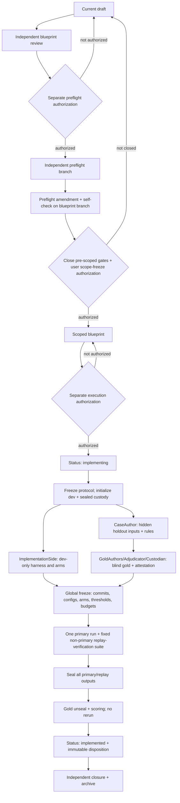

# Task Blueprint: Meander CaseBundle F-GATE 离线可行性验证

- Status: draft
- Created: 2026-08-11
- Last Updated: 2026-08-11
- Authority: task blueprint；本 `draft` 只记录一个待收口的实验切片，不授权建案例、写 harness、运行 holdout、使用凭据、修改产品代码或进入下一状态。只有在独立 preflight、preflight amendment 与 self-check 完成、未决门关闭、用户另行授权 `draft → scoped`，且用户随后再授权执行后，才可消费 Q1 允许的唯一一次 `F-GATE` envelope。
- Inputs:
  - Adopted Q1 decision [`2026-08-11_q1-offline-feasibility-before-external-validation-decision.md`](../../design/decisions/active/2026-08-11_q1-offline-feasibility-before-external-validation-decision.md)，commit `5a37f9470f927bfdf8ee530740995d2c4d70bba7`，文件 SHA-256 `47e48838664328072dd6bda223832286fedc905a2c95283fa66b7a5f204fceec`
  - Review candidate [`meander-factgraph-unified-design-review-candidate-v0-1-1.zh.md`](../../design/design-points/active/meander-factgraph-unified-design-review-candidate-v0-1-1.zh.md)；只作被挑战的设计背景，不是 shipped contract
  - Adversarial disposition [`meander-factgraph-unified-design-adversarial-review-disposition.zh.md`](../../design/design-points/active/meander-factgraph-unified-design-adversarial-review-disposition.zh.md)；只作 finding 索引，不自动授权实施
  - Pinned local repository: `hnsm-backend@5a37f9470f927bfdf8ee530740995d2c4d70bba7`，FactGraph package `0.2.0rc1`
  - 2026-08-11 user authorization to execute the next stage；在执行前的公开边界说明中，该阶段被限定为起草 blueprint pair、独立审阅与目标文件限定提交；未授权 case construction、preflight、experiment execution 或状态推进
- Outputs / Downstream:
  - Paired audit log [`2026-08-11_meander-case-bundle-feasibility.audit.md`](./2026-08-11_meander-case-bundle-feasibility.audit.md)
  - If separately authorized: one independent preflight on its canonical branch, followed by blueprint amendment and self-check before any `scoped` anchor
  - If separately authorized after `scoped`: one disposable benchmark package, one sealed-holdout run batch, one immutable result/report lineage, and this blueprint's completed outcome/audit
  - No production API, service, Agent integration, Translator, UI, customer connector, or automatic successor slice
- Related:
  - [`workflow/blueprints/README.md`](../README.md) — blueprint lifecycle and paired-audit governance
  - [`workflow/CADENCE.md`](../../CADENCE.md) — decision, blueprint, preflight, execution, and archive transitions
  - [`workflow/working/README.md`](../../working/README.md) — scratch artifacts are ephemeral and non-authoritative
  - [`tools/benchmarks/README.md`](../../../tools/benchmarks/README.md) — current tracked benchmark convention
  - [`src/factgraph/application/docs/rule.md`](../../../src/factgraph/application/docs/rule.md) and [`src/factgraph/application/protocol/docs/README.md`](../../../src/factgraph/application/protocol/docs/README.md) — current Rule/RuleExpr/EvaluateResult/Explain truth
- Branch: `v0.3.0-blueprint-meander-case-bundle-feasibility-2026-08-11`
- Related Modules:
  - Proposed benchmark-only home: `tools/benchmarks/meander_f_gate/`
  - Proposed sanitized fixture/gold homes: `tools/benchmarks/fixtures/meander_f_gate_cb0/` and `tools/benchmarks/golden/meander_f_gate_cb0/`
  - Proposed contract tests: `tools/benchmarks/tests/test_meander_f_gate_*.py`
  - Scratch only during a later authorized execution: `workflow/working/meander-case-feasibility/`
  - Production source explicitly excluded: `src/factgraph/**` and the separate Meander repository
- Audit Log:
  - [`2026-08-11_meander-case-bundle-feasibility.audit.md`](./2026-08-11_meander-case-bundle-feasibility.audit.md)

> **Product-state guard:** architecture remains `REVISE`; product authorization remains `STOP-except-discovery`; `P-GATE` remains open. An offline result cannot prove a buyer, budget, lawful customer-data path, reviewer value, product wedge, production safety, or market demand.

## 1. Problem

The unified design currently rests on several unverified links: a source-bound proposition must become a valid deterministic query; the engine must distinguish support, contradiction, conflict, insufficient evidence, and invalid coverage; evidence must point to the right retained source; and a historical run must be replayable without silently reading current state. Testing those links together with Agent Plan generation, Translator fidelity, a product API, and UI would create an uninterpretable failure surface.

Q1 therefore permits exactly one bounded offline experiment before external product validation. This blueprint turns that permission into a falsifiable task shape while preserving four separations:

1. current shipped FactGraph substrate versus proposed Meander/Policy/Plan contracts;
2. deterministic semantic feasibility versus Translator or Agent fidelity;
3. integrity/locator conformance versus source truth, authority, freshness, or business materiality;
4. corpus-local mechanism evidence versus reviewer and market value.

The immediate question is not “can we build the whole product?” It is:

> Given human-authored, source-bound, structured facts, a frozen proposition, and a frozen rule program, can pinned FactGraph plus a mechanical disposable adapter produce the declared logic result and evidence, expose every gap, complete four replay subcontracts, and provide a corpus-local inspectability/replay increment over fair deterministic baselines without the adapter secretly implementing the business reasoning?

## 2. Goals

1. Define and freeze a benchmark-only `CaseBundle v0` protocol. It is deliberately not a preview implementation of future production `CaseBundle`, `SourceRecord`, `ClaimSet`, `Policy`, `Plan`, `Scenario`, or `Run` APIs.
2. Build, only after later authorization, one sparse coverage corpus with a development split and an untouched sealed holdout; preserve corpus lineage, source bindings, gold disagreements, and machine-readable coverage.
3. Compare a pinned FactGraph `RuleProgram` arm with a source-only control and a semantically equivalent direct-reference evaluator under one parity contract.
4. Attribute every output field to FactGraph native behavior, the benchmark adapter, the common scorer, or human gold; reject conclusions manufactured by the wrapper.
5. Test four replay subcontracts independently: deterministic re-execution, artifact reconstruction, mutation isolation, and unavailable-source behavior.
6. Produce immutable per-case data and separate `PASS / PARTIAL / FAIL / UNRESOLVED` verdicts for deterministic feasibility, logical conformance, source/locator integrity, replay, corpus-local baseline increment, and every deliberately untested dimension.
7. End the one-time envelope after one globally frozen holdout run batch (one primary scored invocation plus only the fixed non-primary replay-verification operations); do not auto-authorize repair, a second holdout, product implementation, or `P-GATE` closure.

## 3. Non-goals

- No Agent, Agent Plan, Translator, MCP, L0–L3 participation, callback, inline repair, Decide/Action Middleware, or product UI.
- No production `Policy`, `Scenario`, `Run`, `SourceRecord`, `ClaimSet`, `ValidationRequest`, or public SDK/API contract.
- No changes to `src/factgraph/**`, the Meander repository, production dependency graphs, runtime services, live connectors, or deployment surfaces.
- No customer, private, regulated, licensed-without-permission, or otherwise sensitive source data.
- No claim about market frequency, production error rate, reviewer time/value, buyer, budget, lawful customer access, pilot readiness, or willingness to pay.
- No statistical confidence interval or production safety-rate inference from 32 deliberately selected instances.
- No requirement that FactGraph beat a semantically equivalent reference evaluator on logic accuracy. A difference there first indicates a parity or reference defect.
- No forced accuracy comparison between a source-only artifact and an automated verdict arm.
- No use of the holdout after unseal to repair code, tune thresholds, add an arm, or claim a second result within this envelope.
- No extension of the experiment merely because a result is `PARTIAL`, `FAIL`, or `UNRESOLVED`.

## 4. Current Context

### 4.1 Binding Q1 boundary

The adopted Q1 decision locks these constraints:

- `F-GATE` and `P-GATE` are independent; external outreach no longer blocks this offline experiment, but all product evidence remains open.
- The allowed envelope is non-transferable, non-renewable, numerically capped, and contains one taxonomy/corpus lineage, one disposable harness, frozen baselines, one final holdout evaluation, and one report/audit lineage.
- Development and holdout, implementation and gold, credential and data-egress authorization, digest and reconstructability, and technical and product verdicts must not be collapsed.
- Translator, Agent Plan, and product UI are excluded from the initial deterministic chain.
- A false `SUPPORTED`, silent coverage gap, source mismatch, or replay fallback cannot be averaged away.

This blueprint narrows those constraints into `F-GATE-CB0`; it does not relax them.

### 4.2 Pinned shipped substrate and attribution limits

The following matrix is an implementation-planning input, not a claim that the target product exists:

| Surface at `hnsm-backend@5a37f947...` | State | Evidence | Permitted use in this experiment | Forbidden inference |
| --- | --- | --- | --- | --- |
| `RuleProgram`, named clauses, program facts | `SHIPPED REUSABLE` | non-persistent scope `src/factgraph/sdk/rule_program.py:1-7`; DTOs `:30-97`; public exports `src/factgraph/sdk/__init__.py:32-40/:139-145` | Frozen selected rule program without persisting rules | “Policy v0 is implemented” |
| Closed `RuleProgramGoal` | `SHIPPED REUSABLE` | `src/factgraph/sdk/rule_program.py:100-125` | Mechanical evaluation of a closed positive or refuting goal | Arbitrary Agent query/Plan support |
| Per-evaluation premise scope | `SHIPPED REUSABLE` | `src/factgraph/sdk/rule_program.py:128-155` | Isolate declared premise filters without mutating runtime-global policy | Full proposed Scenario/what-if semantics |
| Read-only native program evaluation | `SHIPPED REUSABLE` | `src/factgraph/sdk/rule_program_runtime.py:65-87`; public dispatch `src/factgraph/sdk/store.py:1500-1529` | Deterministic FactGraph arm; `engine="native"` only | Cross-engine parity or production service readiness |
| Rule/view/scope/support digests and captured explanation | `SHIPPED REUSABLE WITH SHAPE LIMIT`; `SHAPE CONFLICT` for portable clean rebuild | result fields `src/factgraph/sdk/rule_program.py:189-244`; runtime assembly `src/factgraph/sdk/rule_program_runtime.py:168-249`; later-ledger-mutation capture test `tests/sdk/test_rule_program_evaluate.py:201-210`; scope hash uses `repr` at runtime `:481-487`; view identity includes DB/transaction/assertion identity at `:490-529` | Exact comparison only when reopening the same retained workspace; native values are observed fields in portable reconstruction | Cross-process/hash-seed stability or a complete replay API |
| Original assertion support in recursive evidence | `SHIPPED REUSABLE` | support construction `src/factgraph/sdk/rule_program_runtime.py:569-705`; assertion-to-source/evidence projection `:803-819`; tests `tests/sdk/test_rule_program_evaluate.py:101-312` | Attribute a derived result to native assertion IDs within one captured workspace | Complete external `SourceRecord + locator` recovery |
| Durable workspace reopen/integrity checks | `SHIPPED REUSABLE` | workspace methods `src/factgraph/sdk/store.py:1831-1954`, reopen body `:1930-1979`; history/integrity `src/factgraph/core/store/database.py:2261-2382` | Substrate for exact-artifact reopen and fail-closed checks | Portable reconstruction preserving DB/assertion-bound identities |
| Generic `EvaluateResult` fingerprint | `SHAPE CONFLICT` for cross-run equality | digest fields `src/factgraph/application/protocol/evaluate_result.py:116-135/:358-404/:579-626`; ID propagation `src/factgraph/sdk/store.py:3264-3355`; fixed-input digest/ID-shape tests `tests/application/protocol/test_evaluate_result_digests.py:31-84` | May inform normalized fields | Whole generic fingerprint can be compared unchanged across runs |
| Complete external source record/locator | `ABSENT` for this target contract | current `factgraph.application.explain.Source`, used by `EvidenceGraph`, is narrower at `src/factgraph/application/explain/evidence_tree.py:32-47` | Mechanical benchmark mapping may bridge assertion ID to retained fixture locator | Native FactGraph source-registry capability |
| Target Policy/Plan/Translator/Agent/UI contracts | `DEFERRED / OUT OF SCOPE` | no pinned shipped contract is relied upon | None | Any target product capability |

The experiment must use `RuleProgram` as a substrate, not rename it to “Policy” or present it as the target Policy implementation. `RuleProgramResult.evaluated_at` is excluded from deterministic equality. If generic `EvaluateResult` appears in a baseline, random `run_id`, `result_id`, and derived row IDs must be excluded or normalized according to the frozen comparator.

### 4.3 Capability attribution table to freeze at preflight

| Output responsibility | FactGraph native | Benchmark adapter | Common scorer | Gold side |
| --- | --- | --- | --- | --- |
| Business verdict derivation | Must be the principal implementation in `A-FACTGRAPH` | Marshaling and fixed status mapping only | No | No |
| Reference business verdict | No | `A-REFERENCE` owns its independent direct implementation | No | No |
| Source artifact byte/digest/locator validation | Assertion support only | May perform mechanical integrity lookup | Scores exactness | Supplies expected binding |
| Derivation/evidence trace | Native support/evidence | Canonical serialization only | Scores declared fields | Supplies expected facts/edges |
| Replay manifest/lineage | Digests and retained workspace where available | Wraps every required experiment input and run | Verifies readability/equality | No |
| Coverage or ambiguity label | No | Must not infer hidden gold | Scores emitted explicit state | Supplies label/adjudication |

If the adapter evaluates business conditions, resolves conflicts, infers coverage, repairs a result, or fabricates provenance, the FactGraph increment dimension is `FAIL` or `UNRESOLVED`. The work may still reveal a reusable wrapper, but it cannot be reported as FactGraph mechanism evidence.

### 4.4 Adoption-review carry-forward identity gate

The 2026-08-11 user adoption turn `019ff082-3edb-78f2-b045-ee89db181deb`, item `item-1051`, states that **three non-blocking review items** become mandatory future-blueprint obligations, but that message references rather than enumerates them; their exact upstream review source and text are not available in the currently recoverable chain. This draft records the gap rather than inventing content:

| ID | Exact source | Exact obligation | Blueprint mapping | Closure |
| --- | --- | --- | --- | --- |
| `OBL-REVIEW-01` | user turn `019ff082-3edb-78f2-b045-ee89db181deb`, item `item-1051`, 2026-08-11；exact upstream item unavailable | `UNRESOLVED — do not infer` | `UNRESOLVED` | Original wording, upstream source identity, and clause mapping required before `scoped` |
| `OBL-REVIEW-02` | same adoption reference；exact upstream item unavailable | `UNRESOLVED — do not infer` | `UNRESOLVED` | Same |
| `OBL-REVIEW-03` | same adoption reference；exact upstream item unavailable | `UNRESOLVED — do not infer` | `UNRESOLVED` | Same |

The Q1 §7.2/§8 obligations are independently binding. They may overlap the missing three, but they must not be substituted for them without provenance.

### 4.5 Draft-time environment observation

Static audit and an independent read-only probe found the `RuleProgram` substrate suitable for a disposable harness. Environment behavior is not interchangeable:

- `/Users/zhenzhili/miniforge3/bin/python` 3.10.11 with pytest 9.0.2 exits `139` without output on the focused suite;
- `/Users/zhenzhili/miniforge3/envs/factpy/bin/python` 3.10.20 with pytest 9.0.2 passes the 14 focused tests below in `0.61s`:

```bash
PYTHONDONTWRITEBYTECODE=1 PYTHONPATH=src \
/Users/zhenzhili/miniforge3/envs/factpy/bin/python \
-m pytest -p no:cacheprovider \
tests/sdk/test_rule_program_evaluate.py \
tests/application/protocol/test_evaluate_result_digests.py \
tests/test_db_attach_lifecycle.py::DBAttachLifecycleTests::test_attach_with_durable_view_scopes_reads_and_evaluate \
-q
```

Two temporary read-only probes in the `factpy` environment also observed stable rule/view/scope/support digests and canonical EvidenceGraph across repeated evaluation and workspace reopen, while `evaluated_at` changed. Those probes are local observations, not shipped tests or a replay contract. Before `scoped`, `ENV-01` still requires dependency/command pinning and clean-checkout reproduction so the passing named environment—not a bare `python` alias—becomes canonical.

## 5. Proposed Shape

### 5.1 Experiment identity, hypothesis, and verdict scope

- Envelope ID: `F-GATE-CB0`
- Corpus contract: `meander_f_gate_case_bundle_v0`
- Unit of analysis: one frozen case instance containing one proposition and its declared scoring dimensions
- Primary hypothesis: on every scorable holdout instance, `A-FACTGRAPH` exactly matches human gold and the semantically equivalent `A-REFERENCE`, produces no false support/challenge or silent gap, binds required evidence to the declared source artifact, and completes all mandatory replay checks.
- Increment hypothesis: at least one structured evidence/derivation/replay capability used in the final result is natively emitted by FactGraph, while a fair `A-REFERENCE` attempt under the same integration/tuning cap must add and actually exercise equivalent instrumentation (or explicitly fail to do so within that cap); a common wrapper may not donate the feature to either arm.
- Null/falsification: any kill condition in §7.4, or an inability to attribute the claimed increment, defeats the corresponding hypothesis.

Every result is qualified: **“on `F-GATE-CB0`, its frozen taxonomy/corpus and pinned versions.”** No status transfers to production, other corpora, Translator/Agent behavior, or `P-GATE`.

### 5.2 Fixed one-time envelope proposed for scope freeze

These numbers are proposed as the complete cumulative cap. They become binding only if the user separately approves scope freeze; they may be reduced, but execution may not begin with placeholders.

| Resource | Hard cumulative cap |
| --- | ---: |
| Calendar | 15 working days from explicit execution authorization to final disposition |
| Recorded labor | 120 person-hours across protocol, corpus/gold, harness, runs, audit, and report |
| Corpus/gold labor sub-cap | 36 hours |
| Harness/common contract/baselines sub-cap | 40 hours |
| Run/replay/audit sub-cap | 20 hours |
| Analysis/report/governance sub-cap | 16 hours |
| Unallocated reserve | 8 hours; cannot fund a second experiment or post-holdout repair |
| Deterministic compute | 40 CPU-core-hours |
| Durable non-sensitive experiment storage | 5 GiB |
| Case instances | Exactly 32 |
| Primary scored holdout invocation | Exactly once per scored arm over all 16 holdout instances |
| Pre-registered non-primary replay-verification operations | For each mandatory deterministic arm: exactly one same-artifact re-execution over all 16 instances, one portable reconstruction over all 16, 24 fixed mutation instances (8 class representatives × 3 operator kinds), and 8 fixed unavailable-source instances; all execute in the same frozen run batch before gold unseal and are scored only on their declared replay dimensions |
| Customer/private/regulated inputs | 0 |
| Product-source changes | 0 |
| Conditional external-model arm | At most EUR 75, 1,000,000 input tokens, 250,000 output tokens, one pinned model snapshot; zero until separately authorized |

Crossing any cumulative cap ends the envelope and makes both the envelope-compliance dimension and overall envelope disposition `FAIL`; dimensions not reached because of the stop remain `UNRESOLVED`. If the required ledger is missing or corrupted so compliance cannot be established, the budget dimension and overall disposition are `UNRESOLVED`, never `PASS`. Neither state creates an implied extension.

A tracked `budget_ledger` is part of global freeze and records calendar start/end, actor, activity, arm or `common` allocation, non-overlapping active human/operator minutes, AI-agent wall-clock/turn usage, CPU-core-hours, storage, model tokens, provider invoice amount, reserve request, and approval timestamp. `labor_used = sum(non-overlapping active human/operator minutes) / 60`; user review and actual human supervision count once, while unattended AI-agent runtime is recorded separately and does not become invented person-hours. Calendar use is counted from the execution-authorization timestamp through immutable disposition in the declared working-day calendar; CPU use is the sum of allocated cores × active process hours; storage and provider usage use measured bytes and provider usage/invoice records. Arm-specific work is charged to that arm, common protocol/scorer work remains visibly `common`, and reserve must be approved and entered before use rather than reclassified afterward.

### 5.3 Coverage taxonomy and corpus split

The corpus has 16 case families. Each family contains one base instance and one single-variable perturbation, for 32 total instances:

- development: 8 families / 16 instances;
- sealed holdout: 8 different-content families / 16 instances;
- each primary class appears once in development and once in holdout;
- a base/perturbation pair changes exactly one pre-registered semantic or artifact variable.

The eight primary classes each own exactly one required invariant:

1. **value relation** — a one-value mutation changes the positive/refuting entailment relation as pre-registered;
2. **temporal boundary** — one as-of boundary mutation changes eligibility without reading current time;
3. **unit normalization** — one unit/value representation mutation preserves the canonical value relation;
4. **absence semantics** — missing evidence remains underdetermined rather than becoming negation unless closure is explicitly present;
5. **entity distinction** — two ontology-compatible identities remain distinct through evaluation;
6. **compound coverage** — one missing conjunct produces an explicit incomplete/underdetermined result rather than support;
7. **unresolved conflict** — simultaneously supported positive and refuting goals remain explicit conflict;
8. **conditional activation** — one premise mutation changes whether a conditional rule path is reached.

Terms such as freshness, collision, open/closed-world contrast, exceptions, multi-hop, and cascade may appear only as a declared `secondary_stressor`. A class name or secondary stressor is not evidence that every umbrella mechanism was tested. Any umbrella mechanism not instantiated as the class's `required_invariant` is reported `UNRESOLVED`.

Replay source deletion and mutation are horizontal checks applied across classes, not a ninth semantic class. The matrix is a sparse falsification design, not a Cartesian product or estimate of market prevalence.

The public, pre-run coverage commitment has an explicit non-label allowlist:

```text
case_family_id
instance_id
split
primary_class
required_invariant
secondary_stressor
source_shape
source_state
proposition_shape
rule_program_ref
rule_program_digest
rule_depth
branch_shape
paired_instance_id
perturbation_operator
```

The separately sealed gold matrix adds `expected_logic_status`, `expected_coverage_status`, `scorable_dimensions`, `expected_exclusion`, `expected_metamorphic_relation`, expected bindings/edges, ambiguity/adjudication, and any pre-registered severity. Neither per-case labels nor split-level outcome counts are visible to ImplementationSide or any arm before all frozen outputs seal. The public commitment records only taxonomy/class/family counts plus the SHA-256 of the sealed outcome-count commitment.

The sealed holdout must satisfy this non-vacuity contract before global freeze: at least `12/16` logic-scorable instances, at least 3 `SUPPORTED`, 3 `CONTRADICTED`, 2 `UNDERDETERMINED`, and 1 `CONFLICT`, no more than 4 `UNSCORABLE`, and at least one logic-scorable instance for every primary class. Only the GoldAuthors/Adjudicator and `GoldCustodian` verify these counts inside sealed custody. `GoldCustodian` emits a role-signed count-validity attestation bound to the gold-package digest that reveals only pass/fail, not counts or labels. Before the run, RunCustodian checks only package/digest/attestation integrity; after all output sealing and gold unseal, the scorer recomputes counts and verifies the attestation. If the minimum or attestation does not hold, corpus validity and overall disposition are `UNRESOLVED`; a `100%` score over a smaller or empty denominator is forbidden.

### 5.4 Benchmark-only CaseBundle v0

Each instance has this logical package:

```text
manifest.json
sources/*
observed_input.json
rule_program.json          # benchmark-owned canonical codec; constructs public RuleProgram DTOs only
manual_fact_projection.json
schema_coordinate.json
gold.json                    # separate custody; never visible to ImplementationSide
replay_expectations.json     # same gold custody; single source for expected replay relations/results
```

`observed_input.json` is the only arm-visible case contract:

- case/family/schema/taxonomy version;
- frozen proposition with separate positive and explicitly defined refuting closed goals;
- digest/reference to the single canonical `manual_fact_projection.json` rather than a duplicate fact payload;
- source artifact IDs, byte digests, and benchmark locators;
- selected `RuleProgram` reference/digest and premise scope;
- task-required capabilities and output schema, but no expected outcome, expected coverage, ambiguity, exclusion, scorable dimension, or gold-derived field.

`manual_fact_projection.json` owns the portable fact truth and uses stable `benchmark_fact_id` values. Native assertion IDs are generated only while constructing a run workspace—current implementations use UUIDs at `src/factgraph/core/evidence/write_protocol.py:124-125` and `src/factgraph/core/store/database.py:2929-2930`—and the run manifest captures `benchmark_fact_id → native_assertion_id`; native IDs are never pre-frozen as portable identity. `rule_program.json` uses one benchmark-owned codec frozen at preflight, and `schema_coordinate.json` pins the schema class/import coordinate needed to construct the workspace. The codec may construct only public FactGraph DTOs and cannot implement business reasoning. `CASE-CODEC-01` must close these choices, schema validation, canonical byte encoding, and mapping time before `scoped`.

`BenchmarkSourceArtifact` is a complete experiment source entry, not production `SourceRecord`. It records `artifact_id`, `kind`, origin URI or opaque authorized reference, media type, capture time, byte digest, byte length, license/authorization basis, retention state, and one or more typed locators. `CaseBundle v0` permits exactly two locator shapes: `(a)` immutable UTF-8 bytes with half-open byte offsets, and `(b)` raw JSON bytes with RFC 6901 JSON Pointer. PDF page/region, Unicode-codepoint/character spans, and database-record locators are out of scope and remain `UNRESOLVED` unless a later decision freezes their renderer/parser/snapshot semantics. A fact projection points to the exact artifact and locator supporting its value. Native assertion support and the benchmark adapter's assertion-to-external-locator mapping are scored and attributed separately.

`gold.json` is independently authored and separately sealed. It contains:

- `SUPPORTED | CONTRADICTED | CONFLICT | UNDERDETERMINED | UNSCORABLE`;
- expected supporting and refuting fact IDs;
- expected source artifact IDs and locators;
- expected coverage/capability state;
- gold-derived scorable dimensions, ambiguity, disagreement, and exclusion reason;
- digest/reference to the separately sealed `replay_expectations.json` (the sole truth source for expected replay relations/results);
- admissible evidence/trace requirements.

Logic mapping is frozen and intentionally does not equate absence with negation:

| Positive goal | Explicit refuting goal | Logic status |
| --- | --- | --- |
| entailed | not entailed | `SUPPORTED` |
| not entailed | entailed | `CONTRADICTED` |
| not entailed | not entailed | `UNDERDETERMINED` |
| entailed | entailed | `CONFLICT` |
| invalid source/contract or adjudicated non-scorable | n/a | `UNSCORABLE` |

### 5.5 Roles, gold independence, and sealed-holdout custody

Minimum roles:

- `ProtocolOwner`: freezes taxonomy, arms, metrics, thresholds, and budget; does not write scored-arm implementation.
- `CaseAuthor`: constructs holdout inputs, source artifacts, fact projections, propositions, and RulePrograms; does not see scored-arm implementation or output.
- `GoldAuthor-A` and `GoldAuthor-B`: independently label all 16 holdout instances without seeing each other's labels or any scored-arm output; neither modifies the harness or runs a scored arm.
- `GoldAdjudicator`: resolves recorded A/B disagreement without seeing scored-arm output. If a genuinely independent third adjudicator is unavailable, disagreement remains `UNSCORABLE`.
- `GoldCustodian`: owns sealed gold, validates the hidden denominator contract, and emits only the digest-bound count-validity attestation before unseal; it may be the GoldAdjudicator but not ImplementationSide or RunCustodian.
- `ImplementationSide`: sees development input/gold plus an aggregate holdout coverage commitment; never sees holdout cases or gold before the scored run.
- `RunCustodian/Scorer`: after global freeze, opens holdout input, runs the frozen primary and pre-registered replay-verification suite, seals all outputs, then and only then opens gold and scores; cannot tune or patch.
- `FinalAuditor`: independently audits the frozen run, scoring, budget, and disposition; cannot be ImplementationSide, RunCustodian/scorer, CaseAuthor, either GoldAuthor, or GoldAdjudicator/GoldCustodian.

`CaseAuthor` should be separate from both GoldAuthors. If staffing makes overlap unavoidable, it may overlap with at most one GoldAuthor; the other GoldAuthor and GoldAdjudicator remain blind and independent. `CUSTODY-01` must freeze this incompatibility matrix rather than merely list names.

Holdout input and holdout gold are two independently sealed packages. Before `scoped`, the blueprint must name their actual durable custodian, storage/access mechanism, opaque locator, retention rule, and eventual lawful-release policy. At pre-registration it records each package's SHA-256, byte size, item count, coverage commitment, creation time, and custodian. Digest proves integrity only; it does not substitute for access control.

Recommended minimum mechanism is a user- or independent-custodian-held encrypted bundle or controlled location outside the implementation checkout, with the decryption capability unavailable to ImplementationSide. Git branches, `workflow/working`, obscured filenames, or “please do not open” are not access controls.

All arms write normalized output to a write-once run identity using content-addressed filenames; the custodian creates an atomic completion marker and records a pre-gold seal digest/commit before gold unseal. `PATHS-01` must freeze the actual permission, atomicity, and no-overwrite mechanism—ordinary tracked Git files are not assumed append-only. Once holdout input is exposed to the scored runner and any scored output is produced, that holdout is consumed permanently. If role separation or custody cannot be made real, only an engineering smoke may run; logical and semantic verdicts remain `UNRESOLVED`.

Gold disagreement is retained. Development gold may be single-authored, but at least 25% of development instances receive an independent blind check before freeze. An unresolved holdout disagreement becomes `UNSCORABLE` or an explicit ambiguity case; it is never forced into the accuracy denominator. Gold cannot be changed after unseal. If later audit proves a gold-protocol defect, the affected case/dimension becomes `UNRESOLVED`; no corrected label, rescore, or rerun is allowed inside `F-GATE-CB0`.

### 5.6 Arms and parity contract

#### Mandatory arms and control

| Arm | Role | Output/claim boundary |
| --- | --- | --- |
| `A-SOURCE` | Mandatory non-scored control artifact: proposition plus frozen source/locator only | Emits no automated business verdict and is excluded from automated schema, logic denominators, and scored-invocation counts. Without a separately authorized blind-review task, only artifact existence/integrity is tested; no performance claim is made. |
| `A-REFERENCE` | Minimal direct deterministic evaluator | Receives the same manual facts, declared business/rule semantics, and positive/refuting mapping as FactGraph—but no per-case gold; must implement every business condition and gets the same cap to implement and exercise the normalized evidence/replay contract, not an intentionally weak subset. |
| `A-FACTGRAPH` | Pinned `RuleProgram` + native `evaluate_program` + captured explanation | Adapter may marshal, invoke, normalize fixed statuses, validate artifact bytes, and serialize; it may not perform substantive reasoning. |

#### Conditional/applicability arms

- `A-LLM-JUDGE`: one generic LLM snapshot only after separate BYOK credential and data-egress authorization. Its task is the same normalized reasoning task as deterministic arms: canonical manual facts, frozen proposition, and frozen rule semantic contract—not a separate raw-document extraction task. Provider/model/prompt/schema, temperature, max tokens, timeout, retry count, and provider-error status must freeze before the first holdout-input execution. A retry is allowed only as the pre-registered policy inside that single primary invocation; no rerun may occur after other-arm output or gold inspection. Its outputs must seal before any gold unseal. If absent at global freeze, it is permanently absent from `F-GATE-CB0`; it cannot be run later on the consumed holdout, and unique mechanism value versus a generic LLM remains `UNRESOLVED`.
- Applicable incumbent/native QA: preflight must name a real implementation that accepts the same task contract. If none is present without adding a prohibited product service or dependency, record `N/A` with evidence; do not fabricate a weak substitute. Unique market-incumbent value remains `UNRESOLVED`.

#### Parity rules

All scored arms receive the same arm-visible `observed_input.json`, referenced source bytes/digests, canonical manual facts, proposition, declared rule semantics, allowed non-gold mapping information, and normalized output schema. No arm receives expected status/coverage, gold scorable/exclusion labels, expected metamorphic relation, or outcome counts. Common preprocessing cannot carry arm-specific hidden logic. Each arm's integration effort and post-integration tuning are recorded separately; before freeze, each scored arm gets at most 6 hours and 2 explicit tuning revisions. Any unavoidable asymmetry is reported per case and cannot be averaged away.

`A-REFERENCE` must be semantically equivalent. If `A-FACTGRAPH` beats it on logic accuracy, first classify the difference as a parity/reference defect and stop scoring product increment until resolved on development data. Logic equality is the control; FactGraph's candidate increment lies in native evidence, derivation structure, failure explicitness, and replay substrate. The reference's equivalent instrumentation attempt is real, runs inside the same 6-hour/2-revision cap, and records added code/config, time, emitted fields, and any explicit in-cap failure. If that attempt is not executed, deterministic increment is `UNRESOLVED`, never `PASS`.

### 5.7 Normalized output and metric separation

Every automated arm first emits a raw record. A frozen, shared mechanical normalizer applies the §5.4 truth table identically; it does not infer business facts or hidden coverage:

```text
case_id
arm_id
execution_valid
positive_goal_entailed
refuting_goal_entailed
logic_status
coverage_status
supporting_fact_ids
refuting_fact_ids
source_locator_bindings
evidence_artifact_ref
run_manifest_ref
errors
warnings
latency_ms
setup_revision
```

`coverage_status` is `COMPLETE | INCOMPLETE | INVALID | UNKNOWN` against the arm-visible required contract. Gold-derived expected coverage is added only by the scorer after output sealing. `source_conformance`, exact-match flags, and confusion labels are scorer fields, not inputs to an arm.

The frozen confusion rules are:

- false support: output `SUPPORTED` while adjudicated gold is any logic status other than `SUPPORTED`;
- false challenge: output `CONTRADICTED` while adjudicated gold is any logic status other than `CONTRADICTED`;
- silent gap: a required source/capability/contract component is incomplete, invalid, unavailable, or unknown, yet the output emits a consuming logic verdict without an explicit non-complete coverage state/error.

There is no post-hoc “material” exemption: every such mismatch stops the envelope. Mandatory deterministic thresholds use these frozen units and denominators:

| Metric | Unit / frozen denominator | Gate |
| --- | --- | ---: |
| Accepted-but-wrong `SUPPORTED` | every adjudicated logic-scorable output from each mandatory deterministic arm | `0` |
| False challenge / false `CONTRADICTED` | same | `0` |
| Silent coverage, source, or capability gap | every primary and pre-registered replay/mutation output | `0` |
| `A-FACTGRAPH` versus human gold exact logic match | adjudicated logic-scorable holdout cases; `n >= 12` | `100%` |
| `A-REFERENCE` versus human gold exact logic match | same cases | `100%` |
| `A-FACTGRAPH` versus `A-REFERENCE` semantic equivalence | all 16 primary holdout cases | `100%` |
| Ambiguous/unscorable cases explicitly abstain or mark unscorable | all gold ambiguity/`UNSCORABLE` cases; if `n=0`, report `N/A`, not `PASS` | `100%` when applicable |
| Expected external-source locator exactness | every sealed-gold expected locator binding | `100%` |
| Expected native evidence/fact binding completeness | every sealed-gold expected fact/evidence edge | `100%` |
| Same-artifact deterministic re-execution within each arm | 16 cases × 2 mandatory deterministic arms = 32 comparisons | `100%` |
| Portable semantic reconstruction | 16 cases × 2 mandatory deterministic arms = 32 comparisons | `100%` |
| Mutation isolation | 8 class representatives × 3 frozen operators × 2 arms = 48 comparisons | `100%` |
| Unavailable-source behavior | 8 frozen class representatives × 2 arms = 16 comparisons | `100%` |
| Hidden gold leakage | every arm-visible artifact and run event | `0` |
| Substantive business reasoning in the FactGraph adapter | full adapter diff and every output | `0` |
| Missing durable per-case output | all primary and fixed replay/mutation operations | `0` |

Every denominator and exact case/edge/locator/operator manifest freezes before holdout input is opened. A missing minimum or post-run exclusion makes corpus/protocol validity and overall disposition `UNRESOLVED`; it cannot produce a vacuous `100%`. Report exact numerators and denominators such as `0/16` and `16/16`; never convert them into a population error rate.

Corpus-local increment is scored separately:

1. Logic must equal the reference; accuracy is not the claimed increment.
2. At least one evidence/derivation/replay feature used in the reported result must be emitted by FactGraph native artifacts.
3. The direct reference must receive the same opportunity and cap to implement and execute equivalent provenance/replay instrumentation; the report records the real code/config/time/output comparison rather than a counterfactual claim that it “would require” work.
4. If every useful field comes from manual manifests or the wrapper, the increment dimension is `FAIL`.
5. If the reference instrumentation attempt does not run, deterministic increment is `UNRESOLVED`. Without the LLM or a relevant incumbent arm, only the executed deterministic comparison may be judged; broader “unique mechanism value” remains `UNRESOLVED`.

Artifact legibility remains `UNRESOLVED` unless a blind, role-defined reviewer task with a pre-registered population, method, threshold, and comparator is separately included without breaking the fixed cap. This blueprint does not currently include that task.

### 5.8 Replay protocol

The protocol distinguishes native artifact identity from portable semantic identity. Native digests remain captured observations; they are not assumed stable across a newly ingested workspace or different hash seed.

For same-artifact re-execution, each arm computes its own `exact_artifact_fingerprint` as a common envelope plus an arm-native payload. The common envelope contains case/source and declared-semantic-contract digests, canonical normalized output, and runner/adapter/config/environment digests. `A-FACTGRAPH`'s native payload contains:

```text
rule_set_digest
view_snapshot_digest
premise_scope_digest
support_digest
canonicalized EvidenceGraph
```

`A-REFERENCE`'s payload instead contains its own frozen verdict, trace/instrumentation artifacts, and their canonical digest; it never receives or fabricates FactGraph-native fields. Equality is always primary-versus-reexecution **within the same arm**, never cross-arm fingerprint equality. This contract reopens the same byte-captured arm artifacts/workspace under the frozen interpreter, dependencies, and hash seed. It excludes wall-clock fields such as `evaluated_at`; otherwise that arm's native IDs/digests are compared exactly. Preflight must reproduce the known cross-process/hash-seed shape risk and prove the frozen exact-artifact command rather than generalize it.

For portable reconstruction, each arm likewise receives a common benchmark semantic envelope plus its own normalized evidence/trace payload. The common envelope uses source bytes/digests/locators, canonical `benchmark_fact_id` facts, declared semantics, canonical sorted premise-scope representation/digest, normalized logic status, and runner/config/environment versions. `A-FACTGRAPH` evidence edges are rewritten through the captured `benchmark_fact_id → native_assertion_id` mapping; `A-REFERENCE` uses its separately frozen normalized instrumentation schema. DB IDs, transaction IDs, native assertion IDs, native `view_snapshot_digest`, native `premise_scope_digest`, native `support_digest`, and raw EvidenceGraph bytes are observations but not cross-workspace equality keys. Portable equality is again within-arm primary-versus-reconstruction, while cross-arm equivalence is scored only on the shared normalized contract. Both fingerprints are benchmark-only and are not new production replay APIs.

Replay checks:

1. **Deterministic re-execution** — both mandatory deterministic arms run all 16 holdout instances exactly once more by reopening the same captured workspace/artifacts; output and `exact_artifact_fingerprint` must match the primary output exactly.
2. **Portable artifact reconstruction** — in a clean checkout/temporary environment, both deterministic arms rebuild all 16 cases using only the durable portable manifest and referenced artifacts. `semantic_fingerprint` must match while new DB/native assertion identities may differ. A missing or digest-mismatched artifact returns benchmark-owned outcome/error code `NON_REPLAYABLE`; this is not a shipped FactGraph status.
3. **Mutation isolation** — one representative per primary class is frozen, and each receives exactly three separately versioned operators: one `source_or_fact` mutation chosen before the run, one `rule_program` mutation, and one `config_or_version` mutation. This yields 24 mutation instances per deterministic arm. Each creates a comparative run identity, must satisfy its sealed expected metamorphic relation, and leaves the original artifact/digest unchanged; it is never labeled replay of the original.
4. **Unavailable source** — one pre-registered representative per primary class (8 per deterministic arm) is deleted, denied, or digest-invalidated by a frozen operator. The run must fail explicitly and cannot read a live/current replacement.

Global freeze creates two independently digested packages. The run-visible `operation_manifest.json` contains replay case IDs, mutation patches/digests, unavailable-source operators, timeout/retry, and partial-output rules; it contains no expected result. The gold-only `replay_expectations.json` contains expected metamorphic relations and results and remains sealed. The primary execution and this full non-primary replay-verification suite all occur in one frozen run batch **before** any output seal is opened to GoldAuthors/Adjudicator and before gold unseal. Replay outputs never create a second primary verdict and cannot trigger repair, tuning, reselection, or rerun.

A future model re-call is always a new versioned comparison. For an optional model arm, replay means reconstructing the captured request/response/config artifacts, not promising byte-identical regeneration.

### 5.9 Durable artifact topology

Subject to preflight confirmation, one canonical tracked package owns the experiment truth:

```text
tools/benchmarks/meander_f_gate/
  README.md
  schemas/
  runner/
  comparators/
  manifests/
  budget_ledger/
  results/meander_f_gate_cb0/
  report/meander_f_gate_cb0.md
tools/benchmarks/fixtures/meander_f_gate_cb0/
tools/benchmarks/golden/meander_f_gate_cb0/
tools/benchmarks/tests/test_meander_f_gate_*.py
```

- Development fixtures and lawful non-sensitive gold are tracked.
- Before scoring, the repository contains only the sealed holdout's opaque locator, integrity/coverage commitment, custody metadata, and no revealing cases/gold.
- After final scoring, holdout inputs/gold may be promoted to the tracked fixture/golden homes only if lawful and sanitized. Otherwise the repository retains a lawful durable locator, digest, access/retention state, and explicit reconstruction status.
- Normalized per-case arm outputs, run manifest, environment/config pins, budget ledger/actuals, aggregates, and final report are tracked and sufficient to recompute every aggregate.
- Before `scoped`, `PATHS-01` freezes a write-once run-ID/content-addressed naming scheme, no-overwrite/atomic completion behavior, custodian permissions, and the exact pre-gold seal digest/commit. Git tracking alone is not represented as append-only storage.
- Before `scoped`, `CASE-CODEC-01` freezes the single canonical fact file, benchmark-owned RuleProgram codec, schema coordinate, canonical byte format, and run-time benchmark/native assertion-ID mapping described in §5.4.
- `workflow/working/meander-case-feasibility/` may hold local workspaces, temporary scripts, debug outputs, and raw captures during an authorized run, but no final claim may depend solely on it.
- This blueprint and paired audit own governance and deviations. No new standalone audit subtype is invented; the separately authorized preflight uses the existing `preflight` subtype.
- `tools/benchmarks/README.md` is updated if the benchmark package is implemented.

### 5.10 Optional BYOK and data-egress gate

Mandatory deterministic arms use no API key. If `A-LLM-JUDGE` is separately authorized:

- inject the key only through an approved runtime secret/environment mechanism; do not create `.env` or tracked credential files;
- never place the secret in commands, transcripts, notebooks, fixtures, prompts, captures, responses, or reports;
- record provider, model snapshot, prompt/schema/sampling versions and digests without recording the secret;
- obtain a separate explicit data-egress authorization after recording source license/authorization, classification/redaction allowlist, provider retention/training, region/residency, subprocessors or DPA applicability, deletion, cache/log, and derived-output handling;
- send only synthetic or explicitly allowlisted public-derived content;
- if either authorization is absent at global freeze, do not run the arm and do not extend the envelope.

BYOK authorizes credential use only. It never authorizes data egress.

### 5.11 Execution sequence



No arrow grants authority automatically; every repository-governed state transition still requires the applicable explicit authorization.

## 6. Boundaries And Invariants

- `INV-F01` — `P-GATE` stays open and product authorization stays `STOP-except-discovery` regardless of offline outcome.
- `INV-F02` — one envelope, one corpus lineage, one holdout, one global freeze, one scored run batch, one unseal, no renewal.
- `INV-F03` — no Agent, Translator, Plan, UI, production service, live connector, or customer workflow.
- `INV-F04` — no FactGraph or Meander production-source change; benchmark code remains outside `src/`.
- `INV-F05` — the FactGraph adapter performs only marshaling, invocation, fixed normalization, integrity checks, and capture; no substantive business inference.
- `INV-F06` — `A-REFERENCE` receives the full semantic contract and cannot be intentionally weakened.
- `INV-F07` — development and holdout are isolated; both gold authors, adjudicator, ImplementationSide, and RunCustodian satisfy the declared operational separation.
- `INV-F08` — every scored arm and replay operator freezes before first holdout-input execution; primary and all fixed non-primary replay-verification outputs seal before gold unseal.
- `INV-F09` — after holdout consumption there is no repair, tuning, threshold change, arm addition, or rescoring in this envelope.
- `INV-F10` — false support, false challenge, source mismatch, silent gap, and replay fallback cannot be averaged into a pass.
- `INV-F11` — source byte/locator integrity is not source truth, authority, freshness, or materiality.
- `INV-F12` — digest equality is not artifact reconstructability; both are tested.
- `INV-F13` — mutation produces a comparative run, never a replay of the original.
- `INV-F14` — scratch is not durable evidence; every aggregate is recomputable from tracked or lawfully retrievable artifacts.
- `INV-F15` — BYOK and data-egress approval are separate; absence of either forbids the model arm.
- `INV-F16` — no result authorizes a successor experiment, production implementation, external contact, or market claim.
- `INV-F17` — expected outcomes, coverage, exclusions, scorable dimensions, outcome counts, and metamorphic relations remain sealed from every arm until all outputs seal.
- `INV-F18` — native workspace/assertion-bound identity and portable benchmark semantic identity are never substituted for one another.

## 7. Acceptance And Stop Conditions

### 7.1 Required before `draft → scoped`

- [ ] `OBL-REVIEW-01..03` have exact original text, source identity/date, and clause-level mappings; nothing is inferred.
- [ ] The user confirms or revises the numeric envelope in §5.2.
- [ ] Named people/agents and actual access mechanisms are recorded for `ProtocolOwner`, `CaseAuthor`, both `GoldAuthor` roles, `GoldAdjudicator`, `GoldCustodian`, `ImplementationSide`, `RunCustodian/Scorer`, and `FinalAuditor`; the §5.5 incompatibility matrix is enforced.
- [ ] Exact durable custody locations and access/retention/release policy are recorded for separate holdout-input and holdout-gold packages.
- [ ] The 16-family/32-instance taxonomy, one required invariant per class, single-variable perturbation rule, public allowlist, sealed outcome-count/non-vacuity commitment, exact denominators, and double-annotation gold contract are accepted.
- [ ] Mandatory/conditional arms, actual reference instrumentation attempt, primary/replay invocation counts, replay case IDs/operators/relations, and absence consequences are frozen.
- [ ] `ENV-01` is closed with one pinned Python/dependency environment, exact reproducible commands, and a clean-checkout smoke result.
- [ ] `CASE-CODEC-01` freezes the unique fact truth source, RuleProgram codec, schema coordinate, canonical encoding, and assertion-ID mapping contract.
- [ ] `PATHS-01` freezes repository commit/branch ownership, durable paths/ignore behavior, write-once run identity, atomic completion marker, custodian permissions, and pre-gold seal mechanism.
- [ ] `BUDGET-01` freezes the ledger schema, counting/allocation rules, caps, and reserve authorization mechanism.
- [ ] The native-versus-adapter capability attribution matrix is confirmed against full shipped files in independent preflight scope.
- [ ] A separately authorized independent preflight has run on its canonical branch; required/recommended amendments, independent diff-check, and self-check are complete with no open high-severity finding.
- [ ] This paired audit records independent draft and preflight review results and maps every finding to a closed amendment or explicit non-high scope gate.
- [ ] It remains explicit that preflight, `draft → scoped`, and execution each need separate authorization.

### 7.2 Required before any holdout execution

- [ ] Blueprint status is `scoped`; separate execution authorization has been recorded and status has advanced to `implementing` before repository work begins.
- [ ] Case inputs, gold, and adjudication are actually role-separated; holdout input and gold are independently sealed.
- [ ] All source artifacts are synthetic or explicitly authorized/allowlisted and non-sensitive.
- [ ] Common schema, arms, commits, dependencies/hash seed, config, tuning history/budget ledger, metrics, denominators, thresholds, exclusions, case/operator manifests, timeout/retry/partial-output rules, and comparator are globally frozen.
- [ ] Every required artifact has a locator, digest, retention state, and reconstruction owner.
- [ ] Dev-only dry runs demonstrate the runner and scorer without accessing holdout.
- [ ] Optional model arm either has separate credential and data-egress authorization and is frozen, or is permanently absent from this envelope.
- [ ] RunCustodian records the exact primary plus fixed replay-suite commands and the verified write-once/content-addressed output destination.

### 7.3 Final `PASS` requirements

- [ ] Role separation and sealed-holdout custody remained effective through output sealing.
- [ ] The mandatory `A-SOURCE` control exists with intact artifacts; every scored arm ran exactly one primary invocation over all holdout inputs; mandatory deterministic arms completed only the fixed non-primary replay-verification suite, all before gold unseal.
- [ ] `0` false support, `0` false challenge, and `0` silent coverage/source/capability gap.
- [ ] FactGraph/reference/gold logic conformance is exact on every scorable case.
- [ ] Every ambiguity/unscorable case abstains explicitly.
- [ ] Required source locators and evidence/fact bindings are exact and complete.
- [ ] All four replay subcontracts pass at their declared denominators.
- [ ] Capability attribution proves the common wrapper did not perform the claimed inference or provenance work.
- [ ] The corpus-local increment is tied to native FactGraph artifacts and to an actually executed, equally capped reference instrumentation attempt—not to a deliberately weakened or hypothetical reference.
- [ ] Durable per-case outputs can recompute every aggregate; budget actuals remain within every cap.
- [ ] Final report returns independent verdict dimensions and preserves all mandatory `UNRESOLVED` product/Translator/Agent/reviewer claims.

### 7.4 Immediate stop / immutable failure conditions

Stop the envelope and preserve all artifacts if any occurs:

- holdout input/gold leakage or loss of role separation;
- any false `SUPPORTED` or false challenge on adjudicated gold;
- a silent coverage/source/capability failure;
- the FactGraph adapter must implement substantive business reasoning to continue;
- a fair, semantically equivalent reference arm cannot be established;
- replay uses current/live state, a required artifact cannot be reconstructed, or an unavailable source silently falls back;
- private data or a secret enters the repository, transcript, logs, or model payload without authorization;
- any cumulative budget is exceeded;
- continued progress requires a production-source change;
- anyone proposes repair, threshold adjustment, arm addition, or a new scored run after holdout consumption.

`PARTIAL`, `FAIL`, and `UNRESOLVED` remain immutable within this lineage. A new hypothesis requires a new decision, cap, preregistration, untouched holdout, explicit authorization, an original-outcome parent link, and a machine-readable diff of claims, thresholds, and exclusions. That decision must also state why `P-GATE` is or is not the required next step.

### 7.5 Overall disposition derivation

Mandatory overall dimensions are: protocol/custody validity, logical conformance, source binding, all four replay contracts, deterministic increment against the actually attempted reference, durable recomputability, and budget compliance. Optional dimensions are LLM/incumbent comparison and reviewer legibility.

- `PASS`: every mandatory dimension passes. A pre-registered absent/N/A optional arm leaves only its own dimension `UNRESOLVED` or `N/A` and does not downgrade overall `PASS`. Product, Translator, Agent, and market dimensions remain separately `UNRESOLVED`.
- `PARTIAL`: not used as an overall `F-GATE-CB0` disposition. It may label only a pre-registered non-safety optional subdimension and cannot override the overall truth table.
- `FAIL`: any kill condition or mandatory-dimension failure occurs. In particular, a falsified increment makes overall `FAIL` even when logical conformance remains independently `PASS`; actual cap exceedance makes budget and overall disposition `FAIL`.
- `UNRESOLVED`: any mandatory dimension lacks a valid denominator, protocol/custody/environment/lawful artifact, reference attempt, budget ledger, or valid scoring basis, and no independent `FAIL` has already occurred. Missing cap evidence is `UNRESOLVED`; actual cap exceedance is `FAIL`.

No weighted aggregate can override these rules.

## 8. Implementation Plan

1. **Blueprint intake only** — recover and map `OBL-REVIEW-01..03`; resolve numeric caps, roles, custody, paths, arms, and `ENV-01`. Do not create cases.
2. **Independent blueprint review** — attack parity, holdout leakage, capability attribution, budget realism, source legality, replay definitions, and status derivation; append findings to paired audit.
3. **Separate preflight authorization and branch** — only after explicit authorization, start from `workflow/templates/audit/preflight.md` on the canonical independent preflight branch; fully read the pinned RuleProgram/evaluation/evidence/persistence surfaces and run the multi-process/hash-seed shape probe.
4. **Preflight amendment and self-check** — on the blueprint branch, apply all required/recommended preflight findings, independently diff-check them, and self-check the complete pair; no high-severity finding may remain.
5. **Scope-freeze authorization** — only then may the user separately approve `draft → scoped`; unresolved gates remain visible and prevent the anchor.
6. **Execution authorization and lifecycle transition** — separately request permission before any case, harness, sealed package, credential, or run is created; only after approval advance `scoped → implementing`.
7. **Protocol and corpus preparation** — ProtocolOwner freezes schemas/matrices/denominators; CaseAuthor constructs hidden inputs/rules under custody; both GoldAuthors independently label them; GoldAdjudicator resolves eligible disagreements; GoldCustodian validates the denominator contract, emits the opaque attestation, and seals input/gold separately.
8. **Dev-only harness** — ImplementationSide builds the common contract, actual `A-REFERENCE` instrumentation attempt, and `A-FACTGRAPH` in `tools/benchmarks`; uses only development data and records each tuning revision and budget entry.
9. **Conditional egress gate** — before global freeze, either authorize and freeze `A-LLM-JUDGE` under both credential and egress gates or mark it permanently absent.
10. **Global freeze** — lock case/status-count commitments, exact denominators, primary/replay case and operator manifests, arms, code commits, codecs, dependencies/hash seed, configs, prompts/retry rules, thresholds, exclusions, budget ledger, write-once outputs, and digests; independent audit confirms no leakage.
11. **Frozen holdout run batch** — RunCustodian opens holdout input only; performs exactly one primary invocation per scored arm followed by the pre-registered non-primary deterministic/reconstruction/mutation/unavailable-source verification suite; seals every output/digest before gold is opened.
12. **Gold unseal and scoring** — open gold only after the entire frozen batch seals; produce per-case, per-class, per-dimension, and coverage-gap results without changes, exclusions, repair, rescore, or rerun.
13. **Disposition, `implemented`, and documentation** — write normalized immutable results, exact denominators, capability attribution, budget actuals, deviations, and independent verdicts; update `tools/benchmarks/README.md` if the package exists; advance to `implemented` only when the blueprint contract is complete or immutably disposed under its truth table.
14. **Independent closure and archive** — FinalAuditor, under the §5.5 incompatibility rule, closes high-severity audit findings; fill §10 and archive blueprint/audit plus the applicable preflight through the canonical lifecycle; the envelope ends with no automatic successor.

## 9. Docs To Update

Only during a later authorized implementation:

- `tools/benchmarks/README.md` — add the benchmark-only workload, exact reproduction command, arm status, and limitations.
- `tools/benchmarks/meander_f_gate/README.md` — protocol/reproduction/artifact manifest; explicitly not product truth.
- This blueprint and paired audit — status changes, deviations, outcome, budgets, and immutable disposition.
- A separately authorized standalone preflight under `workflow/audit/active/`, archived with this blueprint.
- No `src/factgraph/**/docs` update unless a later decision separately authorizes a production-code/contract change; such a change is outside this blueprint.
- No `docs/README.md` update is currently planned because this creates no product-facing persistent entry. Preflight must revisit this if the artifact topology changes.

## 10. Outcome / Deviations

To be filled only after an authorized execution:

- Final per-dimension disposition:
- Frozen corpus/taxonomy/arm/version coordinates:
- Per-case result and recomputation manifest:
- Replay subcontract results:
- Capability attribution result:
- Budget caps versus actuals:
- Unresolved dimensions:
- Final product-state statement (`P-GATE` remains open unless separately decided):
- Deviations and why they occurred:
- Archive commit and artifact locations:

At `draft`, no experiment outcome exists.
