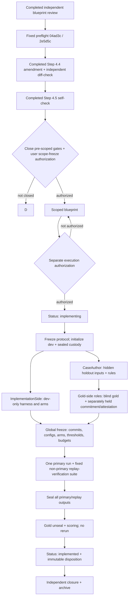

# Task Blueprint: Meander CaseBundle F-GATE 离线可行性验证

- Status: draft
- Created: 2026-08-11
- Last Updated: 2026-08-11
- Authority: task blueprint；本 `draft` 只记录一个待收口的实验切片，不授权建案例、写 harness、运行 holdout、使用凭据、修改产品代码或进入下一状态。只有在独立 preflight、preflight amendment 与 self-check 完成、未决门关闭、用户另行授权 `draft → scoped`，且用户随后再授权执行后，才可消费 Q1 允许的唯一一次 `F-GATE` envelope。
- Inputs:
  - Adopted Q1 decision [`2026-08-11_q1-offline-feasibility-before-external-validation-decision.md`](../../design/decisions/active/2026-08-11_q1-offline-feasibility-before-external-validation-decision.md)，commit `5a37f9470f927bfdf8ee530740995d2c4d70bba7`，文件 SHA-256 `47e48838664328072dd6bda223832286fedc905a2c95283fa66b7a5f204fceec`
  - Review candidate [`meander-factgraph-unified-design-review-candidate-v0-1-1.zh.md`](../../design/design-points/active/meander-factgraph-unified-design-review-candidate-v0-1-1.zh.md)；只作被挑战的设计背景，不是 shipped contract
  - Adversarial disposition [`meander-factgraph-unified-design-adversarial-review-disposition.zh.md`](../../design/design-points/active/meander-factgraph-unified-design-adversarial-review-disposition.zh.md)；只作 finding 索引，不自动授权实施
  - FactGraph substrate pin: `hnsm-backend@5a37f9470f927bfdf8ee530740995d2c4d70bba7`，FactGraph package `0.2.0rc1`；所有 shipped-capability 主张只解析到该 substrate，不把未来 benchmark harness 冒充为这个 commit
  - Benchmark harness/run pin: `UNASSIGNED AT DRAFT`；后续获授权实现才产生独立 exact harness commit 与 benchmark-artifact digests，且 global freeze 必须证明 `src/factgraph/**` 相对 substrate pin 零漂移
  - 2026-08-11 user authorization to execute the next stage；在执行前的公开边界说明中，该阶段被限定为起草 blueprint pair、独立审阅与目标文件限定提交；未授权 case construction、preflight、experiment execution 或状态推进
  - Completed independent preflight `workflow/audit/active/2026-08-11_meander-case-bundle-feasibility-preflight.md`，固定对象为 commit `04ad3c722f14e67ab6370d228aa8ee010ea4d9ff`、blob `2e5d5c7361659cc3d53526843de0bf66cb0d51a8`、内容 SHA-256 `7ab6b6113d501f5dffae8e374f109d061a76b954de51a96ea861e699e502f7d5`；本次 amendment 只从该固定对象读取，不依赖 preflight branch tip
  - 2026-08-11 user authorization to proceed with Step 4.4；范围仅为把上述 preflight 的全部 Required/Recommended finding 及 Operator scope guard 写入本 blueprint pair、独立 diff review 并限定提交；不授权 Step 4.5 self-check、`scoped`、case/harness、实验、凭据或产品源码变更
  - 2026-08-11 user authorization to execute Step 4.5 self-check；范围仅为完整重读本 pair、逐项核对 preflight/gates、取得独立 second opinion，并在 self-check 发现必要收紧时仅修改和提交本 pair；不授权 `scoped`、case/harness、实验、凭据或产品源码变更
- Outputs / Downstream:
  - Paired audit log [`2026-08-11_meander-case-bundle-feasibility.audit.md`](./2026-08-11_meander-case-bundle-feasibility.audit.md)
  - Completed independent preflight and completed Step 4.5 self-check；其余未决门仍须关闭，才可请求任何 `scoped` anchor
  - At Step 4.9 archive, import the preflight artifact content-identically from the pinned commit/blob above and archive it with this pair；不得从浮动 branch tip 重取或改写内容
  - If separately authorized after `scoped`: one disposable benchmark package, one sealed-holdout run batch, one immutable result/report lineage, and this blueprint's completed outcome/audit
  - No production API, service, Agent integration, Translator, UI, customer connector, or automatic successor slice
- Related:
  - [`workflow/blueprints/README.md`](../README.md) — blueprint lifecycle and paired-audit governance
  - [`workflow/CADENCE.md`](../../CADENCE.md) — decision, blueprint, preflight, execution, and archive transitions
  - [`workflow/working/README.md`](../../working/README.md) — scratch artifacts are ephemeral and non-authoritative
  - [`tools/benchmarks/README.md`](../../../tools/benchmarks/README.md) — current tracked benchmark convention
  - [`src/factgraph/application/docs/rule.md`](../../../src/factgraph/application/docs/rule.md) and [`src/factgraph/application/protocol/docs/README.md`](../../../src/factgraph/application/protocol/docs/README.md) — current Rule/RuleExpr/EvaluateResult/Explain truth
- Branch: `v0.3.0-blueprint-meander-case-bundle-feasibility-2026-08-11`
- Related Modules:
  - Proposed benchmark-only home: `tools/benchmarks/meander_f_gate/`
  - Proposed sanitized fixture/gold homes: `tools/benchmarks/fixtures/meander_f_gate_cb0/` and `tools/benchmarks/golden/meander_f_gate_cb0/`
  - Proposed contract tests: `tools/benchmarks/tests/test_meander_f_gate_*.py`
  - Scratch only during a later authorized execution: `workflow/working/meander-case-feasibility/`
  - Production source explicitly excluded: `src/factgraph/**` and the separate Meander repository
- Audit Log:
  - [`2026-08-11_meander-case-bundle-feasibility.audit.md`](./2026-08-11_meander-case-bundle-feasibility.audit.md)

> **Product-state guard:** architecture remains `REVISE`; product authorization remains `STOP-except-discovery`; `P-GATE` remains open. An offline result cannot prove a buyer, budget, lawful customer-data path, reviewer value, product wedge, production safety, or market demand.

## 1. Problem

The unified design currently rests on several unverified links: a source-bound proposition must become a valid deterministic query; the engine must distinguish support, contradiction, conflict, insufficient evidence, and invalid coverage; evidence must point to the right retained source; and a historical run must be replayable without silently reading current state. Testing those links together with Agent Plan generation, Translator fidelity, a product API, and UI would create an uninterpretable failure surface.

Q1 therefore permits exactly one bounded offline experiment before external product validation. This blueprint turns that permission into a falsifiable task shape while preserving four separations:

1. current shipped FactGraph substrate versus proposed Meander/Policy/Plan contracts;
2. deterministic semantic feasibility versus Translator or Agent fidelity;
3. integrity/locator conformance versus source truth, authority, freshness, or business materiality;
4. corpus-local mechanism evidence versus reviewer and market value.

The immediate question is not “can we build the whole product?” It is:

> Given human-authored, source-bound, structured facts, a frozen proposition, and a frozen rule program, can pinned FactGraph plus a mechanical disposable adapter produce the declared logic result and evidence, expose every gap, complete four replay subcontracts, and provide a corpus-local inspectability/replay increment over fair deterministic baselines without the adapter secretly implementing the business reasoning?

## 2. Goals

1. Define and freeze a benchmark-only `CaseBundle v0` protocol. It is deliberately not a preview implementation of future production `CaseBundle`, `SourceRecord`, `ClaimSet`, `Policy`, `Plan`, `Scenario`, or `Run` APIs.
2. Build, only after later authorization, one sparse coverage corpus with a development split and an untouched sealed holdout; preserve corpus lineage, source bindings, gold disagreements, and machine-readable coverage.
3. Compare a pinned FactGraph `RuleProgram` arm with a source-only control and a semantically equivalent direct-reference evaluator under one arm-semantic-parity contract.
4. Attribute every output field to FactGraph native behavior, the benchmark adapter, the common scorer, or human gold; reject conclusions manufactured by the wrapper.
5. Test four replay subcontracts independently: deterministic re-execution, artifact reconstruction, mutation isolation, and unavailable-source behavior.
6. Produce immutable per-case data and separate `PASS / PARTIAL / FAIL / UNRESOLVED` verdicts for deterministic feasibility, logical conformance, source/locator integrity, replay, corpus-local baseline increment, and every deliberately untested dimension.
7. End the one-time envelope after one globally frozen holdout run batch (one primary scored batch invocation per arm plus only the fixed non-primary replay-verification batches); do not auto-authorize repair, a second holdout, product implementation, or `P-GATE` closure.

## 3. Non-goals

- No Agent, Agent Plan, Translator, MCP, L0–L3 participation, callback, inline repair, Decide/Action Middleware, or product UI.
- No production `Policy`, `Scenario`, `Run`, `SourceRecord`, `ClaimSet`, `ValidationRequest`, or public SDK/API contract.
- No changes to `src/factgraph/**`, the Meander repository, production dependency graphs, runtime services, live connectors, or deployment surfaces.
- No customer, private, regulated, licensed-without-permission, or otherwise sensitive source data.
- No claim about market frequency, production error rate, reviewer time/value, buyer, budget, lawful customer access, pilot readiness, or willingness to pay.
- No statistical confidence interval or production safety-rate inference from 32 deliberately selected instances.
- No requirement that FactGraph beat a semantically equivalent reference evaluator on logic accuracy. A difference there first indicates a parity or reference defect.
- No forced accuracy comparison between a source-only artifact and an automated verdict arm.
- No use of the holdout after unseal to repair code, tune thresholds, add an arm, or claim a second result within this envelope.
- No extension of the experiment merely because a result is `PARTIAL`, `FAIL`, or `UNRESOLVED`.
- No `Restricted Portable Operator`、`PURE_MAP`、`SNAPSHOT_LOOKUP`、unified Query/GoalPlan、external functor/predicate，或其第九类案例、arm、输入生产器、预算与代码。该假设需要独立 decision 与 disposable parity spike，且后者必须先验证 host-materialized relations；不能借用或续期本 envelope。

## 4. Current Context

### 4.1 Binding Q1 boundary

The adopted Q1 decision locks these constraints:

- `F-GATE` and `P-GATE` are independent; external outreach no longer blocks this offline experiment, but all product evidence remains open.
- The allowed envelope is non-transferable, non-renewable, numerically capped, and contains one taxonomy/corpus lineage, one disposable harness, frozen baselines, one final holdout evaluation, and one report/audit lineage.
- Development and holdout, implementation and gold, credential and data-egress authorization, digest and reconstructability, and technical and product verdicts must not be collapsed.
- Translator, Agent Plan, and product UI are excluded from the initial deterministic chain.
- A false `SUPPORTED`, silent coverage gap, source mismatch, or replay fallback cannot be averaged away.

This blueprint narrows those constraints into `F-GATE-CB0`; it does not relax them.

### 4.2 Pinned shipped substrate and attribution limits

The following matrix is an implementation-planning input, not a claim that the target product exists:

| Surface at `hnsm-backend@5a37f947...` | State | Evidence | Permitted use in this experiment | Forbidden inference |
| --- | --- | --- | --- | --- |
| `RuleProgram`, named clauses, program facts | `SHIPPED REUSABLE` | non-persistent scope `src/factgraph/sdk/rule_program.py:1-7`; DTOs `:30-97`; public exports `src/factgraph/sdk/__init__.py:32-40/:139-145` | Frozen selected rule program without persisting rules | “Policy v0 is implemented” |
| Application-Rule-only CB0 profile | `BENCHMARK STRICT SUBSET OF SHIPPED` | runtime accepts Rule/RuleExpr at `src/factgraph/sdk/rule_program_runtime.py:263-283`，but RuleExpr structured-body evidence is incomplete for this use at `:694-703/:788-880` | Acyclic positive native evaluation under §5.4.1 grammar | Full RuleProgram/RuleExpr support or a production profile |
| Produced-head materialization | `SHIPPED SHADOWING; CB0 REJECTS COLLISION` | runtime replaces materialized program-produced heads at `src/factgraph/sdk/rule_program_runtime.py:357-390`; test `tests/sdk/test_rule_program_evaluate.py:167-198` | Pre-run collision rejection only | Reference arm may consume a materialized produced head |
| Closed `RuleProgramGoal` | `SHIPPED REUSABLE` | `src/factgraph/sdk/rule_program.py:100-125` | Mechanical evaluation of a closed positive or refuting goal | Arbitrary Agent query/Plan support |
| Per-evaluation premise scope | `SHIPPED REUSABLE` | `src/factgraph/sdk/rule_program.py:128-155` | Isolate declared premise filters without mutating runtime-global policy | Full proposed Scenario/what-if semantics |
| Read-only native program evaluation | `SHIPPED REUSABLE` | `src/factgraph/sdk/rule_program_runtime.py:65-87`; public dispatch `src/factgraph/sdk/store.py:1500-1529` | Deterministic FactGraph arm; `engine="native"` only | Cross-engine parity or production service readiness |
| Rule/view/scope/support digests and captured explanation | `SHIPPED REUSABLE WITH SHAPE LIMIT`; `SHAPE CONFLICT` for portable clean rebuild | result fields `src/factgraph/sdk/rule_program.py:189-244`; runtime assembly `src/factgraph/sdk/rule_program_runtime.py:168-249`; later-ledger-mutation capture test `tests/sdk/test_rule_program_evaluate.py:201-210`; scope hash uses `repr` at runtime `:481-487`; view identity includes DB/transaction/assertion identity at `:490-529` | Exact comparison only in separately verified byte-identical disposable copies of one clean-closed retained base；native values are observations in portable reconstruction | Cross-process/hash-seed stability or a complete replay API |
| Original assertion support in recursive evidence | `SHIPPED REUSABLE` | support construction `src/factgraph/sdk/rule_program_runtime.py:569-705`; assertion-to-source/evidence projection `:803-819`; tests `tests/sdk/test_rule_program_evaluate.py:101-312` | Attribute a derived result to native assertion IDs within one captured workspace | Complete external `SourceRecord + locator` recovery |
| Raw EvidenceGraph versus recursive support steps | `SHIPPED STRUCTURAL ARTIFACTS WITH DIFFERENT SHAPES` | EvidenceGraph builder has empty joins for RuleProgram projection at `src/factgraph/sdk/rule_program_runtime.py:694-703`; recursive RuleRef topology is carried in steps at `:569-599` | Inputs to two separately attributed benchmark codecs | EvidenceGraph alone is a portable support DAG |
| Durable workspace reopen/integrity checks | `SHIPPED REUSABLE` | workspace methods `src/factgraph/sdk/store.py:1831-1954`, reopen body `:1930-1979`; history/integrity `src/factgraph/core/store/database.py:2261-2382` | Substrate for exact-artifact reopen and fail-closed checks | Portable reconstruction preserving DB/assertion-bound identities |
| Generic `EvaluateResult` fingerprint | `SHAPE CONFLICT` for cross-run equality | digest fields `src/factgraph/application/protocol/evaluate_result.py:116-135/:358-404/:579-626`; ID propagation `src/factgraph/sdk/store.py:3264-3355`; fixed-input digest/ID-shape tests `tests/application/protocol/test_evaluate_result_digests.py:31-84` | May inform normalized fields | Whole generic fingerprint can be compared unchanged across runs |
| Complete external source record/locator | `ABSENT` for this target contract | current `factgraph.application.explain.Source`, used by `EvidenceGraph`, is narrower at `src/factgraph/application/explain/evidence_tree.py:32-47` | Mechanical benchmark mapping may bridge assertion ID to retained fixture locator | Native FactGraph source-registry capability |
| Target Policy/Plan/Translator/Agent/UI contracts | `DEFERRED / OUT OF SCOPE` | no pinned shipped contract is relied upon | None | Any target product capability |

The experiment must use `RuleProgram` as a substrate, not rename it to “Policy” or present it as the target Policy implementation. `RuleProgramResult.evaluated_at` is excluded from deterministic equality. If generic `EvaluateResult` appears in a baseline, random `run_id`, `result_id`, and derived row IDs must be excluded or normalized according to the frozen comparator；其 `minimal_row_evidence` 或 explain-builder 缺失/失败即使伴随 `status="passed"`，也只能记为 degraded `INCOMPLETE/UNSUPPORTED` evidence，不能冒充 native complete evidence。

Substrate pin 与 harness/run pin 是两个独立身份。上表只描述 `5a37f947...` 的 shipped FactGraph。后续 benchmark commit 只能在获授权后增加 `src/factgraph/**` 之外的 harness；frozen run manifest 必须同时记录两个 commits、全部 benchmark artifact digests，以及 `git diff --exit-code 5a37f947... <harness-commit> -- src/factgraph` 的空差异证据。任何报告都不得把后来的 runner 描述成 `hnsm-backend@5a37f947...`。

### 4.3 Capability ownership and degradation contract

| Output responsibility | FactGraph native | Benchmark adapter | Common scorer | Gold side |
| --- | --- | --- | --- | --- |
| Business verdict derivation | Must be the principal implementation in `A-FACTGRAPH` | Marshaling and fixed status mapping only | No | No |
| Reference business verdict | No | `A-REFERENCE` owns its independent direct implementation | No | No |
| Native RuleProgram logic/evidence/support observation | Owns goal entailment, captured `EvidenceGraph`, recursive support steps and native digests | May invoke and serialize, but not add a missing proof | Scores only the frozen native/normalized fields | Supplies expected facts/edges or admissible proof set |
| Source artifact byte/digest/locator validation | Exposes assertion support only；does not own external locator completeness | Owns mechanical assertion↔benchmark fact↔source/locator validation | Scores exactness | Supplies expected binding |
| Portable EvidenceGraph/support codecs | Supplies native graph and support receipts only | Owns ID rewriting, canonical ordering and benchmark semantic digests | Verifies codec/schema and equality | Supplies admissible expected topology |
| Workspace integrity substrate | Owns durable close/reopen and native integrity checks | Owns whole-workspace capture manifest | Verifies captured bytes/digests | No |
| Experiment custody and portable reconstruction | No | Owns sealed-package custody adapter and clean-build reconstruction | Verifies separation/readability/equality | GoldCustodian owns hidden package and commitment |
| Coverage or ambiguity label | No | Must not infer hidden gold | Scores emitted explicit state | Supplies label/adjudication |

If the adapter evaluates business conditions, resolves conflicts, infers coverage, repairs a result, or fabricates provenance, the FactGraph increment dimension is `FAIL` or `UNRESOLVED`. The work may still reveal a reusable wrapper, but it cannot be reported as FactGraph mechanism evidence. Every result report must keep the five ownership lines above separate；benchmark source mapping、portable codecs、custody 或 reconstruction 的成功不得被合并成“FactGraph native”，而 generic fallback degradation 必须逐 case 显式显示。

### 4.4 Adoption-review carry-forward identity gate

The 2026-08-11 user adoption turn `019ff082-3edb-78f2-b045-ee89db181deb`, item `item-1051`, states that **three non-blocking review items** become mandatory future-blueprint obligations, but that message references rather than enumerates them; their exact upstream review source and text are not available in the currently recoverable chain. This draft records the gap rather than inventing content:

| ID | Exact source | Exact obligation | Blueprint mapping | Closure |
| --- | --- | --- | --- | --- |
| `OBL-REVIEW-01` | user turn `019ff082-3edb-78f2-b045-ee89db181deb`, item `item-1051`, 2026-08-11；exact upstream item unavailable | `UNRESOLVED — do not infer` | `UNRESOLVED` | Original wording, upstream source identity, and clause mapping required before `scoped` |
| `OBL-REVIEW-02` | same adoption reference；exact upstream item unavailable | `UNRESOLVED — do not infer` | `UNRESOLVED` | Same |
| `OBL-REVIEW-03` | same adoption reference；exact upstream item unavailable | `UNRESOLVED — do not infer` | `UNRESOLVED` | Same |

The Q1 §7.2/§8 obligations are independently binding. They may overlap the missing three, but they must not be substituted for them without provenance.

The fixed preflight independently re-checked the recoverable task history and again found only the adoption reference, not the three enumerated upstream obligations. Failed recovery is evidence of source absence, not waiver or closure. PF-R01..PF-R04、PF-Rec01..02、Q1 obligations or new clauses in this amendment must not be substituted for `OBL-REVIEW-01..03` without exact provenance. Step 4.4 may amend the draft while they remain open；`draft → scoped` may not occur.

### 4.5 Draft-time environment observation

Static audit and an independent read-only probe found the `RuleProgram` substrate suitable for a disposable harness. Environment behavior is not interchangeable:

- `/Users/zhenzhili/miniforge3/bin/python` 3.10.11 with pytest 9.0.2 exits `139` without output on the focused suite;
- `/Users/zhenzhili/miniforge3/envs/factpy/bin/python` 3.10.20 with pytest 9.0.2 passes the 14 focused tests below in `0.61s`:

```bash
PYTHONDONTWRITEBYTECODE=1 PYTHONPATH=src \
/Users/zhenzhili/miniforge3/envs/factpy/bin/python \
-m pytest -p no:cacheprovider \
tests/sdk/test_rule_program_evaluate.py \
tests/application/protocol/test_evaluate_result_digests.py \
tests/test_db_attach_lifecycle.py::DBAttachLifecycleTests::test_attach_with_durable_view_scopes_reads_and_evaluate \
-q
```

Two temporary read-only probes in the `factpy` environment also observed stable rule/view/scope/support digests and canonical EvidenceGraph across repeated evaluation and workspace reopen, while `evaluated_at` changed. The fixed independent preflight reran the same focused suite as `14 passed in 0.34s` and added the multi-process/hash-seed shape probe. These remain local observations, not shipped tests or a replay contract. Before `scoped`, `ENV-01` still requires dependency/command pinning and clean-checkout reproduction so the passing named environment—not a bare `python` alias—becomes canonical.

## 5. Proposed Shape

### 5.1 Experiment identity, hypothesis, and verdict scope

- Envelope ID: `F-GATE-CB0`
- Corpus contract: `meander_f_gate_case_bundle_v0`
- Unit of analysis: one frozen case instance containing one proposition and its declared scoring dimensions
- Primary hypothesis: on every scorable holdout instance, `A-FACTGRAPH` exactly matches human gold and the semantically equivalent `A-REFERENCE`, produces no false support/challenge or silent gap, binds required evidence to the declared source artifact, and completes all mandatory replay checks.
- Increment hypothesis: at least one structured evidence/derivation/replay capability used in the final result is natively emitted by FactGraph, while a fair `A-REFERENCE` attempt under the same integration/tuning cap must add and actually exercise equivalent instrumentation (or explicitly fail to do so within that cap); a common wrapper may not donate the feature to either arm.
- Null/falsification: any kill condition in §7.4, or an inability to attribute the claimed increment, defeats the corresponding hypothesis.

Every result is qualified: **“on `F-GATE-CB0`, its frozen taxonomy/corpus and pinned versions.”** No status transfers to production, other corpora, Translator/Agent behavior, or `P-GATE`.

### 5.2 Fixed one-time envelope proposed for scope freeze

These numbers are proposed as the complete cumulative cap. They become binding only if the user separately approves scope freeze; they may be reduced, but execution may not begin with placeholders.

| Resource | Hard cumulative cap |
| --- | ---: |
| Calendar | 15 working days from explicit execution authorization to final disposition |
| Recorded labor | 120 person-hours across protocol, corpus/gold, harness, runs, audit, and report |
| Corpus/gold labor sub-cap | 36 hours |
| Harness/common contract/baselines sub-cap | 40 hours |
| Run/replay/audit sub-cap | 20 hours |
| Analysis/report/governance sub-cap | 16 hours |
| Unallocated reserve | 8 hours; cannot fund a second experiment or post-holdout repair |
| Per scored-arm integration/tuning sub-cap | At most 6 recorded non-overlapping active human/operator hours and 2 explicit tuning revisions per arm；counted inside, not in addition to, the 120-hour total and applicable workstream sub-cap |
| Deterministic compute | 40 CPU-core-hours |
| Durable non-sensitive experiment storage | 5 GiB |
| Case instances | Exactly 32 |
| Primary scored holdout batch invocation | Exactly one batch per scored arm；each deterministic batch contains 16 case bundles / 32 goal calls |
| Pre-registered non-primary replay-verification operations | For each mandatory deterministic arm: exactly one same-artifact re-execution over all 16 instances, one portable reconstruction over all 16, 24 fixed mutation instances (8 class representatives × 3 operator kinds), and 8 fixed unavailable-source instances; all execute in the same frozen run batch before gold unseal and are scored only on their declared replay dimensions |
| Customer/private/regulated inputs | 0 |
| Product-source changes | 0 |
| Conditional external-model arm | At most EUR 75, 1,000,000 input tokens, 250,000 output tokens, one pinned model snapshot; zero until separately authorized |

Crossing any hard cap in the table—including a global cap、workstream sub-cap、per-arm 6-hour integration/tuning cap or 2-revision cap—ends the envelope and makes both the envelope-compliance dimension and overall envelope disposition `FAIL`; dimensions not reached because of the stop remain `UNRESOLVED`. If the required ledger is missing or corrupted so compliance cannot be established, the budget dimension and overall disposition are `UNRESOLVED`, never `PASS`. Neither state creates an implied extension.

A tracked `budget_ledger` is part of global freeze and records calendar start/end, actor, activity, arm or `common` allocation, non-overlapping active human/operator minutes, explicit per-arm tuning-revision ordinal, AI-agent wall-clock/turn usage, CPU-core-hours, storage, model tokens, provider invoice amount, reserve request, and approval timestamp. `labor_used = sum(non-overlapping active human/operator minutes) / 60`; user review and actual human supervision count once, while unattended AI-agent runtime is recorded separately and does not become invented person-hours. Calendar use is counted from the execution-authorization timestamp through immutable disposition in the declared working-day calendar; CPU use is the sum of allocated cores × active process hours; storage and provider usage use measured bytes and provider usage/invoice records. Arm-specific work is charged to that arm and checked against both its 6-hour/2-revision limit and the containing cumulative caps；common protocol/scorer work remains visibly `common`, and reserve must be approved and entered before use rather than reclassified afterward.

### 5.3 Coverage taxonomy and corpus split

The corpus has 16 case families. Each family contains one base instance and one single-variable perturbation, for 32 total instances:

- development: 8 families / 16 instances;
- sealed holdout: 8 different-content families / 16 instances;
- each primary class appears once in development and once in holdout;
- a base/perturbation pair changes exactly one pre-registered semantic or artifact variable.

The eight primary classes each own exactly one required invariant:

1. **value relation** — a one-value mutation changes the positive/refuting entailment relation as pre-registered;
2. **temporal boundary** — one as-of boundary mutation changes eligibility without reading current time;
3. **unit normalization** — one unit/value representation mutation preserves the canonical value relation;
4. **absence semantics** — missing evidence remains underdetermined rather than becoming negation unless closure is explicitly present;
5. **entity distinction** — two ontology-compatible identities remain distinct through evaluation;
6. **compound coverage** — one missing conjunct produces an explicit incomplete/underdetermined result rather than support;
7. **unresolved conflict** — simultaneously supported positive and refuting goals remain explicit conflict;
8. **conditional activation** — one premise mutation changes whether a conditional rule path is reached.

Terms such as freshness, collision, open/closed-world contrast, exceptions, multi-hop, and cascade may appear only as a declared `secondary_stressor`. A class name or secondary stressor is not evidence that every umbrella mechanism was tested. Any umbrella mechanism not instantiated as the class's `required_invariant` is reported `UNRESOLVED`.

Replay source deletion and mutation are horizontal checks applied across classes, not a ninth semantic class. The matrix is a sparse falsification design, not a Cartesian product or estimate of market prevalence.

The public, pre-run coverage commitment has an explicit non-label allowlist:

```text
case_family_id
instance_id
split
primary_class
required_invariant
secondary_stressor
source_shape
source_state
proposition_shape
rule_program_ref
rule_program_digest
rule_depth
branch_shape
paired_instance_id
perturbation_operator
```

The separately sealed gold matrix adds `expected_logic_status`, `expected_coverage_status`, `expected_abstention`, `scorable_dimensions`, `expected_exclusion`, `expected_metamorphic_relation`, expected bindings/edges, admissible proofs, ambiguity/adjudication, and any pre-registered severity. Neither per-case labels nor split-level outcome counts are visible to ImplementationSide or any arm before all frozen outputs seal. The public commitment records only taxonomy/class/family counts plus an opaque hiding commitment to the sealed outcome counts；a direct checksum or public signature over the low-entropy count vector is forbidden because it is enumerable.

The sealed holdout must satisfy this non-vacuity contract before global freeze: at least `12/16` `LOGIC_SCORABLE` instances, at least 3 `SUPPORTED`, 3 `CONTRADICTED`, 2 `UNDERDETERMINED`, and 1 `CONFLICT`, exactly `0` `EXPECTED_ABSTENTION`, no more than 4 `UNSCORABLE`, and at least one logic-scorable instance for every primary class. CB0 has no ambiguity detector and therefore refuses to manufacture an arm-visible abstention case；the `ABSTAIN` algebra is exercised only by a non-corpus development protocol fixture with an explicit non-gold `DECLARED_INPUT_AMBIGUITY` signal. A gold-side `UNSCORABLE` is excluded rather than converted into expected abstention. Only the GoldAuthors/Adjudicator and `GoldCustodian` verify holdout counts inside sealed custody.

`COUNT-COMMITMENT-01` freezes the sole hiding construction as `count_commitment_v1 = SHA-256(CB0-CJSON-v1({domain: "meander-f-gate-cb0/count-commitment/v1", protocol_version, corpus_version, taxonomy_version, count_predicate, count_vector, nonce_hex}))`，where `nonce_hex` encodes 32 cryptographically random hidden bytes. The nonce remains outside every arm-visible artifact and unavailable to ImplementationSide until every frozen output seals. HMAC、a raw count digest and any alternative construction are forbidden inside this lineage.

`AttestationKeyCustodian` separately authenticates GoldCustodian's pass/fail attestation over the opaque commitment. The attested payload binds protocol/corpus/taxonomy version, holdout-input digest, gold-package digest, the exact count predicate, opaque commitment, creation time, GoldCustodian identity and attestation-mechanism version. Hidden-nonce custody and attestation-signing-key custody belong to distinct named principals and independently controlled credential domains；neither is available to ImplementationSide before output seal. `CUSTODY-01` must name the authentication mechanism、authenticator、verifier、key/nonce custodians、revocation check and failure behavior. Before the run, RunCustodian verifies only package/digest/attestation integrity；after all output sealing and gold unseal, the scorer recomputes counts, opens the commitment and verifies the attestation. A pre-run verification/revocation failure prevents execution and leaves protocol validity `UNRESOLVED`；post-consumption tampering or a false attestation makes protocol/custody `FAIL`. If the minimum does not hold, corpus validity and overall disposition are `UNRESOLVED`；a `100%` score over a smaller or empty denominator is forbidden.

### 5.4 Benchmark-only CaseBundle v0

Each instance belongs to two physically separate package classes plus one public opaque custody record:

```text
ArmVisibleCaseInput/
  manifest.json
  sources/*
  observed_input.json
  declared_rule_semantics.json
  arm_semantic_parity.json
  rule_program.json
  premise_scope.json
  manual_fact_projection.json
  schema_coordinate.json

GoldOnlyCaseData/
  gold.json
  replay_expectations.json

PublicCustodyRecord/
  opaque_input_locator
  holdout_input_payload_digest
  opaque_gold_locator
  gold_payload_digest
  count_commitment
  detached_count_validity_attestation
```

`GoldOnlyCaseData` must not be nested in, encrypted together with, mounted beside, or readable through the same credential as `ArmVisibleCaseInput`. The listing above groups protocol roles only；it does not authorize physical co-location. Public custody metadata contains no secret/nonce、raw count、label、case body or gold.

`observed_input.json` is the only arm-visible case contract:

- case/family/schema/taxonomy version;
- frozen proposition with separate positive and explicitly defined refuting non-empty closed goals;
- digest/reference to the single canonical `manual_fact_projection.json` rather than a duplicate fact payload;
- source artifact IDs, byte digests, and benchmark locators;
- selected neutral-semantics、parity、`RuleProgram` and fully resolved premise-scope references/digests;
- task-required capabilities and output schema, but no expected outcome, expected coverage, ambiguity, exclusion, scorable dimension, or gold-derived field.

`manual_fact_projection.json` owns the portable fact truth and uses stable `benchmark_fact_id` values. Native assertion IDs are generated only while constructing a run workspace—current implementations use UUIDs at `src/factgraph/core/evidence/write_protocol.py:124-125` and `src/factgraph/core/store/database.py:2929-2930`—and native IDs are never pre-frozen as portable identity. `schema_coordinate.json` pins the schema class/import coordinate needed to construct the workspace. The benchmark codecs may construct only public FactGraph DTOs and cannot implement business reasoning.

#### 5.4.1 `CB0 RuleProgram Profile`

`PROGRAM-PROFILE-01` is a benchmark compatibility subset, not a change to shipped `RuleProgram`:

- every `RuleProgramClause.body` and `.head` is exactly one application-layer `Rule`；`RuleExpr` bodies are rejected, and each clause must lower to exactly one head;
- program-produced predicate dependencies form an acyclic positive graph；negation、aggregate and nested/implicit rule-reference dependencies are absent;
- allowed body atoms are only `PredAtom` and `CmpAtom(eq|ne|gt|ge|lt|le)`；`InAtom`、`BuiltinAtom`、`NotAtom`、aggregate terms and `RuleRefAtom` are excluded from CB0. This deliberately avoids treating missing EDB evidence as negation and removes arithmetic/coercion/overflow ambiguity from the slice;
- logical constant/program/goal/scope values are limited to canonical UTF-8 strings、signed 64-bit integers and booleans；dates、units、decimals and entity references must use a frozen string/integer representation；`null`、float/NaN/Infinity、bytes、set/frozenset、mapping/list constants、custom objects and any `repr`-dependent value are rejected from logical value positions;
- a body/head is an application-layer `Rule` whose public ports map only to `Var` values. The head's foundation contains positive `PredAtom` values only, produces `head.id`, and compiles to one ordered port tuple；body/head `Rule.version` must be absent so `RuleProgramClause.version` is the sole executable version coordinate;
- `declared_rule_semantics.json` assigns one exact logical type to every predicate position、variable and constant. `PredAtom` is exact typed tuple membership；`eq/ne` accepts only operands of the identical declared type and uses exact value equality/inequality；`gt/ge/lt/le` accepts signed 64-bit integers only and rejects bool、numeric strings and every cross-type pair. There is no implicit coercion. Any illegal operand combination is `PROGRAM_PROFILE_INVALID` before goal execution；a post-validation primitive exception is `ENGINE_ERROR + NO_VERDICT`;
- every `rule_id` is globally unique in the selected program regardless of version；every clause version is explicit, non-empty NFC text, and no nested body/head version may silently create a second executable coordinate;
- all producers for one predicate have identical arity；both closed goals are non-empty, have a selected-program producer and match that arity;
- clauses canonical-sort by `(rule_id, version)`；body atom order stays declared because it is part of the artifact identity;
- `RuleProgram.facts` is empty in CB0. Ontology constants required by a case enter as separately source-bound manual projections；a program fact is a profile error and cannot silently become evidence;
- `manual_fact_projection.json` may not contain a predicate produced by the selected program. CB0 therefore rejects this collision before either arm runs instead of exercising shipped selected-program shadowing.

Each scorable entailed goal has a sealed `proof_contract`: either one unique expected proof or a finite admissible proof set. Native runtime may select one winning support；the scorer checks that selected proof against the contract and never assumes all possible proofs were returned.

`DUAL-GOAL-01` defines one `(arm_id, case_id)` as exactly two ordered `evaluate_program`-equivalent calls—positive then refuting—against the same immutable workspace、program、resolved scope and config. After common pre-call validation succeeds, both calls are attempted independently；an exception on one side does not suppress the other. Each call owns its raw result/error, captured raw EvidenceGraph and raw support steps；explanation is not obtained by a third evaluation. If common validation fails, both explicit goal records carry `NOT_RUN_DUE_TO_PRIOR_ERROR`. One primary **batch invocation** covers all 16 holdout cases；that equals 16 **case bundles** and 32 **goal calls** per arm, or 64 primary goal calls across the two mandatory deterministic arms. Replay uses the same three named accounting levels；no metric may use the unqualified word “invocation.”

#### 5.4.2 Canonical program, scope, source, evidence and support contracts

`CB0-CJSON-v1` is UTF-8 without BOM or trailing newline, with NFC strings, lexically sorted object keys, no duplicate keys or insignificant whitespace. JSON metadata may use schema-declared `null`、objects and arrays；numbers remain signed 64-bit integers and floats/NaN/Infinity are forbidden. Logical value positions remain restricted by §5.4.1. Arrays preserve declared semantic order unless this contract states an explicit sort key.

- `declared_rule_semantics.json` is the single arm-neutral business-semantics statement. It contains versioned predicate declarations、stable clause/condition IDs、exact operand types、the frozen primitive truth semantics above、typed terms、produced predicates、positive/refuting goals、premise-scope semantics and proof contract；it contains no FactGraph class/AST/native ID/lowering output or gold field.
- `rule_program.json` is the mechanical FactGraph projection. Its exact `CB0-CJSON-v1` bytes and SHA-256 `rule_program_artifact_digest` are the portable authoritative identity of the executable A-FACTGRAPH program；native `rule_set_digest`/program token is an observed runtime field only. The decoder validates the strict profile, builds only public DTOs, re-encodes, and requires a byte-identical round trip.
- `arm_semantic_parity.json` maps every neutral clause/head/condition/term/goal/scope ID exactly once to its RuleProgram projection coordinate. It validates cardinality、operator、operand type、primitive truth-semantics version and value correspondence without executing a condition or producing a verdict.
- `premise_scope.json` explicitly carries all three resolved dimensions—`exclusions`、`allowances` and `blocks`—as canonically sorted arrays. Empty arrays mean disabled；`null`/omission and runtime-global inheritance are invalid. The benchmark computes `scope_artifact_digest` over canonical bytes；native `premise_scope_digest` is observation only.

At ingestion, `SOURCE-BINDING-01` records a bijection `benchmark_fact_id ↔ native ledger assertion_id`. `benchmark_fact_id` identifies one projection instance, not a semantic tuple；tuple-equal assertions from different sources remain distinct IDs. CB0 fixes locator cardinality to exactly one `(artifact_id, typed_locator)` per `benchmark_fact_id`；corroborating sources become distinct projection instances. Every receipt witness must resolve to exactly one disjoint tagged namespace: `ledger:<native_assertion_id> → benchmark_fact_id`, or the reserved `program:<fact_id>` namespace. Because CB0 bans program facts, that second namespace must be empty. Unknown、double-resolved、cross-namespace、folded or tuple-equal/source-distinct mapping makes `execution_valid=false` and `coverage_status=INVALID` before any logic verdict is consumed. Only ledger witnesses enter external-locator completeness.

Raw `evidence_graph_to_dict(...)` and native support steps/digests are retained unchanged for exact-artifact inspection；they are not portable identity. `normalized_evidence_graph_v0` rewrites native source refs to tagged benchmark fact IDs, removes/replaces graph/view/support native identity, preserves semantic path/rule/atom/status/port/source/join content, canonical-sorts each collection by declared stable keys, rejects missing/unmapped witnesses, and hashes `CB0-CJSON-v1` bytes as `semantic_evidence_digest`. Rendering-only text/layout remains in the raw artifact but outside the semantic digest.

Because shipped `EvidenceGraph` does not encode recursive RuleRef topology, `normalized_support_dag_v0` separately normalizes `RuleProgramExplanation.steps`. It preserves normalized bindings、non-fact operation/status、RuleRef coordinate、child edge and unresolved state；rewrites receipt witnesses through the tagged namespaces；replaces native support digests with bottom-up semantic node IDs；and canonical-sorts nodes/edges. A cycle、dangling child、unresolved child for an entailed goal、unequal payload under one semantic ID or unmapped witness invalidates execution. Its `semantic_support_dag_digest` is portable within-arm identity；this codec is benchmark-owned and not a production proof format.

`CASE-CODEC-01` remains the parent operational gate. Before `scoped`, its concrete schemas/fixtures must instantiate the already frozen `RULE-PROGRAM-CODEC-01`、`SCOPE-CODEC-01`、`SOURCE-BINDING-01`、`EVIDENCE-CODEC-01` and `SUPPORT-DAG-CODEC-01` contracts without changing their semantics.

`BenchmarkSourceArtifact` is a complete experiment source entry, not production `SourceRecord`. It records `artifact_id`, `kind`, origin URI or opaque authorized reference, media type, capture time, byte digest, byte length, license/authorization basis, retention state, and exactly one typed locator per projection instance. `CaseBundle v0` permits exactly two locator shapes: `(a)` immutable UTF-8 bytes with half-open byte offsets, and `(b)` raw JSON bytes with RFC 6901 JSON Pointer. PDF page/region, Unicode-codepoint/character spans, and database-record locators are out of scope and remain `UNRESOLVED` unless a later decision freezes their renderer/parser/snapshot semantics. Native assertion support and the benchmark adapter's assertion-to-external-locator mapping are scored and attributed separately.

#### 5.4.3 Gold-side case state and dual-goal logic

`gold.json` is independently authored and separately sealed. It contains:

- `gold_case_status: LOGIC_SCORABLE | EXPECTED_ABSTENTION | UNSCORABLE`;
- `expected_logic_status: SUPPORTED | CONTRADICTED | CONFLICT | UNDERDETERMINED | null`;
- `expected_arm_disposition: LOGIC_VERDICT | ABSTAIN | null`;
- expected supporting and refuting fact IDs;
- expected source artifact IDs and locators;
- expected coverage/capability state;
- gold-derived scorable dimensions, ambiguity, disagreement, and exclusion reason;
- digest/reference to the separately sealed `replay_expectations.json` (the sole truth source for expected replay relations/results);
- admissible evidence/trace requirements.

`LOGIC_SCORABLE` requires a non-null expected logic status and `LOGIC_VERDICT`. `EXPECTED_ABSTENTION` is reserved in the schema for a pre-registered ambiguity detectable from arm-visible material, null logic status and `ABSTAIN`, but its CB0 corpus count is frozen to zero. Gold-side `UNSCORABLE` is caused only by unresolved adjudication、corpus defect or absent scoring basis；it carries no expected arm disposition, gives no abstention credit and never appears as an arm output. Invalid source/contract/codec/execution/evidence instead produces arm `NO_VERDICT`.

The four-cell mapping runs only when both calls are valid、coverage-complete and no pre-registered arm-visible ambiguity requires `ABSTAIN`；it intentionally does not equate absence or an exception with negation:

| Positive goal | Explicit refuting goal | Logic status |
| --- | --- | --- |
| entailed | not entailed | `SUPPORTED` |
| not entailed | entailed | `CONTRADICTED` |
| not entailed | not entailed | `UNDERDETERMINED` |
| entailed | entailed | `CONFLICT` |

If either call is missing、invalid、timed out、partial or otherwise non-consuming, `logic_status=null`，arm disposition is `NO_VERDICT`, and the four-cell table is not evaluated.

### 5.5 Roles, gold independence, and sealed-holdout custody

Minimum roles:

- `ProtocolOwner`: freezes taxonomy, arms, metrics, thresholds, and budget; does not write scored-arm implementation.
- `CaseAuthor`: constructs holdout inputs, source artifacts, fact projections, propositions, and RulePrograms; does not see scored-arm implementation or output.
- `GoldAuthor-A` and `GoldAuthor-B`: independently label all 16 holdout instances without seeing each other's labels or any scored-arm output; neither modifies the harness or runs a scored arm.
- `GoldAdjudicator`: resolves recorded A/B disagreement without seeing scored-arm output. If a genuinely independent third adjudicator is unavailable, disagreement remains `UNSCORABLE`.
- `GoldCustodian`: owns sealed gold, validates the hidden denominator contract, and emits only the digest-bound count-validity attestation before unseal; it may be the GoldAdjudicator but not ImplementationSide or RunCustodian.
- `CommitmentSecretCustodian`: holds the hidden nonce until output seal；must be a different named principal/credential domain from `AttestationKeyCustodian` and cannot be ImplementationSide or pre-gold RunCustodian.
- `AttestationKeyCustodian`: authenticates the opaque count-validity attestation；cannot hold the hiding material or be ImplementationSide/RunCustodian.
- `ImplementationSide`: sees development input/gold plus an aggregate holdout coverage commitment; never sees holdout cases or gold before the scored run.
- `RunCustodian/Scorer`: after global freeze, opens holdout input, runs the frozen primary and pre-registered replay-verification suite, seals all outputs, then and only then opens gold and scores; cannot tune or patch.
- `FinalAuditor`: independently audits the frozen run, scoring, budget, and disposition; cannot be ImplementationSide, RunCustodian/scorer, CaseAuthor, either GoldAuthor, GoldAdjudicator/GoldCustodian, CommitmentSecretCustodian or AttestationKeyCustodian.

`CaseAuthor` should be separate from both GoldAuthors. If staffing makes overlap unavoidable, it may overlap with at most one GoldAuthor; the other GoldAuthor and GoldAdjudicator remain blind and independent. `CUSTODY-01` must freeze this incompatibility matrix rather than merely list names.

`GoldCustodian` alone holds gold access before output sealing；`CommitmentSecretCustodian` and `AttestationKeyCustodian` separately hold hiding and authentication material. ImplementationSide、all arms and the pre-gold RunCustodian receive none of the three. `RunCustodian/Scorer` is one lifecycle role with temporally split capability: it may receive holdout input after global freeze, but receives gold and commitment-opening material only after the atomic output seal.

Holdout input and holdout gold are two independently sealed, physically separate packages. Before `scoped`, the blueprint must name their actual durable custodians, different storage/access credentials, opaque locators, retention rules, access-log path, revocation/failure handling and eventual lawful-release policy. It must also name generation/storage/destruction-or-retention rules for the hiding and signing material and the verifier identity. At pre-registration it records each package's SHA-256, byte size, item count, coverage commitment, creation time, and custodian. Digest proves integrity only；it does not substitute for access control.

Recommended minimum mechanism is a user- or independent-custodian-held encrypted bundle or controlled location outside the implementation checkout, with the decryption capability unavailable to ImplementationSide. Git branches, `workflow/working`, obscured filenames, or “please do not open” are not access controls.

All arms write normalized output to a write-once run identity using content-addressed filenames；the custodian creates an atomic completion marker and records a pre-gold seal digest before gold unseal. `PATHS-01` must name and dry-run the storage mechanism, immutable/no-overwrite permission, content-addressed naming, atomic completion, custodian identity and failure behavior. Ordinary tracked Git files and FactGraph's internal database-object atomic writes are not experiment custody mechanisms. Once holdout input is exposed to the scored runner and any scored output is produced, that holdout is consumed permanently. If role separation or custody cannot be made real, only an engineering smoke may run；logical and semantic verdicts remain `UNRESOLVED`.

Gold disagreement is retained. Development gold may be single-authored, but at least 25% of development instances receive an independent blind check before freeze. An unresolved holdout disagreement becomes gold-side `UNSCORABLE`；only an ambiguity already detectable from arm-visible material may be pre-registered as `EXPECTED_ABSTENTION`. Neither is forced into the logic-accuracy denominator. Gold cannot be changed after unseal. If later audit proves a gold-protocol defect, the affected case/dimension becomes `UNRESOLVED`; no corrected label, rescore, or rerun is allowed inside `F-GATE-CB0`.

### 5.6 Arms and arm-semantic-parity contract

#### Mandatory arms and control

| Arm | Role | Output/claim boundary |
| --- | --- | --- |
| `A-SOURCE` | Mandatory non-scored control artifact: proposition plus frozen source/locator only | Emits no automated business verdict and is excluded from automated schema, logic denominators, and scored-batch counts. Without a separately authorized blind-review task, only artifact existence/integrity is tested; no performance claim is made. |
| `A-REFERENCE` | Minimal direct deterministic evaluator | Consumes `declared_rule_semantics.json` directly—but no `rule_program.json`、FactGraph lowering/runtime or per-case gold；must independently implement every condition and gets the same cap to implement and exercise the normalized evidence/replay contract, not an intentionally weak subset. |
| `A-FACTGRAPH` | Mechanical `rule_program.json` projection + native `evaluate_program` + captured explanation | Adapter may validate the parity manifest, marshal, invoke, normalize fixed statuses, validate artifact bytes, and serialize；it may not perform substantive reasoning. |

#### Conditional/applicability arms

- `A-LLM-JUDGE`: one generic LLM snapshot only after separate BYOK credential and data-egress authorization. Its task is the same normalized reasoning task as deterministic arms: canonical manual facts, frozen proposition, and frozen rule semantic contract—not a separate raw-document extraction task. Provider/model/prompt/schema, temperature, max tokens, timeout, retry count, and provider-error status must freeze before the first holdout-input execution. A retry is allowed only as the pre-registered policy inside that single primary batch invocation; no rerun may occur after other-arm output or gold inspection. Its outputs must seal before any gold unseal. If absent at global freeze, it is permanently absent from `F-GATE-CB0`; it cannot be run later on the consumed holdout, and unique mechanism value versus a generic LLM remains `UNRESOLVED`.
- Applicable incumbent/native QA: scope freeze must name a real implementation that accepts the same task contract. If none is present without adding a prohibited product service or dependency, record `N/A` with evidence; do not fabricate a weak substitute. Unique market-incumbent value remains `UNRESOLVED`.

#### Parity rules

This is **arm semantic parity**, not engine parity. `A-FACTGRAPH` remains `engine="native"`；`A-REFERENCE` is an independent evaluator of the neutral manifest. All scored arms receive the same arm-visible `observed_input.json`, referenced source bytes/digests, canonical manual facts, proposition, declared rule semantics, allowed non-gold mapping information, and normalized output schema. No arm receives expected status/coverage, gold scorable/exclusion labels, expected metamorphic relation, or outcome counts. Common preprocessing cannot carry arm-specific hidden logic. Each arm's integration effort and post-integration tuning are recorded separately; before freeze, each scored arm gets at most 6 hours and 2 explicit tuning revisions. Any unavoidable asymmetry is reported per case and cannot be averaged away.

`SEMANTIC-PARITY-01` requires the frozen parity manifest to validate exact clause/condition/operator/operand-type/primitive-truth/constant/produced-predicate/goal/scope correspondence before either arm runs. A missing/extra/changed condition、coercion/type divergence、produced-head collision、unsupported profile shape or development semantic disagreement is an arm-parity defect；holdout cannot open until it is corrected and globally frozen. `A-REFERENCE` may parse the neutral manifest with its own code but may not import or call FactGraph evaluator、lowering、RuleProgram runtime or evidence builders.

`A-REFERENCE` must be semantically equivalent. If `A-FACTGRAPH` beats it on logic accuracy, first classify the difference as a parity/reference defect and stop scoring `NATIVE-INCREMENT-01` until resolved on development data. If a difference first appears on consumed holdout, record the frozen failure-algebra disposition and do not repair/rerun. Logic equality is the control; FactGraph's candidate increment lies in the two `NATIVE-INCREMENT-01` capabilities—not benchmark-owned source mapping、portable codecs or custody. The reference's equivalent instrumentation attempt is real, runs inside the same per-arm 6-hour/2-revision cap in §5.2, and records added code/config, time, emitted fields, and any explicit in-cap failure. If that attempt reaches `100%` on both functional candidates, the increment is `FAIL`. If it is `NOT_RUN` or telemetry-incomplete, the increment and—absent another failure—the overall envelope are `UNRESOLVED`；if an executed/frozen reference is semantically non-equivalent or intentionally weakened, the reference-control/logical dimension and overall envelope are `FAIL` while the increment remains `UNRESOLVED`.

### 5.7 Normalized output and metric separation

Every automated arm first emits a sealed pre-scorer `ArmRawBundleV0`. A frozen, shared mechanical normalizer applies the §5.4 table identically；it does not infer business facts or hidden coverage:

```text
case_id
batch_id
operation_id
operation_kind
arm_id
program_artifact_digest
declared_semantics_digest
scope_artifact_digest
snapshot_manifest_ref
positive_goal: GoalCallRaw
refuting_goal: GoalCallRaw
bundle_execution_valid
coverage_status
arm_disposition
logic_status                    # nullable
disposition_reason_codes
capability_statuses             # each: COMPLETE | INCOMPLETE | UNSUPPORTED | N/A
field_attribution               # raw fields: factgraph_native | benchmark_adapter
supporting_fact_ids
refuting_fact_ids
source_locator_bindings
run_manifest_ref
errors                          # BenchmarkErrorV0[]
warnings
latency_ms
setup_revision
```

Each `GoalCallRaw` is the sole owner for its goal side's evidence/support artifact references. It records `goal_role`、canonical goal/digest、`execution_valid`、nullable Boolean `entailed`、typed error references、native RuleProgram fields、the arm-specific raw evidence/trace and support/instrumentation references、any corresponding normalized artifact references/digests, and timing. `ArmRawBundleV0` has no bundle-level evidence/support alias or second fact source；any aggregate index is derived only after the sealed bundle and cannot replace either ordered goal record. `coverage_status` is `COMPLETE | INCOMPLETE | INVALID | UNKNOWN` against the arm-visible required contract. Raw `field_attribution` is fixed by schema to `factgraph_native | benchmark_adapter` only；after output seal the scorer writes a separate `ScoredBundleV0` that references the sealed raw-bundle digest and applicable raw exact/portable fingerprints. Gold-derived expected coverage、`common_scorer | gold` attribution、`source_conformance`、exact-match flags、confusion labels、scorer-only reason codes、candidate-capability aggregates、`exact_workspace_integrity`、`deterministic_increment`、`experiment_check_status` and overall disposition exist only in `ScoredBundleV0`, never in `ArmRawBundleV0` or an arm input. Capability completeness is independent of logic status；a degraded/missing evidence builder cannot normalize into complete evidence.

#### 5.7.1 Three-layer failure algebra

`FAILURE-ALGEBRA-01` keeps three non-substitutable layers:

1. **runtime outcome** — call/bundle validity, Boolean entailment when valid, coverage, capability state and versioned typed errors;
2. **arm disposition** — `LOGIC_VERDICT | ABSTAIN | NO_VERDICT`;
3. **experiment-check status** — `PASS | FAIL | UNRESOLVED`, computed only by the frozen scorer against the pre-registered operation expectation and, after unseal, applicable gold.

`BenchmarkErrorV0` has `schema_version`、`code`、`phase`、`operation_id`、nullable `goal_side`、nullable `artifact_ref`、`retryable` and diagnostic-only `message`. The frozen code set is:

```text
CASE_CONTRACT_INVALID
SCHEMA_COORDINATE_INVALID
CODEC_INVALID
PROGRAM_PROFILE_INVALID
SCOPE_INVALID
SOURCE_MISSING
SOURCE_ACCESS_DENIED
SOURCE_DIGEST_MISMATCH
ENGINE_ERROR
TIMEOUT
RETRY_EXHAUSTED
PARTIAL_OUTPUT
EVIDENCE_INCOMPLETE
SOURCE_BINDING_INVALID
ARTIFACT_MISSING
ARTIFACT_DIGEST_MISMATCH
UNSUPPORTED_CAPABILITY
NOT_RUN_DUE_TO_PRIOR_ERROR
UNEXPECTED_ERROR
```

Scorer-only reason codes include `NON_REPLAYABLE`、`REPLAY_MISMATCH`、`UNEXPECTED_FALLBACK`、`UNEXPECTED_NO_VERDICT` and `WRONG_FAILURE_CLASS`；they are not represented as shipped FactGraph errors. Validation precedence is artifact/source integrity → schema/codec/profile/scope → the two independently attempted goal calls → witness/evidence/capability validation → disposition normalization. All observed errors are retained, but the earliest phase supplies the primary reason；only common pre-call failure may mark both calls `NOT_RUN_DUE_TO_PRIOR_ERROR`, and a call record is never treated as non-entailment because another call failed.

Coverage/error mapping is deterministic. Any row below makes `bundle_execution_valid=false` and `logic_status=null`；`NOT_RUN_DUE_TO_PRIOR_ERROR` inherits the already recorded primary row rather than creating a second coverage classification:

| Runtime error code(s) | Goal-call validity | Bundle coverage | Arm disposition |
| --- | --- | --- | --- |
| `CASE_CONTRACT_INVALID`、`SCHEMA_COORDINATE_INVALID`、`CODEC_INVALID`、`PROGRAM_PROFILE_INVALID`、`SCOPE_INVALID` | both calls invalid/not run | `INVALID` | `NO_VERDICT` |
| `SOURCE_MISSING`、`SOURCE_ACCESS_DENIED`、`SOURCE_DIGEST_MISMATCH` | both calls invalid/not run | `INVALID` | `NO_VERDICT` |
| `ENGINE_ERROR`、`TIMEOUT`、`RETRY_EXHAUSTED`、`PARTIAL_OUTPUT`、`UNEXPECTED_ERROR` | affected call invalid；the other call is still attempted after common validation | `UNKNOWN` | `NO_VERDICT` |
| `EVIDENCE_INCOMPLETE`、`UNSUPPORTED_CAPABILITY` | calls may have Boolean results but bundle is non-consuming | `INCOMPLETE` | `NO_VERDICT` |
| `SOURCE_BINDING_INVALID` | calls may have Boolean results but bundle is non-consuming | `INVALID` | `NO_VERDICT` |
| `ARTIFACT_MISSING`、`ARTIFACT_DIGEST_MISMATCH` | both calls invalid/not run | `INVALID` | `NO_VERDICT`；replay scorer also records `NON_REPLAYABLE` |
| `NOT_RUN_DUE_TO_PRIOR_ERROR` | marked only on calls skipped by common pre-call failure | inherit primary | `NO_VERDICT` |

With no row above, both valid calls plus complete evidence/source/capability checks produce `bundle_execution_valid=true` and `coverage_status=COMPLETE`；the arm then emits either a four-cell `LOGIC_VERDICT` or a valid arm-visible `ABSTAIN` under the rules below.

- `LOGIC_VERDICT` requires `bundle_execution_valid=true`、`coverage_status=COMPLETE`、two Boolean goal results、a non-null four-cell `logic_status` and no consuming error.
- `ABSTAIN` requires `bundle_execution_valid=true`、`coverage_status=COMPLETE`、two completed goal calls、the explicit non-gold arm-visible reason `DECLARED_INPUT_AMBIGUITY` and deliberately unconsumed/null logic status. It cannot be caused by engine、codec、source、evidence、timeout、retry or partial-output failure. CB0 supplies no ambiguity detector and allows this reason only in a dedicated development algebra fixture outside the 32-case corpus；adapter/scorer inference of ambiguity is forbidden.
- `NO_VERDICT` requires null logic status and records the hard failure/non-ambiguity capability reason preventing consumption. Engine/codec/source/evidence failures always land here and cannot earn abstention credit.
- Gold-side `UNSCORABLE` never appears in arm disposition or logic status. A consuming logic verdict with non-complete coverage is a silent gap and immediate failure.

| Pre-registered expectation | Observed arm state | Experiment check |
| --- | --- | --- |
| Valid logic verdict | Exact valid logic verdict | `PASS` |
| Valid logic verdict | Any other arm state, including wrong logic、`ABSTAIN`、unexpected error or `NO_VERDICT` | `FAIL` |
| Expected arm-visible abstention | Valid `ABSTAIN` | `PASS` |
| Expected arm-visible abstention | Any other arm state, including logic verdict or `NO_VERDICT` | `FAIL` |
| Expected explicit unavailable-source failure | Matching typed source failure + `NO_VERDICT` + no fallback | replay check `PASS` |
| Expected explicit unavailable-source failure | Any other arm state, including `ABSTAIN`、missing/wrong typed failure、logic consumption、current/live fallback or silent success | `FAIL` |
| Gold-side `UNSCORABLE` | Any arm output | no arm accuracy/abstention check；exclude and recompute corpus validity |
| Invalid custody/gold/protocol scoring basis | n/a | `UNRESOLVED` unless an independent kill already requires `FAIL` |

The frozen confusion rules are:

- false support: on `LOGIC_SCORABLE`, output `SUPPORTED` while adjudicated logic is not `SUPPORTED`;
- false challenge: on `LOGIC_SCORABLE`, output `CONTRADICTED` while adjudicated logic is not `CONTRADICTED`;
- a logic verdict on `EXPECTED_ABSTENTION` is an abstention-contract failure, not a fabricated gold logic label；`NO_VERDICT` never counts as `ABSTAIN`;
- silent gap: a required source/capability/contract component is incomplete, invalid, unavailable, or unknown, yet the output emits a consuming logic verdict without an explicit non-complete coverage state/error.

There is no post-hoc “material” exemption: every such mismatch stops the envelope. Mandatory deterministic thresholds use these frozen units and denominators:

| Metric | Unit / frozen denominator | Gate |
| --- | --- | ---: |
| Accepted-but-wrong `SUPPORTED` | every adjudicated logic-scorable output from each mandatory deterministic arm | `0` |
| False challenge / false `CONTRADICTED` | same | `0` |
| Silent coverage, source, or capability gap | every primary and pre-registered replay/mutation output | `0` |
| `A-FACTGRAPH` versus human gold exact logic match | adjudicated logic-scorable holdout cases; `n >= 12` | `100%` |
| `A-REFERENCE` versus human gold exact logic match | same cases | `100%` |
| `A-FACTGRAPH` versus `A-REFERENCE` arm-semantic equivalence | all non-`UNSCORABLE` primary holdout cases | `100%` |
| Synthetic arm-visible abstention algebra | dedicated non-corpus development fixture；`NO_VERDICT` receives no credit | `100%` contract test；holdout reports `N/A` |
| Unexpected mandatory-operation `NO_VERDICT` or error-class mismatch | every primary and fixed replay operation | `0` |
| Expected-failure operation conformance | every pre-registered unavailable-source or other expected-failure operation | `100%` |
| Expected external-source locator exactness | every sealed-gold expected locator binding | `100%` |
| Expected native evidence/fact binding completeness | every sealed-gold expected fact/evidence edge | `100%` |
| Selected native support proof admissibility | every entailed goal with a unique/admissible proof contract | `100%` |
| Portable normalized evidence/support-DAG equality | every applicable reconstructed entailed goal in `A-FACTGRAPH` | `100%` |
| Same-artifact deterministic re-execution within each arm | 16 cases × 2 mandatory deterministic arms = 32 comparisons | `100%` |
| Portable semantic reconstruction | 16 cases × 2 mandatory deterministic arms = 32 comparisons | `100%` |
| `native_recursive_support` capability | every primary entailed `A-FACTGRAPH` goal call；denominator must be non-zero | `100%` native-origin admissible topology |
| `exact_workspace_integrity` capability | all 16 primary `A-FACTGRAPH` case bundles | `100%` public-reopen exact comparison |
| Reference functional-equivalent attempt | the same two frozen capability definitions and applicable denominators, under the same cap | actual numerator/denominator for each；never hypothetical |
| Mutation isolation | 8 class representatives × 3 frozen operators × 2 arms = 48 comparisons | `100%` |
| Unavailable-source behavior | 8 frozen class representatives × 2 arms = 16 comparisons | `100%` |
| Hidden gold leakage | every arm-visible artifact and run event | `0` |
| Substantive business reasoning in the FactGraph adapter | full adapter diff and every output | `0` |
| Missing durable per-case output | all primary and fixed replay/mutation operations | `0` |

Every denominator names batch、case bundle、goal call、proof/edge/locator or operation explicitly, and every exact manifest freezes before holdout input is opened. Gold-side `UNSCORABLE` counts/reasons are reported separately and are not an arm-performance denominator. They do not by themselves prevent overall `PASS` while the frozen non-vacuity contract remains valid；if exclusions invalidate a minimum or expose a gold-protocol defect, corpus/protocol validity and overall disposition are `UNRESOLVED`. No post-run exclusion may create a vacuous `100%`. Report exact numerators/denominators such as `0/16` and `16/16`；never convert them into a population error rate.

`NATIVE-INCREMENT-01` is the sole corpus-local deterministic-increment predicate. Before holdout opens, a non-gold `capability_comparison_manifest.json` freezes exactly two candidates, their applicability rules and their per-arm field ownership:

1. `native_recursive_support` — for every primary entailed goal call, a machine-readable recursive rule-to-child-to-ledger-witness topology normalizes to the admissible proof/source contract. `A-FACTGRAPH` qualifies only when the complete pre-normalization topology originates in captured native support steps；generic minimal evidence、a manually completed manifest or benchmark-inferred edge is non-qualifying. The denominator is all primary entailed goal calls and must be non-zero. `A-REFERENCE` attempts the same functional topology contract through its own independently implemented trace and never fabricates native fields.
2. `exact_workspace_integrity` — for every one of the 16 primary case bundles, the arm begins from a recursively verified disposable copy of its frozen retained artifact, reopens it through the arm's frozen public loader, and satisfies the §5.8 exact bundle comparison. `A-FACTGRAPH` qualifies only when durable workspace reopen/integrity observations and both goal payloads participate in the passing comparison. `A-REFERENCE` attempts the same functional persistent-artifact/reopen contract through its own frozen loader and artifacts；a stateless evaluator is not credited merely for recomputing from live memory.

The scorer first computes five independent basis fields:

```text
logic_basis_status       = PASS | FAIL | UNRESOLVED
protocol_basis_status    = VALID | INVALID
budget_basis_status      = WITHIN_CAP | CAP_VIOLATION | MISSING_LEDGER
candidate_basis_status   = VALID | UNFROZEN | ZERO_DENOMINATOR | OBSERVATION_MISSING | OBSERVATION_INVALID
reference_basis_status   = VALID | NOT_RUN | TELEMETRY_INCOMPLETE | SEMANTICALLY_INVALID
```

`reference_basis_status=VALID` requires a real arm-semantic-equivalent attempt and complete code/config/labor/output telemetry sealed at or before the same per-arm 6-hour/2-revision cap in §5.2. `budget_basis_status=CAP_VIOLATION` covers every global、workstream or per-arm time/revision limit；work after a cap violation is never used to qualify either arm. `candidate_basis_status=VALID` requires the globally frozen two-candidate manifest、a non-zero entailed-goal denominator and, for each arm/candidate, either an integer numerator over its frozen denominator or explicit `UNSUPPORTED`；missing/error/unknown candidate data selects `OBSERVATION_MISSING/INVALID` instead. The following ordered truth table is mutually exclusive and exhaustive；the first matching row wins:

| Priority | Preconditions | `deterministic_increment` | Separate mandatory-dimension effect |
| ---: | --- | --- | --- |
| 1 | any basis field is not its valid/pass value | `UNRESOLVED` | `logic_basis_status=FAIL`、`reference_basis_status=SEMANTICALLY_INVALID` or `CAP_VIOLATION` independently makes overall `FAIL`；`NOT_RUN/TELEMETRY_INCOMPLETE` and invalid custody/protocol/missing ledger follow §7.5 |
| 2 | all basis fields valid/pass；either `A-FACTGRAPH` candidate is below `100%`/`UNSUPPORTED`, or any qualifying field lacks native origin | `FAIL` | overall `FAIL` |
| 3 | all basis fields valid/pass；`A-FACTGRAPH` is native-origin `100%` on both；`A-REFERENCE` is `100%` on both functional candidates | `FAIL` | overall `FAIL`；no corpus-local delta |
| 4 | all basis fields valid/pass；`A-FACTGRAPH` is native-origin `100%` on both；`A-REFERENCE` is below `100%` or `UNSUPPORTED` on at least one candidate | `PASS` | contributes to possible overall `PASS` |

Thus a logic-conformance or semantic-reference-control failure cannot be mistaken for an increment result；it gives this dimension `UNRESOLVED` while independently failing overall logic/reference control. An actual global、sub-cap or arm-local cap violation likewise gives this comparison `UNRESOLVED` and independently fails budget/overall. Missing reference work、telemetry、manifest or denominator never becomes `PASS` and, absent an independent failure, leaves overall `UNRESOLVED`.

This proves at most a corpus-local、cap-bound mechanism delta. It does not prove reviewer utility、product demand、market uniqueness, or that a reference implementation could not match the capability with a different budget. Without the LLM or a relevant incumbent arm, broader “unique mechanism value” remains `UNRESOLVED`.

Artifact legibility remains `UNRESOLVED` unless a blind, role-defined reviewer task with a pre-registered population, method, threshold, and comparator is separately included without breaking the fixed cap. This blueprint does not currently include that task.

### 5.8 Replay protocol

The protocol distinguishes native artifact identity from portable semantic identity. Native digests remain captured observations；they are not assumed stable across a newly ingested workspace or different hash seed. The completed fixed preflight demonstrated this shape and is the evidence input；no later step may describe it as a general portable replay guarantee.

`SNAPSHOT-MANIFEST-01` owns two disjoint benchmark contracts. Before any primary deterministic execution, the fully constructed base workspace/artifact set is cleanly closed, then recursively enumerated by canonical relative path、byte length and SHA-256 into `exact_workspace_manifest.json`. It also pins substrate/harness commits、schema、interpreter/dependencies、OS/architecture、`PYTHONHASHSEED`、adapter and config. The complete closed bytes are sealed as a retained base. `save_workspace()` is forbidden as snapshot/copy because shipped behavior does not supply that contract. No scored or verification operation opens or mutates the retained base directly. Primary execution and same-artifact re-execution each receive a separately verified byte-identical disposable copy；mutation and unavailable-source operations each receive their own frozen-operator-derived disposable copy. After copy verification, `A-FACTGRAPH` must open each copy only through the shipped public `FactGraph.load_workspace(copy_path, schema_classes=<classes resolved from schema_coordinate.json>)` path；direct `Database.open`/attach or reuse of the construction-time/live runtime handle is forbidden. `A-REFERENCE` likewise uses its independently frozen artifact loader and may not reuse a live evaluator instance.

`portable_snapshot_manifest.json` contains only portable source artifacts/locators、manual fact projections、neutral semantics、RuleProgram artifact、fully resolved scope、schema coordinate、codec versions and runner/config/environment digests. It contains no workspace bytes、DB/transaction/native assertion ID or native view/scope/support identity. Portable reconstruction receives no exact workspace copy and clean-builds only from this manifest；missing/mismatched inputs cannot fall back to `save_workspace()`、the sealed base、a live source or current state.

Every exact/portable fingerprint consumes only a sealed pre-scorer `ArmRawBundleV0`、its content-addressed raw artifacts and globally frozen non-gold manifests. No `ScoredBundleV0` field may feed a raw projection；the scored record is downstream and references the already computed raw fingerprints. For same-artifact re-execution, `exact_error_projection_v0` retains `schema_version`、`code`、`phase`、nullable `goal_side`、`retryable` and the content digest of any referenced artifact. It excludes diagnostic text、filesystem path and operation-specific reference only；an error itself can never be omitted from comparison. Each arm then constructs an ordered `exact_goal_projection_v0` for both `positive_goal` and `refuting_goal`, containing:

```text
goal_role + canonical_goal + goal_digest
execution_valid + nullable entailed
ordered exact_error_projection_v0[]
arm result fields frozen by the comparison schema
raw evidence/trace artifact content digest
raw recursive-support/instrumentation artifact content digest
```

For `A-FACTGRAPH`, the arm result fields include each goal's `rule_set_digest`、`view_snapshot_digest`、`premise_scope_digest`、`support_digest` and canonically ordered matched-rule/result fields；its two raw artifact pairs are the native EvidenceGraph and captured support steps. For `A-REFERENCE`, they are its separately frozen verdict and trace/instrumentation artifacts；it neither receives nor fabricates FactGraph-native fields.

`exact_bundle_projection_v0` contains `case_id`、`arm_id`、case/source/locator/mapping digests、program/declared-semantics/scope/base-workspace-manifest digests、runner/adapter/config/environment digests、the frozen `setup_revision` coordinate、raw bundle validity/coverage/arm-disposition/logic、arm-emitted disposition reason codes、raw task-capability statuses、raw `factgraph_native | benchmark_adapter` attribution、stable raw bundle-level error projections, and the ordered pair `[positive_goal, refuting_goal]`. It excludes execution-instance metadata: `batch_id`、`operation_id`、`operation_kind`、latency/timing/`evaluated_at`、ephemeral setup-run ID、disposable-copy ID/path、`snapshot_manifest_ref`/`run_manifest_ref` path、output/artifact path and atomic-seal timestamp. It also excludes every downstream scorer/gold field: scorer-only reason codes such as `NON_REPLAYABLE/REPLAY_MISMATCH`、source/match/confusion flags、candidate aggregate/comparison status、`exact_workspace_integrity`、`deterministic_increment`、`experiment_check_status`、overall disposition and `common_scorer | gold` attribution. Exclusion of either goal's Boolean/error、native result field、raw artifact content digest or source/evidence mapping is forbidden. `exact_artifact_fingerprint = SHA-256(CB0-CJSON-v1(exact_bundle_projection_v0))`.

Equality is primary-versus-reexecution **within the same arm**, never cross-arm fingerprint equality. The comparator first checks both ordered goal projections field-by-field, then the bundle fingerprint；only after that comparison does the scorer derive replay status and `exact_workspace_integrity` in `ScoredBundleV0`. The two disposable copies run under the same pinned interpreter、dependencies、OS/architecture、`PYTHONHASHSEED`、runner and config；native IDs/digests included above compare exactly. Each copy and its output are captured separately, while the retained base digest must remain unchanged.

Portable reconstruction uses the analogous ordered `portable_goal_projection_v0`. Each goal retains role/canonical-goal/digest、validity、nullable entailment、the same stable typed-error projection and normalized tagged fact/source mappings. `A-FACTGRAPH` carries that goal's own `semantic_evidence_digest` and `semantic_support_dag_digest` after total witness rewriting；`A-REFERENCE` carries its separately frozen normalized trace/support digests. `portable_bundle_projection_v0` contains the ordered two-goal projections plus case/source bytes/digests/locators、canonical projection-instance fact IDs、program/declared-semantics/scope digests、raw bundle validity/coverage/arm-disposition/logic/reason/capability attribution and runner/adapter/config/environment versions. It excludes the same execution-instance metadata、the entire `ScoredBundleV0` field set above, and all DB/transaction/native assertion/view/scope/support IDs and raw native graph/step bytes. `semantic_fingerprint = SHA-256(CB0-CJSON-v1(portable_bundle_projection_v0))`.

Portable equality is primary-versus-reconstruction within one arm and validates both ordered goal projections before the bundle fingerprint；cross-arm equivalence uses only the shared normalized logic/capability contract, not either arm's fingerprint. Both fingerprint families are benchmark-only and are not new production replay APIs.

Replay checks:

1. **Deterministic re-execution** — both mandatory deterministic arms run all 16 holdout cases once more from their verified byte-identical disposable copies；each of the 32 case-bundle comparisons validates both ordered goal projections (64 goal projections total) and then requires its `exact_artifact_fingerprint` to match primary exactly.
2. **Portable artifact reconstruction** — in a clean checkout/temporary environment, both deterministic arms rebuild all 16 cases using only `portable_snapshot_manifest.json` and referenced portable artifacts. Each of the 32 case-bundle comparisons validates both ordered goal projections (64 goal projections total) and then requires `semantic_fingerprint` equality while new DB/native identities may differ. Missing/digest-mismatched input produces typed `ARTIFACT_MISSING`/`ARTIFACT_DIGEST_MISMATCH` plus scorer reason `NON_REPLAYABLE`；this is not a shipped FactGraph status.
3. **Mutation isolation** — one representative per primary class receives exactly three separately versioned operators: one `source_or_fact` mutation chosen before the run, one `rule_program` mutation, and one `config_or_version` mutation. This yields 24 mutation instances per deterministic arm. Each uses its own disposable derivative, creates a comparative run identity, satisfies its sealed expected metamorphic relation, and leaves the retained base、primary copy and every sibling copy unchanged；it is never labeled replay of the original.
4. **Unavailable source** — one pre-registered representative per primary class (8 per deterministic arm) is deleted、denied or digest-invalidated in its own disposable derivative. The replay check passes only if the arm emits the pre-registered typed source failure plus `NO_VERDICT` and reads no replacement. Silent fallback、wrong failure class or consuming logic verdict is `FAIL`.

Global freeze creates two independently digested packages. The run-visible `operation_manifest.json` contains replay case IDs, mutation patches/digests, unavailable-source operators, timeout/retry, and partial-output rules; it contains no expected result. The gold-only `replay_expectations.json` contains expected metamorphic relations and results and remains sealed. The primary execution and this full non-primary replay-verification suite all occur in one frozen run batch **before** any output seal is opened to GoldAuthors/Adjudicator and before gold unseal. Replay outputs never create a second primary verdict and cannot trigger repair, tuning, reselection, or rerun.

A future model re-call is always a new versioned comparison. For an optional model arm, replay means reconstructing the captured request/response/config artifacts, not promising byte-identical regeneration.

### 5.9 Durable artifact topology

Under the fixed preflight amendment, one canonical tracked package owns the releasable experiment truth:

```text
tools/benchmarks/meander_f_gate/
  README.md
  schemas/
  codecs/
  runner/
  comparators/
  manifests/
  budget_ledger/
  results/meander_f_gate_cb0/
  report/meander_f_gate_cb0.md
tools/benchmarks/fixtures/meander_f_gate_cb0/
tools/benchmarks/golden/meander_f_gate_cb0/
tools/benchmarks/tests/test_meander_f_gate_*.py
```

- Development fixtures and lawful non-sensitive gold are tracked.
- Before scoring, tracked/public metadata contains only opaque input/gold locators、payload digests、the opaque count commitment、detached attestation and non-secret custody metadata. Holdout input、gold、commitment nonce、signing secret and retained sealed workspace base remain in separately frozen custody locations until lawful release conditions are met.
- After final scoring, holdout inputs/gold may be promoted to the tracked fixture/golden homes only if lawful and sanitized. Otherwise the repository retains a lawful durable locator, digest, access/retention state, and explicit reconstruction status.
- Normalized per-case arm outputs, run manifest, environment/config pins, budget ledger/actuals, aggregates, and final report are tracked and sufficient to recompute every aggregate.
- Before `scoped`, `PATHS-01` names a real write-once run-ID/content-addressed storage mechanism, no-overwrite/atomic completion behavior, custodian permissions, clean-close base capture, recursive digest, disposable-copy verification and exact pre-gold seal digest. Git tracking and FactGraph DB atomics are not represented as experiment custody.
- Before `scoped`, `CASE-CODEC-01` supplies concrete schemas/fixtures for the single canonical fact file and the frozen program/scope/source/evidence/support contracts in §5.4；`SNAPSHOT-MANIFEST-01` supplies exact and portable manifest schemas with no fallback.
- `workflow/working/meander-case-feasibility/` may hold local workspaces, temporary scripts, debug outputs, and raw captures during an authorized run, but no final claim may depend solely on it.
- This blueprint and paired audit own governance and deviations. No new standalone audit subtype is invented; the separately authorized preflight uses the existing `preflight` subtype.
- `tools/benchmarks/README.md` is updated if the benchmark package is implemented.

`F-GATE-CB0` is an independent protocol benchmark, not an implicit extension of the existing A–D shared `bench_runner.py`. `BENCH-ENTRY-01` freezes the direct contract-test path `tools/benchmarks/tests/test_meander_f_gate_*.py` and a dedicated `tools/benchmarks/meander_f_gate/` runner CLI with explicit manifest、arm、operation and output-root arguments；root pytest discovery is not a reproduction contract. Before `scoped`, entrypoint names/arguments/ownership/output roots freeze. Before holdout execution, §7.2 freezes the implemented harness commit、exact interpreter/test/runner commands、artifact digests and clean-checkout results.

The command contract, with `ENV-01` values still intentionally unresolved at draft, is:

```bash
PYTHONDONTWRITEBYTECODE=1 PYTHONHASHSEED=<ENV-01-seed> PYTHONPATH=src \
<ENV-01-python> -m pytest -p no:cacheprovider \
tools/benchmarks/tests/test_meander_f_gate_*.py -q

PYTHONDONTWRITEBYTECODE=1 PYTHONHASHSEED=<ENV-01-seed> PYTHONPATH=src \
<ENV-01-python> -m tools.benchmarks.meander_f_gate.runner \
--manifest <run-visible-manifest> --arm <arm-id> \
--operation <primary|exact-reexecution|portable-reconstruction|mutation|unavailable-source> \
--output-root <write-once-output-root>
```

### 5.10 Optional BYOK and data-egress gate

Mandatory deterministic arms use no API key. If `A-LLM-JUDGE` is separately authorized:

- inject the key only through an approved runtime secret/environment mechanism; do not create `.env` or tracked credential files;
- never place the secret in commands, transcripts, notebooks, fixtures, prompts, captures, responses, or reports;
- record provider, model snapshot, prompt/schema/sampling versions and digests without recording the secret;
- obtain a separate explicit data-egress authorization after recording source license/authorization, classification/redaction allowlist, provider retention/training, region/residency, subprocessors or DPA applicability, deletion, cache/log, and derived-output handling;
- send only synthetic or explicitly allowlisted public-derived content;
- if either authorization is absent at global freeze, do not run the arm and do not extend the envelope.

BYOK authorizes credential use only. It never authorizes data egress.

### 5.11 Execution sequence



No arrow grants authority automatically; every repository-governed state transition still requires the applicable explicit authorization.

## 6. Boundaries And Invariants

- `INV-F01` — `P-GATE` stays open and product authorization stays `STOP-except-discovery` regardless of offline outcome.
- `INV-F02` — one envelope, one corpus lineage, one holdout, one global freeze, one scored run batch, one unseal, no renewal.
- `INV-F03` — no Agent, Translator, Plan, UI, production service, live connector, or customer workflow.
- `INV-F04` — no FactGraph or Meander production-source change; benchmark code remains outside `src/`.
- `INV-F05` — the FactGraph adapter performs only marshaling, invocation, fixed normalization, integrity checks, and capture; no substantive business inference.
- `INV-F06` — `A-REFERENCE` receives the full semantic contract and cannot be intentionally weakened.
- `INV-F07` — development and holdout are isolated; both gold authors, adjudicator, ImplementationSide, and RunCustodian satisfy the declared operational separation.
- `INV-F08` — every scored arm and replay operator freezes before first holdout-input execution; primary and all fixed non-primary replay-verification outputs seal before gold unseal.
- `INV-F09` — after holdout consumption there is no repair, tuning, threshold change, arm addition, or rescoring in this envelope.
- `INV-F10` — false support, false challenge, source mismatch, silent gap, and replay fallback cannot be averaged into a pass.
- `INV-F11` — source byte/locator integrity is not source truth, authority, freshness, or materiality.
- `INV-F12` — digest equality is not artifact reconstructability; both are tested.
- `INV-F13` — mutation produces a comparative run, never a replay of the original.
- `INV-F14` — scratch is not durable evidence; every aggregate is recomputable from tracked or lawfully retrievable artifacts.
- `INV-F15` — BYOK and data-egress approval are separate; absence of either forbids the model arm.
- `INV-F16` — no result authorizes a successor experiment, production implementation, external contact, or market claim.
- `INV-F17` — expected outcomes, coverage, exclusions, scorable dimensions, outcome counts, and metamorphic relations remain sealed from every arm until all outputs seal.
- `INV-F18` — native workspace/assertion-bound identity and portable benchmark semantic identity are never substituted for one another.
- `INV-F19` — runtime outcome/error、arm disposition and experiment-check status are distinct；`ABSTAIN`、`NO_VERDICT`、gold-side `UNSCORABLE` and expected-failure `PASS` are never substituted.
- `INV-F20` — count hiding and attestation authentication are separate；no low-entropy raw digest or public signature is represented as a hiding commitment.
- `INV-F21` — holdout input、gold、commitment material and pre-gold output access remain physically and temporally separated under named custody.
- `INV-F22` — no operation mutates the retained clean-closed workspace base；same-artifact checks use byte-identical verified disposable copies, while portable reconstruction receives no workspace copy.
- `INV-F23` — Restricted Portable Operator remains outside `F-GATE-CB0`. A later experiment requires a separate decision、fresh disposable development data/budget/authorization and a host-materialized-relations-first parity spike；it cannot renew、reuse or borrow this holdout.
- `INV-F24` — corpus-local increment is only the frozen `NATIVE-INCREMENT-01` cap-bound comparison；reference parity on both candidate capabilities is `FAIL`, missing comparison basis is `UNRESOLVED`, and neither result implies market/product value.

## 7. Acceptance And Stop Conditions

### 7.1 Required before `draft → scoped`

- [ ] `OBL-REVIEW-01..03` have exact original text, source identity/date, and clause-level mappings; nothing is inferred.
- [ ] The user confirms or revises every §5.2 hard cap, including the per-scored-arm 6 active-hours / 2-revision sub-cap counted inside the global/workstream totals.
- [ ] Named people/agents and actual access mechanisms are recorded for `ProtocolOwner`, `CaseAuthor`, both `GoldAuthor` roles, `GoldAdjudicator`, `GoldCustodian`, `CommitmentSecretCustodian`, `AttestationKeyCustodian`, `ImplementationSide`, `RunCustodian/Scorer`, and `FinalAuditor`; the §5.5 incompatibility matrix is enforced.
- [x] `COUNT-COMMITMENT-01` freezes the domain-bound `CB0-CJSON-v1 + 32-byte hidden nonce + SHA-256` construction and forbids alternatives in §5.3；actual nonce/authentication custody remains `CUSTODY-01`.
- [ ] Exact durable custody locations、separate credentials、access logs and access/retention/release policy are recorded for physically separate holdout-input and holdout-gold packages；hiding and signing material custody is named separately.
- [ ] The 16-family/32-instance taxonomy, one required invariant per class, single-variable perturbation rule, public allowlist, zero-corpus-`EXPECTED_ABSTENTION` / gold-side-`UNSCORABLE` split, sealed non-vacuity commitment, exact denominators, proof contracts, and double-annotation gold contract are accepted.
- [ ] Mandatory/conditional arms, `capability_comparison_manifest.json`、actual reference instrumentation attempt, primary batch/case/goal-call counts, replay case IDs/operators/relations, and absence consequences are frozen.
- [ ] `ENV-01` is closed with one pinned Python/dependency environment, exact reproducible commands, and a clean-checkout smoke result.
- [x] `PROGRAM-PROFILE-01` freezes the strict positive grammar/dependency DAG、`NotAtom/InAtom/BuiltinAtom/RuleRefAtom` exclusions、exact primitive truth/type/coercion rejection、global rule identity、produced-head collision rejection、empty program-fact policy and proof admissibility contract in §5.4.1.
- [x] `DUAL-GOAL-01` freezes the ordered two-call bundle、raw evidence/error ownership and batch/case/goal-call accounting in §5.4.1.
- [x] `SEMANTIC-PARITY-01` freezes the neutral semantics、operand types/primitive truth and one-to-one projection contract in §§5.4.2/5.6；actual arm implementation remains under `ARMS-01`.
- [x] `FAILURE-ALGEBRA-01` freezes typed runtime errors、three result layers、goal-call precedence、`ABSTAIN/NO_VERDICT`、expected-failure mapping and gold-side `UNSCORABLE` semantics in §5.7.1.
- [x] The semantic contracts for `RULE-PROGRAM-CODEC-01`、`SCOPE-CODEC-01`、`SOURCE-BINDING-01`、`EVIDENCE-CODEC-01`、`SUPPORT-DAG-CODEC-01` and `SNAPSHOT-MANIFEST-01`—including pre-scorer-only ordered dual-goal exact/portable projections and downstream `ScoredBundleV0` separation—are frozen in §§5.4.2/5.8；concrete schemas/fixtures remain `CASE-CODEC-01`.
- [ ] `CASE-CODEC-01` instantiates those frozen contracts with the unique fact truth source、schema coordinate、round-trip fixtures、tagged assertion mapping and exact/portable manifest schemas.
- [ ] `PATHS-01` freezes repository ownership、durable paths/ignore behavior、named write-once storage、atomic completion、clean-close base capture、disposable-copy verification、custodian permissions and pre-gold seal.
- [ ] `BENCH-ENTRY-01` freezes the independent CB0 direct-test and runner entrypoint names、arguments、ownership and output roots；implicit root pytest/A–D runner discovery remains forbidden.
- [ ] `BUDGET-01` freezes the ledger schema、global/workstream/per-arm counting and allocation rules、tuning-revision ordinals、caps and reserve authorization mechanism.
- [x] `CAPABILITY-ATTRIBUTION-01` freezes per-field ownership、degradation rules and the generic minimal-evidence exclusion in §§4.2–4.3/5.7；no benchmark-owned field is reportable as shipped FactGraph.
- [x] `NATIVE-INCREMENT-01` freezes the two candidate capabilities、non-vacuous denominators、five basis states and ordered exhaustive `PASS/FAIL/UNRESOLVED` truth table in §5.7；the actual manifest、arms and telemetry remain `ARMS-01`.
- [x] The separately authorized independent preflight is fixed at commit `04ad3c...` / blob `2e5d5c...` / content SHA-256 `7ab6b6...` with disposition `AMEND REQUIRED` and zero abandonment blockers.
- [x] Every Required/Recommended PF is represented by the complete pair, and independent reviewers diff-checked that pair against the fixed preflight object with no remaining finding.
- [x] Step 4.5 self-check confirms PF-R01..PF-R04、PF-Rec01..02、PF-S01..02 and every pre-existing gate with no stale high-severity residual after `SC45-01` tightening and independent recheck.
- [x] This paired audit records independent draft/preflight/amendment review results and maps every finding to a frozen contract or explicit later operational gate.
- [x] It remains explicit that preflight, `draft → scoped`, and execution each need separate authorization.

### 7.2 Required before any holdout execution

- [ ] Blueprint status is `scoped`; separate execution authorization has been recorded and status has advanced to `implementing` before repository work begins.
- [ ] Case inputs、gold and adjudication are role-separated；input/gold packages、credentials、commitment material and lifecycle access are physically/temporally separated and independently sealed.
- [ ] All source artifacts are synthetic or explicitly authorized/allowlisted and non-sensitive.
- [ ] Common schema、failure algebra、operation expectations、arms、commits、dependencies/hash seed、config、tuning history/budget ledger、metrics、denominators、thresholds、exclusions、case/operator manifests、timeout/retry/partial-output rules and comparator are globally frozen.
- [ ] Every required artifact has a locator, digest, retention state, and reconstruction owner.
- [ ] Dev-only direct contract tests cover every failure-algebra row, including expected unavailable-source `NO_VERDICT + replay PASS`、unexpected/wrong-class failure、valid `ABSTAIN` and gold-side `UNSCORABLE` exclusion.
- [ ] A custody dry-run verifies the detached attestation without exposing commitment material, then verifies post-seal opening/recomputation on development data.
- [ ] A workspace dry-run proves primary/re-execution copies begin byte-identical, each `A-FACTGRAPH` copy is reopened through shipped `FactGraph.load_workspace(..., schema_classes=<schema-coordinate classes>)` without a live handle/direct DB attach, the reference uses its frozen loader, portable reconstruction receives no workspace, each mutation touches only its disposable derivative, and the retained base digest remains unchanged.
- [ ] Optional model arm either has separate credential and data-egress authorization and is frozen, or is permanently absent from this envelope.
- [ ] RunCustodian records the exact primary plus fixed replay-suite commands and the verified write-once/content-addressed output destination.
- [ ] The exact harness/run commit and all benchmark artifact digests are frozen separately from the substrate pin；`src/factgraph/**` has zero committed drift from `5a37f947...`, and the exact direct test/runner commands pass in a pinned clean checkout.

### 7.3 Final `PASS` requirements

- [ ] Role separation and sealed-holdout custody remained effective through output sealing.
- [ ] The mandatory `A-SOURCE` control exists with intact artifacts；every scored arm ran exactly one primary batch over all holdout inputs at the frozen case/goal-call counts；mandatory deterministic arms completed only the fixed non-primary replay-verification batches, all before gold unseal.
- [ ] `0` false support, `0` false challenge, and `0` silent coverage/source/capability gap.
- [ ] FactGraph/reference/gold logic conformance is exact on every scorable case.
- [ ] Holdout contains zero `EXPECTED_ABSTENTION` by contract；the non-corpus development fixture yields valid `ABSTAIN`, and `NO_VERDICT` earns no credit.
- [ ] Gold-side `UNSCORABLE` cases are excluded without requiring clairvoyant arm behavior, and all remaining frozen minima still hold.
- [ ] Every expected-failure operation yields the exact typed failure and `NO_VERDICT` while receiving its operation-check `PASS`；no mandatory operation yields an unexpected error、wrong failure class、partial consuming result or fallback.
- [ ] Required source locators and evidence/fact bindings are exact and complete.
- [ ] All four replay subcontracts pass at their declared denominators.
- [ ] Capability attribution reports every owner separately, proves the common wrapper did not perform claimed inference/provenance work, and denies native-increment credit to degraded generic evidence.
- [ ] `NATIVE-INCREMENT-01` is recomputed exactly: all five basis fields are valid/pass, `A-FACTGRAPH` is `100%` on both frozen native-origin candidates, the equally capped reference attempt and telemetry are real, and that reference remains below `100%` or `UNSUPPORTED` on at least one functional equivalent；reference parity makes this dimension and overall result `FAIL`.
- [ ] Durable per-case outputs can recompute every aggregate; budget actuals remain within every cap.
- [ ] Post-unseal commitment opening/recomputation and detached authentication both verify；every disposable-copy manifest verifies and every retained base digest is unchanged.
- [ ] Final report returns independent verdict dimensions and preserves all mandatory `UNRESOLVED` product/Translator/Agent/reviewer claims.

### 7.4 Immediate stop / immutable failure conditions

Stop the envelope and preserve all artifacts if any occurs:

- holdout input/gold leakage or loss of role separation;
- any false `SUPPORTED` or false challenge on adjudicated gold;
- a silent coverage/source/capability failure;
- a runtime exception、partial result or coverage failure is interpreted as `not entailed`、`ABSTAIN` or any consuming logic verdict；or `NO_VERDICT` is credited as expected abstention;
- an arm emits `ABSTAIN` without the sole permitted development-fixture signal or when any other disposition is expected;
- an expected-failure operation consumes a logic verdict、silently succeeds、reads current/live replacement state or returns the wrong failure class;
- the FactGraph adapter must implement substantive business reasoning to continue;
- an executed/frozen `A-REFERENCE` is shown semantically non-equivalent or intentionally weakened. Mere `NOT_RUN` or incomplete telemetry is not this kill；it leaves the reference basis and overall envelope `UNRESOLVED` absent another failure;
- replay uses current/live state, a required artifact cannot be reconstructed, or an unavailable source silently falls back;
- commitment nonce、gold access or signing secret becomes visible before all outputs seal；or hiding deviates from `count_commitment_v1`/uses a raw low-entropy checksum or public signature over counts;
- any operation mutates the retained workspace base、reuses another operation's mutable copy or supplies a workspace copy to portable reconstruction;
- private data or a secret enters the repository, transcript, logs, or model payload without authorization;
- any hard cap in §5.2 is exceeded, including the per-arm 6-hour or 2-revision cap;
- continued progress requires a production-source change;
- anyone proposes repair, threshold adjustment, arm addition, or a new scored run after holdout consumption.

`PARTIAL`, `FAIL`, and `UNRESOLVED` remain immutable within this lineage. A new hypothesis requires a new decision, cap, preregistration, untouched holdout, explicit authorization, an original-outcome parent link, and a machine-readable diff of claims, thresholds, and exclusions. That decision must also state why `P-GATE` is or is not the required next step.

### 7.5 Overall disposition derivation

Mandatory overall dimensions are: protocol/commitment/custody validity, logical conformance, failure-algebra conformance, source binding, all four replay contracts, `NATIVE-INCREMENT-01` against the actually attempted reference, durable recomputability, and budget compliance. Optional dimensions are LLM/incumbent comparison and reviewer legibility.

| Condition | Mandatory dimension result | Overall effect |
| --- | --- | --- |
| Expected valid operation matches its frozen contract | `PASS` | contributes to possible overall `PASS` |
| Expected unavailable-source failure returns exact typed failure + `NO_VERDICT` | replay subcontract `PASS` | no downgrade |
| Expected arm-visible ambiguity returns valid `ABSTAIN` | abstention dimension `PASS` | no downgrade |
| Unexpected error/`NO_VERDICT`、wrong failure class、semantic mismatch or silent fallback on a valid operation | affected dimension `FAIL` | overall `FAIL` |
| Leakage、tampering、retained-base mutation、cap exceedance or another §7.4 kill | affected dimensions `FAIL` | overall `FAIL` |
| Executed/frozen reference is semantically non-equivalent or intentionally weakened | reference-control/logic `FAIL`；increment `UNRESOLVED` | overall `FAIL` |
| Reference is `NOT_RUN` or telemetry-incomplete with no independent failure | reference-control and increment `UNRESOLVED` | overall `UNRESOLVED` |
| A `NATIVE-INCREMENT-01` basis is invalid/non-pass | increment `UNRESOLVED` | independent logic/budget/protocol cause still supplies the overall `FAIL/UNRESOLVED` result per this table |
| Gold-side `UNSCORABLE` while all minima remain valid | excluded and reported | no automatic downgrade |
| Missing/invalid custody、commitment verification、denominator、gold basis or lawful artifact without an independent kill | affected dimension `UNRESOLVED` | overall `UNRESOLVED` |
| Gold-side exclusions invalidate a frozen minimum | corpus/protocol `UNRESOLVED` | overall `UNRESOLVED` |

- `PASS`: every mandatory dimension passes. A pre-registered absent/N/A optional arm leaves only its own dimension `UNRESOLVED` or `N/A` and does not downgrade overall `PASS`. Product, Translator, Agent, and market dimensions remain separately `UNRESOLVED`.
- `PARTIAL`: not used as an overall `F-GATE-CB0` disposition. It may label only a pre-registered non-safety optional subdimension and cannot override the overall truth table.
- `FAIL`: any kill condition or mandatory-dimension failure occurs, including unexpected mandatory-operation failure. In particular, a falsified increment makes overall `FAIL` even when logical conformance remains independently `PASS`; actual cap exceedance makes budget and overall disposition `FAIL`.
- `UNRESOLVED`: any mandatory dimension lacks a valid denominator, protocol/commitment/custody/environment/lawful artifact, reference attempt, budget ledger, or valid scoring basis, and no independent `FAIL` has already occurred. Missing cap or commitment-verification evidence is `UNRESOLVED`; actual cap exceedance/tampering is `FAIL`.

No weighted aggregate can override these rules.

## 8. Implementation Plan

**Operator scope guard:** CB0 may inform a later Restricted Portable Operator decision, but no numbered step may implement、score、budget or authorize Operator/Query artifacts、arms、cases、host-materialized relations or production-source changes.

1. **Blueprint intake/carry-forward recovery** — recovery was attempted；if `OBL-REVIEW-01..03` remain unavailable, preserve them as blocking while docs-only review/amendment/self-check continues. Resolve no missing text by inference；do not create cases or request `scoped`.
2. **Independent blueprint review** — completed against parity、leakage、attribution、budget、source legality、replay and status derivation；findings are in the paired audit.
3. **Fixed independent preflight** — completed on its canonical branch at commit `04ad3c...` / blob `2e5d5c...`；the shipped surfaces and hash-seed shape probe were reviewed without modifying the blueprint branch.
4. **Step 4.4 amendment and independent diff-check — completed** — on this blueprint branch, every Required/Recommended finding and PF-S02 guard was applied to this pair；independent runtime/SDK、repository/codec、failure/custody and governance/product-boundary reviews reached `CLEAR`. This pair-only commit records the step without changing status or creating experiment artifacts.
5. **Step 4.5 self-check — completed** — the whole amended pair was re-read and every PF/pre-existing gate was checked. `SC45-01` removed ambiguous bundle-level evidence/support aliases；independent technical and governance rechecks returned `CLEAR`, with no high residual and no state advance.
6. **Scope-freeze authorization** — only after Step 4.5 and all blocking gates close may the user separately approve `draft → scoped`.
7. **Execution authorization and lifecycle transition** — separately request permission before any case、harness、sealed package、credential or run is created；only after approval advance `scoped → implementing`.
8. **Protocol and corpus preparation** — ProtocolOwner freezes schemas/matrices/denominators/failure expectations；CaseAuthor constructs hidden inputs/rules under physical custody；GoldAuthors label independently；GoldAdjudicator resolves eligible disagreement；GoldCustodian validates the count predicate and gold payload, CommitmentSecretCustodian generates the nonce and computes the opaque commitment, and the distinct AttestationKeyCustodian authenticates GoldCustodian's pass/fail statement. No gold、nonce or signing material reaches the run side.
9. **Dev-only independent harness** — ImplementationSide builds the dedicated entrypoint、canonical codecs、common scorer、actual `A-REFERENCE` instrumentation and `A-FACTGRAPH` using development data only；run failure-algebra、custody-opening and disposable-workspace contract tests and record tuning/budget.
10. **Conditional egress gate** — before global freeze, either authorize and freeze `A-LLM-JUDGE` under credential and egress gates or mark it permanently absent.
11. **Global freeze** — lock the three-layer failure algebra、operation expectations、physical package identities、commitment/attestation coordinates、workspace-base digests/copy procedure、case/status commitments、denominators、arms、substrate+harness pins and zero product-source diff、codecs、environment/config、budget、write-once output mechanism and all digests；independent audit confirms no leakage.
12. **Frozen holdout run batch** — RunCustodian opens input only；each primary/replay/mutation/unavailable-source operation starts from its own verified disposable copy, and expected failures still produce durable typed output；seal every output/digest before gold opens.
13. **Gold unseal and scoring** — only after atomic output seal, open gold and authorized commitment material；recompute/verify commitment and authentication, apply the operation truth table, and never convert gold `UNSCORABLE` into abstention credit. No changes、exclusions、repair、rescore or rerun.
14. **Disposition, `implemented`, and documentation** — write normalized immutable results、exact denominators、per-owner capability attribution、budget actuals、deviations and independent verdicts；advance to `implemented` only when the blueprint contract is complete or immutably disposed.
15. **Independent closure and archive** — FinalAuditor closes high findings；at Step 4.9 import the standalone preflight content-identically from fixed blob `2e5d5c...`, verify SHA-256 `7ab6b6...`, then archive it with this pair. A floating branch tip is never authoritative；the envelope ends with no automatic successor.

## 9. Docs To Update

Only during a later authorized implementation:

- `tools/benchmarks/README.md` — add the benchmark-only workload, exact reproduction command, arm status, and limitations.
- `tools/benchmarks/meander_f_gate/README.md` — protocol/reproduction/artifact manifest; explicitly not product truth.
- This blueprint and paired audit — status changes, deviations, outcome, budgets, and immutable disposition.
- At Step 4.9, the standalone preflight is imported/archived content-identically from blob `2e5d5c7361659cc3d53526843de0bf66cb0d51a8` and verified against SHA-256 `7ab6b6113d501f5dffae8e374f109d061a76b954de51a96ea861e699e502f7d5`; no floating branch-tip copy is authoritative.
- No `src/factgraph/**/docs` update unless a later decision separately authorizes a production-code/contract change; such a change is outside this blueprint.
- No `docs/README.md` update is currently planned because this creates no product-facing persistent entry. Step 4.5 confirmed that the artifact topology did not change.

## 10. Outcome / Deviations

To be filled only after an authorized execution:

- Final per-dimension disposition:
- Frozen corpus/taxonomy/arm/version coordinates:
- Per-case result and recomputation manifest:
- Replay subcontract results:
- Capability attribution result:
- Budget caps versus actuals:
- Unresolved dimensions:
- Final product-state statement (`P-GATE` remains open unless separately decided):
- Deviations and why they occurred:
- Archive commit and artifact locations:

At `draft`, no experiment outcome exists.
