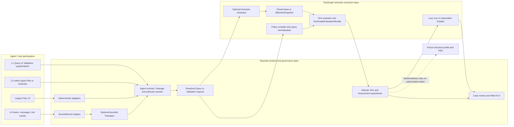
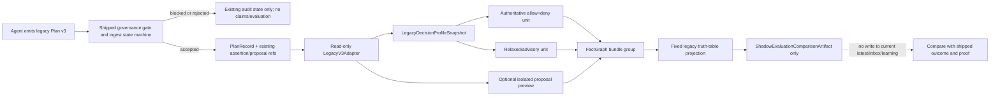
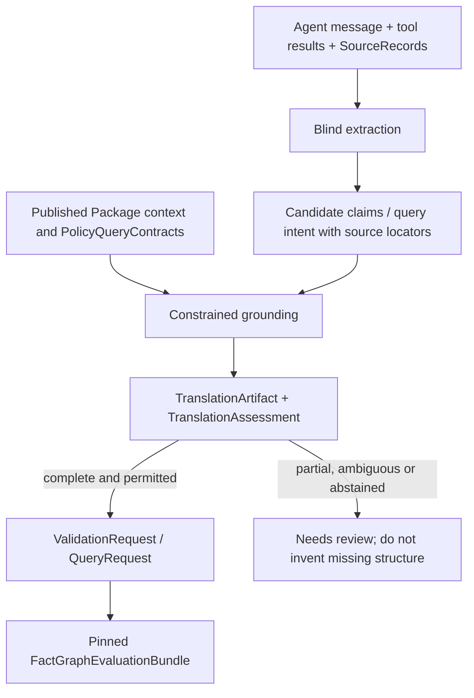

# Design-Point: Meander × FactGraph 统一设计候选 v0.1（Adversarial Review Freeze）

- Status: working
- Created: 2026-08-10
- Last Updated: 2026-08-10
- Authority: candidate design / non-authoritative reference. **Not current behavior.** Becomes a constraint only when cited by an adopted decision, an implemented blueprint, current module docs (`src/factgraph/*/docs/`), or `workflow/foundations/architecture_principles.md`.
- Inputs:
  - [`rule-addressing-semantic-ports-and-evaluation-target.zh.md`](./rule-addressing-semantic-ports-and-evaluation-target.zh.md)
  - [`premise-effective-view-and-scenario-resolution.zh.md`](./premise-effective-view-and-scenario-resolution.zh.md)
  - [`scenario-plan-what-if-run-and-policy-aware-explain.zh.md`](./scenario-plan-what-if-run-and-policy-aware-explain.zh.md)
  - Adopted [`2026-06-26_evidencegraph-readonly-and-rule-structure-type.md`](../../decisions/active/2026-06-26_evidencegraph-readonly-and-rule-structure-type.md)
  - [`2026-08-08_active-design-point-governance-vs-shipped.md`](../../../audit/active/2026-08-08_active-design-point-governance-vs-shipped.md)
  - Product research package: [`01_执行摘要与最终判决.md`](</Users/zhenzhili/obsidian_workspace/symb-Intelli./codex_report/01_执行摘要与最终判决.md>), [`06_Agent四级参与与Verify_Decide设计.md`](</Users/zhenzhili/obsidian_workspace/symb-Intelli./codex_report/06_Agent四级参与与Verify_Decide设计.md>), [`08_推荐架构与实施级MVP规格.md`](</Users/zhenzhili/obsidian_workspace/symb-Intelli./codex_report/08_推荐架构与实施级MVP规格.md>)
  - FactGraph target baseline: `hnsm-backend@dbe79d705a879dda069a0a19b59071ad340bcc76`
  - Meander shipped baseline: `meander@4ddb8e36f0b7a80e99a7447c719c21b4776d6ca7`
  - Meander current dependency baseline: `factgraph-new@b92d6bf5405be8d15eedea5b97aa7408914e76b9`
  - Meander Agent baseline: `meander-agent@e4b044911de5495ffa93edeba933985588b51cfa` / package `0.10.0`
  - 2026-08-08—2026-08-10 user design discussion: ontology-bound ports, Rule/Policy/Package, Plan, Agent participation, Query/Validation, Claim/Premise, Scenario/What-if, Evaluate/Explain, WebUI, migration and risk-first implementation order
- Outputs / Downstream:
  - Independent cold-start adversarial review of this candidate; no review result exists yet
  - Future load-bearing FactGraph and Meander decision records after review findings are resolved
  - Future post-Q synthesis and one narrowly scoped experiment blueprint; this document is not itself implementation authorization
- Related:
  - [`explain-layer-complete-design.zh.md`](./explain-layer-complete-design.zh.md)
  - [`explanation-completion-roadmap.zh.md`](./explanation-completion-roadmap.zh.md)
  - [`identity-mechanism-redesign.zh.md`](./identity-mechanism-redesign.zh.md)
  - [`ledger-schema-specification.zh.md`](./ledger-schema-specification.zh.md)
  - [`append-only-ledger-evaluation.zh.md`](./append-only-ledger-evaluation.zh.md)

> **Authority reminder**: this is a review-frozen candidate, not an adopted architecture and not current product behavior. It does not supersede its input essays, change either repository, authorize a blueprint, or reopen/close an ADR. Its purpose is to give an independent reviewer one coherent, falsifiable design instead of asking the reviewer to reconstruct intent from conversation history.

## 0. How to read this review freeze

### 0.1 What is frozen

This revision freezes one internally coherent answer to the following question:

> If Meander continues beyond discovery, what is the smallest end-to-end product and technical architecture in which an Agent only declares what it wants checked, Meander resolves authority and product context, FactGraph performs deterministic query/scenario evaluation, and an operator can inspect the exact meaning, evidence, source, result row, and counterfactual without a second evaluator?

It freezes the answer for review, not for implementation. The reviewer is explicitly invited to reject the whole answer, not merely improve names or DTO fields.

### 0.2 Status vocabulary

Every substantial claim in this document belongs to one of these classes:

| Label | Meaning |
|---|---|
| `SHIPPED` | Verified in the pinned code baseline; this document does not change it. |
| `ADOPTED CONSTRAINT` | Already locked by an adopted FactGraph decision. |
| `SETTLED DIRECTION` | The current discussion has converged enough to use as the candidate's backbone, but no ADR has adopted it. |
| `PROVISIONAL` | A coherent proposed form that may be replaced after review or experiment. |
| `EXPERIMENT REQUIRED` | It cannot honestly be resolved by design reasoning alone. |
| `OPEN DECISION` | A load-bearing choice that blocks a production blueprint. |
| `DEFERRED` | Deliberately outside the first product/implementation slice. |
| `REJECTED` | Considered incompatible with the candidate's invariants. |

Illustrative Python and JSON are protocol probes. They are not approved public syntax.

### 0.3 Three scopes must remain distinct

```text
SHIPPED SYSTEM
  current Meander v3 + current factgraph-new dependency

CONDITIONAL TARGET ARCHITECTURE
  this document's coherent Meander × target FactGraph design

FIRST VALIDATION SLICE
  Plan/UI/compiler experiments and one headless vertical path
```

The target architecture is intentionally larger than the first validation slice. A component appearing in the target architecture does not authorize building it now.

### 0.4 Product authorization boundary

The product research did **not** authorize a horizontal Agent reasoning/control platform. Its surviving recommendation was to stop horizontal productization, preserve the FactGraph/evidence assets, and validate one source-bound reviewer workflow with a static challenge artifact and baseline ablation.

Therefore this candidate has two independent gates:

1. **Product gate**: reviewer value, legal data access, semantic cost, buyer/budget and FactGraph ablation must justify moving beyond discovery.
2. **Architecture gate**: Plan meaning, Policy/query semantics, replay, source integrity, UI comprehension and cross-repository migration must survive adversarial tests.

Passing the architecture gate cannot substitute for passing the product gate.

## 1. Executive design thesis

### 1.1 Product core — `SETTLED DIRECTION`, conditional on product gate

Meander's defensible product core is:

> A source-bound Verify and review layer that turns Agent output or intent into a versioned, challengeable, replayable assessment under operator-owned policy and evidence rules.

Meander is not primarily:

- a generic knowledge graph UI;
- a general Agent reasoning service;
- an LLM gateway or observability platform;
- a Policy authoring copilot that silently publishes model output;
- an action authorization/execution engine;
- a truth or compliance certification system.

Query and What-if are enabling capabilities. They become product surfaces only where they help a reviewer understand or challenge an Agent case.

### 1.2 Technical core — `SETTLED DIRECTION`

```text
Agent / Translator / deterministic adapter
  -> Meander submission and source artifacts
  -> Meander authority/contract resolution
  -> FactGraph Policy query + optional Scenario
  -> multi-row result
  -> selected-row / expectation Explain
  -> Meander assessment, review and UI
```

The Agent is responsible for a declaration of intent and supplied information. It is not responsible for performing or narrating the authoritative reasoning.

### 1.3 Initial implementation cell — `PROVISIONAL`

Agent participation, Agent policy authority, and disposition are three axes rather than one ladder. The first production-compatible cell is deliberately narrow:

```text
Participation: current L3 typed Plan compatibility
Authority:     A0 server-fixed assigned Policy
Disposition:   shadow / evaluate-only
```

Parallel experiments may test L0 Translator + A0 and L1 explicit validation + A0. A1 Agent-selected published Policy, A2 inline Policy composition, L2 repair, and action enforcement remain gated.

## 2. Shipped baseline and migration truth

### 2.1 Current Meander — `SHIPPED`

At `meander@4ddb8e3` and `meander-agent@e4b0449`:

1. An Agent is prompted or instrumented to emit structured Plan v3.
2. Plan v3 carries `plan{name, description, target}`, facts, relations, and optional Rule proposals.
3. The active ontology validates entity, identity, property, relation, Plan name and target.
4. The v3 Agent contract exposes entities, relations and Plan kinds, but deliberately hides derivations/rules because rule authority belongs to the operator.
5. Agent-declared facts/relations are persisted as `claimed_by_agent` assertions in the customer ledger.
6. Meander derives the formal allow/deny coordinates from the server-side Plan/ontology contract.
7. The effective `PolicySet` assigned to the workspace/Agent selects immutable derivation IDs.
8. Authoritative evaluation excludes Agent claims; a relaxed path may produce advisory support.
9. Results map to `proven / denied / advisory / needs_review` and are persisted with policy/rule/snapshot/proof context.
10. `needs_review` and policy-`denied` cases enter the operator workflow; decisions, Rule proposals, learning, recall, and evidence export already exist.
11. The shipped product is shadow/pre-action assurance. It does not call the Agent back, block an action, or execute one.

The current negotiated Agent contract is `contract_version=2` with `plan_format_version=3`. Its vocabulary exposes entities, properties, relations and Plan kinds but intentionally omits derivations/Policy rules. Current Plan v3 is therefore best classified as **L3 participation with A0 authority**: the Agent emits a typed structure, while Meander still owns the applicable PolicySet, allow/deny projection and execution semantics.

These are assets to preserve, not implementation mistakes to erase.

### 2.2 Current FactGraph target branch — `SHIPPED` in hnsm-backend, not in Meander

At `hnsm-backend@dbe79d7`:

- application `Rule(id, when, ports, version, repr)` and `RuleExpr` are current;
- Rule occurrences and aliases support AND/OR composition and explicit joins;
- public evaluation still uses a concrete `head` for projection and result identity;
- `EvaluateResult` contains multiple `EvaluateRow` objects and immutable fingerprints;
- `row.explain()` is a live-result convenience over the canonical Explain machinery;
- manual `fg.eval.explain(..., head=closed_head, engine/config=...)` performs a new evaluation;
- tree-shaped native/Soufflé/ProbLog RuleStructure and EvidenceGraph share lowering-derived identity at branch-and-below; PyReason EvidenceTimeline is outside that node-identity guarantee;
- EvidenceGraph and RuleStructure are readonly projections, never authoring/evaluation input;
- premise-admissibility filters, RuleProgram, fact/rule overlay primitives and four engine adapters exist with different capability limits.

Meander currently depends on adjacent `factgraph-new@b92d6bf`, not on this hnsm-backend branch. Target-branch capability must never be described as shipped Meander behavior.

### 2.3 Existing Explain durability must not regress

Current Meander persists frozen proof/evidence snapshots with Plan evaluations. The target desire for lazy row-specific Explain is not permission to replace those artifacts with a callback or digest-only reference before durable Run replay exists. During migration, eager frozen proof remains the compatibility floor.

### 2.4 The most dangerous compatibility fracture

Current Plan claims and future Scenario premises have different lifecycles:

```text
Plan v3 observation/claim
  -> append-only customer ledger
  -> persistent audit/recall/learning history

Scenario premise
  -> run-local EffectiveSnapshot
  -> never written to authoritative ledger
  -> disappears outside the Run
```

`SETTLED DIRECTION`: no adapter may silently reinterpret current v3 facts as Scenario premises. A legacy adapter consumes the already accepted Plan/assertion refs and forms a separate versioned LegacyEvaluationGroup; it never re-ingests or reduces shipped allow/deny/advisory evaluation to one future Policy expectation.

### 2.5 Baseline documentation is not internally uniform

Cold reviewers must verify shipped claims against pinned code/tests, not README prose alone. At the pinned baselines, known seams include:

- meander-agent code/package is Plan v3 / `0.10.0`, while portions of its README still describe older Plan forms;
- Meander README dependency guidance and the actual adjacent editable meander-agent/factgraph setup are not one exact version statement;
- some code comments and labels documentation retain older contract/outcome wording;
- the server accepts an `origin.source` hint that the current meander-agent structured schema does not emit;
- a free-form origin/source hint is not a complete SourceRecord and never grants accreditation.

These are compatibility/documentation risks, not evidence that the target contracts are already shipped.

### 2.6 Pinned implementation evidence map

This table is the verification entry point for `SHIPPED` statements; target objects elsewhere in this document have no such claim.

| Shipped fact | Pinned code entry |
|---|---|
| Agent Contract omits derivations/rules from the Agent surface | [Meander `agent_contract.py`](</Users/zhenzhili/meander-latest-stack/meander/src/meander/ontology/agent_contract.py:12>) |
| Ontology Plan declaration and target shape | [Meander `models.py`](</Users/zhenzhili/meander-latest-stack/meander/src/meander/ontology/models.py:265>) |
| Plan v3 schema/server binding | [Meander `schema.py`](</Users/zhenzhili/meander-latest-stack/meander/src/meander/plans/schema.py:387>) and [meander-agent `openai.py`](</Users/zhenzhili/meander-latest-stack/meander-agent/src/meander_agent/openai.py:78>) |
| Server projection of Plan to Policy goal coordinates | [Meander `policy_projection.py`](</Users/zhenzhili/meander-latest-stack/meander/src/meander/ontology/policy_projection.py:1>) |
| PolicySet persistence and effective assignment | [Meander `policies.py`](</Users/zhenzhili/meander-latest-stack/meander/src/meander/governance/policies.py:43>) and [`effective_for_agent`](</Users/zhenzhili/meander-latest-stack/meander/src/meander/governance/policies.py:405>) |
| Agent claim semantics and ingest | [Meander `semantics.py`](</Users/zhenzhili/meander-latest-stack/meander/src/meander/plans/semantics.py:19>) and [`ingest.py`](</Users/zhenzhili/meander-latest-stack/meander/src/meander/plans/ingest.py:1133>) |
| Governance gate precedes accepted-plan assertion writes | [Meander `ingest.py`](</Users/zhenzhili/meander-latest-stack/meander/src/meander/plans/ingest.py:1034>) and [accepted write boundary](</Users/zhenzhili/meander-latest-stack/meander/src/meander/plans/ingest.py:1078>) |
| Authoritative/advisory evaluation split | [Meander `evaluate.py`](</Users/zhenzhili/meander-latest-stack/meander/src/meander/plans/evaluate.py:267>) |
| Current label/consumability separation | [Meander `labels.py`](</Users/zhenzhili/meander-latest-stack/meander/src/meander/plans/labels.py:1>) |
| Current Meander investigation compiles a Rule/RuleExpr-backed entity match | [Meander `investigation.py`](</Users/zhenzhili/meander-latest-stack/meander/src/meander/graph/investigation.py:54>) |
| Current Rule, occurrence and port substrate | [FactGraph `rule.py`](</Users/zhenzhili/hnsm-backend/src/factgraph/application/protocol/rule.py:52>), [occurrence types](</Users/zhenzhili/hnsm-backend/src/factgraph/application/protocol/rule.py:218>) and [port inference](</Users/zhenzhili/hnsm-backend/src/factgraph/application/protocol/rule.py:557>) |
| Current RuleExpr AND/OR/join surface | [FactGraph `rule_expr.py`](</Users/zhenzhili/hnsm-backend/src/factgraph/application/protocol/rule_expr.py:20>) |
| DNF lowering, branch limit and alias handling | [FactGraph `rule_expr_lowering.py`](</Users/zhenzhili/hnsm-backend/src/factgraph/application/protocol/rule_expr_lowering.py:757>) |
| Multi-row EvaluateResult and live lazy row Explain | [FactGraph `evaluate_result.py`](</Users/zhenzhili/hnsm-backend/src/factgraph/application/protocol/evaluate_result.py:82>) and [container API](</Users/zhenzhili/hnsm-backend/src/factgraph/application/protocol/evaluate_result.py:135>) |
| Manual Explain re-evaluates; native lazy probe can read live ledger | [FactGraph `store.py`](</Users/zhenzhili/hnsm-backend/src/factgraph/sdk/store.py:3020>) and [lazy probe](</Users/zhenzhili/hnsm-backend/src/factgraph/sdk/store.py:3575>) |
| Current result/closed-head fingerprint construction risk | [FactGraph `store.py`](</Users/zhenzhili/hnsm-backend/src/factgraph/sdk/store.py:3293>) |
| Readonly RuleStructure/EvidenceGraph substrate | [FactGraph `rule_structure.py`](</Users/zhenzhili/hnsm-backend/src/factgraph/application/protocol/rule_structure.py:229>), [`evidence_tree.py`](</Users/zhenzhili/hnsm-backend/src/factgraph/application/explain/evidence_tree.py:89>) and the [adopted readonly ADR](../../decisions/active/2026-06-26_evidencegraph-readonly-and-rule-structure-type.md) |

Any cold-review finding that conflicts with this map should cite the pinned code and distinguish implementation drift from design disagreement.

## 3. Goals, non-goals and success condition

### 3.1 Goals — `SETTLED DIRECTION`

The candidate aims to make these statements true:

1. An Agent can ask a bounded business question without constructing a derivation chain or engine head.
2. Operator-owned Policy, assignment, premise eligibility and execution profile cannot be weakened by Agent structure.
3. FactGraph is independently usable for the same Policy query and Scenario semantics without Meander.
4. Claims, hypotheses, policy modifications and action authorization remain different semantic domains.
5. Evaluate and Explain share one exact Policy/query/snapshot/config identity.
6. Multi-row results do not force eager explanation of every row.
7. A reviewer can see original output, resolved meaning, used/excluded evidence, Policy state, row result, source and scenario diff without reading raw JSON.
8. Existing Plan history, Policy assignment, Inbox, learning, recall and evidence export remain readable during migration.
9. Unsupported, ambiguous or incomplete states remain explicit and never become logical false or product success.

### 3.2 Non-goals — `DEFERRED` or `REJECTED`

The first product path does not include:

- arbitrary Agent-authored authoritative Policy;
- automatic Rule/Policy publication from learning or model output;
- general symbolic constraint solving or minimal-world repair;
- action authorization, executor, receipt or TOCTOU control;
- a new generic trace/LLM evaluation dashboard;
- a new LLM/API-key vault or model-management platform;
- a full Package marketplace or universal ontology builder;
- automatic explanation of every returned row;
- simultaneous semantic parity across all engines;
- removal of public `head`, current Plan v3, or current historical proof records.

### 3.3 Success condition

The design succeeds only if it reduces the total burden of producing a correct, useful Agent assessment. A more elegant FactGraph API that requires more ontology mapping, more Agent prompt work, or a second complex UI is not success.

## 4. System boundaries and ownership

### 4.1 Ownership table — `SETTLED DIRECTION`

| Component | Owns | Must not own |
|---|---|---|
| FactGraph core/application | Ontology/schema resolution, Rule/Policy logical semantics, semantic addressing, Scenario normalization, EffectiveSnapshot, evaluate, expectation evaluation, result rows, logical Explain/provenance, engine capability errors, repository-neutral `FactGraphEvaluationBundle` values | Agent identities, tenants, API keys, AssignmentRevision/GovernanceSnapshot resolution, product verdict, durable product repositories, UI workflow |
| FactGraph SDK/service | ergonomic authoring and transport over the same application protocols | a second implementation of Policy/Scenario semantics |
| Meander | Plan/trace/API ingress, SourceRecord lifecycle/admission, Agent contract, Policy publication/assignment projection, execution-profile resolution, Translator integration, tagged Attempt/Run/Assessment persistence, review/disposition, WebUI | independent add/replace/retract logic, row/expectation re-evaluation, a second Policy evaluator, frontend-derived proof |
| meander-agent | provider bindings, contract/schema consumption, candidate Plan production, transport | deciding truth, authority, applicable mandatory Policy, final assessment |
| Existing PEP/executor | future real action interception/execution and receipt | being inferred from a successful Verify result |

### 4.2 Cross-repository protocol split

One universal mega-DTO is rejected. The seams are deliberately separate:

```text
Meander-owned external ingress
  PlanSubmission / ValidationRequest / QueryRequest / TranslationArtifact

Meander-owned product resolution
  GovernanceSnapshot / SourceAdmissionArtifact
  PinnedQueryRequest or PinnedValidationRequest / EvaluationUnit[]

FactGraph-owned logical execution
  Policy artifact / EvaluationQuery / ScenarioSpec / ExecutionProfile
  -> FactGraphEvaluationBundle
     (EvaluateResult + ExpectationResult[] + ReplayContext)

Meander-owned product output
  EvaluationAttempt
    = IngressRejected | ResolutionRejected | ExecutionFailed | CompletedRunRecord
  Assessment / ReviewEvent / UI read model
```

`FactGraphEvaluationBundle` is an immutable serializable value, not a FactGraph database record. A live SDK `EvaluationHandle` may bind ergonomic `row.explain()` callbacks to that bundle. Meander persists a `CompletedRunRecord` that embeds or content-addresses the exact bundle. Assessments and later review events point **to** the Run; the immutable Run does not contain a growing list of assessment refs.

This prevents FactGraph from acquiring tenant/Agent concepts, prevents Meander from reimplementing row/expectation logic, and gives detached Explain one explicit owner boundary.

### 4.3 No semantic interpretation in the UI

The browser receives a structured read model. It may filter, expand, align and visually overlay nodes; it may not decide:

- whether a node logically holds;
- which source is authoritative;
- whether a missing fact is false;
- whether a result is approved;
- how a Scenario changes the effective world.

Every edit creates a typed draft or a new immutable Scenario/Run through the backend.

### 4.4 Conditional target architecture



This is a conditional target map. The first validation slice exercises only a thin path through it; it does not authorize building every box.

## 5. Canonical terminology and authority

### 5.1 Core terms

| Term | Candidate meaning | Authority/lifetime |
|---|---|---|
| Ontology | Entity identities, fields, relations, types and addressable semantic coordinates | versioned operator artifact |
| Rule | Reusable logical component with internal variables and ontology-bound public ports | authored/reviewed artifact |
| Rule occurrence | One use of a Rule inside a Policy, identified by stable alias | part of Policy version |
| Policy | Complete business condition composed from Rule occurrences, comparisons and Boolean structure; no fixed result projection | published/operator-owned by default |
| PolicyPlanSpec | Current ontology `plans:` name/target declaration; closer to an A0 validation profile than the new Policy | shipped ontology artifact |
| PolicySet | Current Meander governance object selecting derivation IDs for assignment | shipped, append-only/versioned |
| PackageRelease | Optional immutable release manifest over ontology, Rules, Policies, query contracts and static execution defaults | Meander-side governance concept; not required in first slice |
| AssignmentRevision | Effective-time workspace/Agent assignment to published content; not embedded as mutable Package content | Meander governance artifact |
| GovernanceSnapshot | Immutable resolution of ontology, Policy/Rule selection, assignments, premise policy, Agent authority and execution profile for one attempt | required Run/Attempt anchor; `package_ref` may be absent |
| AgentContract | Permission-filtered projection of vocabulary and callable/queryable surface for one Agent/integration | server-generated, versioned |
| AssessmentSubject | The Agent/user proposition, answer, intent or artifact being checked | immutable subject; does not support itself by default |
| Claim | A proposition extracted or supplied with an explicit role and provenance | persistent only if accepted by ingest; not automatically true/authoritative |
| EvidenceClaimSet | Candidate independent evidence claims offered for premise admission | caller may nominate; server/premise policy decides admissibility |
| Scenario premise | A grounded proposition adopted only in one effective world | run-local, non-persistent |
| Policy overlay | A run-local proposed modification to Policy settings/structure | isolated, non-published, normally privileged/deferred |
| EvaluationQuery | Typed runtime question over one Policy: bindings, projection and optional expectation | FactGraph logical artifact |
| QueryRequest | Product request for typed rows/evidence; no required verdict expectation | Meander/API artifact |
| ValidationRequest | Product request to assess one or more expected propositions/outcomes | Meander/API artifact |
| DecisionRequest | Future action authorization request with principal/action/resource/state | separate Future product; not implied by validation |
| ExecutionProfile | Exact engine, semantics, budgets and capture/replay configuration resolved by operator/deployment policy | pinned once per completed Run |
| FactGraphEvaluationBundle | Repository-neutral immutable FactGraph result value containing rows, expectations and replay context | produced by one completed logical execution |
| EvaluationHandle | Live SDK convenience over a FactGraph bundle and Explain resolver | process-local; never the durable record |
| EvaluationAttempt | Tagged Meander record for ingress rejection, resolution rejection, execution failure or completion | append-only product/audit artifact |
| CompletedRunRecord | Meander's immutable durable envelope around one FactGraph bundle and resolved product context | only the completed attempt variant |
| ExplanationArtifact | Lazy or captured explanation for one explicit row/expectation/query target | child artifact pointing to one completed Run |

The generic word `Plan` is overloaded. In this candidate:

- **Plan v3** means the shipped Meander wire object;
- **PlanSubmission** means a future external declaration envelope;
- **CompiledProgram** means FactGraph/compiler lowering output;
- **ScenarioSpec** means run-local What-if input.

Likewise, current Meander `Source` means an Agent connection/token, while `SourceRecord` here means one complete evidence-source entry. Implementations should use unambiguous type names such as `AgentConnection` and `EvidenceSourceRecord` until the old names are migrated.

When prose below says “Run” without a type name, it means the completed logical execution as represented jointly by one FactGraphEvaluationBundle and its Meander CompletedRunRecord. Protocols and code must use the explicit names.

### 5.2 Authority is not syntax

The following implications are rejected:

```text
structured Agent output       != accredited fact
native ClaimSet               != trusted witness
valid Policy AST              != published organizational policy
SourceRecord exists           != source is authoritative or true
Policy query matched          != action is authorized
no result row                 != opposite proven
Scenario premise has priority != globally truer than ledger
```

### 5.3 Four integrity questions for every source

Source handling separates:

1. content integrity — is this the exact captured content/version?
2. capture authenticity — which authenticated channel/principal produced it?
3. business authority — is this source eligible for this predicate/policy/time?
4. statement correctness — does the proposition actually follow from the source?

No caller-provided tag may silently upgrade any of these.

## 6. FactGraph logical design

### 6.1 Semantic ports — `SETTLED DIRECTION`

Every public Rule port in the managed Rule/Policy path binds to one canonical Ontology endpoint:

```text
coworkers.person1 -> Person.identity
coworkers.person2 -> Person.identity
coworkers.company -> Company.identity
age_lookup.age    -> Person.age
```

Intermediate implementation variables remain internal. Binding two ports to the same Ontology node states shared type/meaning, not variable equality. `person1` and `person2` remain distinct unless Policy composition explicitly joins them.

The target introduces a derived or stored readonly contract:

```text
RuleContract
├── rule_ref + current Rule content digest
├── semantic_contract_digest
└── public ports[]
    ├── logical port name
    ├── execution type: entity_ref | value
    └── canonical Ontology endpoint + schema digest
```

The serialization location of the binding remains an `OPEN DECISION`; its content identity does not. Semantic-port descriptors must enter `semantic_contract_digest` (or a future revised Rule content digest). Rebinding a port creates a new digest/version and consequently changes Policy, PolicyQueryContract, GovernanceSnapshot and Run fingerprints.

New business Policy must not be inserted into `src/factgraph/core/policy`, whose current meaning is assertion active/chosen/visibility policy.

### 6.2 Rule occurrence and namespace — `SETTLED DIRECTION`

Policy composes Rule occurrences, not unqualified Rule-global variables:

```python
pair = coworkers.as_("pair")
job1 = employment.as_("job1")
job2 = employment.as_("job2")
```

The shared Policy namespace contains qualified paths:

```text
pair.person1
pair.person2
job1.person
job2.person
```

An occurrence alias is part of the Policy version's external addressing identity once exposed. Renaming it requires a new Policy contract version or explicit compatibility alias.

Authored and lowered occurrence identities are different namespaces:

```text
authored occurrence_id/path
  -> stable Policy/Agent contract address such as pair.person1

lowered branch_occurrence_id
  -> compiler-private identity such as branch copies/rewritten aliases
```

DNF or engine lowering may map one authored occurrence to several internal activations. The compiler must emit an explicit one-to-many lineage map. Generated branch aliases and position-based branch IDs never enter public Policy paths, Agent contracts or compatibility aliases.

### 6.3 Policy — `SETTLED DIRECTION` with `OPEN DECISION` grammar

Policy is the operator-owned business condition above reusable Rules. It is neither a second Rule nor a list-only PolicySet.

Illustrative canonical intent:

```python
pair = coworkers.as_("pair")

older_coworker = Policy(
    id="hr.older_coworker",
    version="3",
    when=All(
        pair,
        pair.person1.age > pair.person2.age,
    ),
)
```

Policy does not declare output ports. Its addressable symbol space is inferred from occurrences, semantic ports and permitted field navigation.

The first compiler experiment is limited to:

```text
Rule occurrence
All
Any
direct typed comparison
explicit equality/unification join
```

`Not`, `Unless`, priority, deny-overrides, aggregate, temporal operators and automatic identity-to-field expansion require explicit support/closure semantics before production. Numeric permission levels may be a UI preset, but the canonical contract should be an explicit operator allowlist rather than an ordinal whose meaning drifts.

### 6.4 Full SDK address space versus Agent query contract

Pure FactGraph users may inspect every valid semantic path. Meander must not automatically expose every internal Rule port to every Agent.

`PROVISIONAL`: Meander derives a versioned, permission-filtered `PolicyQueryContract`:

```text
PolicyQueryContract
├── policy_ref / policy_digest
├── bindings[]      stable paths caller may bind
├── selections[]    stable paths caller may read
├── expectations[]  supported result predicates/set modes
├── field visibility / sensitivity metadata
└── contract_digest
```

This is generated rather than manually duplicating Policy ports. It may expose `pair.person2.age` without exposing Rule bodies, hidden variables or restricted fields.

### 6.5 `bind`, `select`, `expect` — `SETTLED DIRECTION`

| Element | Meaning | Must not mean |
|---|---|---|
| `bind` | constrain one addressable Policy path to a typed concrete term | write a fact, declare authority, or define a Policy parameter |
| `select` | project addressable paths into named result columns | add conditions or decide which Policy applies |
| `expect` | identify the row/set/Boolean proposition the caller asks to validate | become a Policy conclusion or authorization |
| Scenario | construct a run-local effective input world | persist claims or change global Policy |

`select` is optional only when the query mode is explicit. The production contract should not overload absence of `select` without specifying whether the mode is `exists`, `count`, `rows` or expectation-only.

Branch-local selections that may remain unbound are rejected in the first slice rather than silently returned as `null`.

FactGraph, not Meander, evaluates canonical expectations over logical results. Meander only maps returned `ExpectationResult` values into product Assessments. The first slice admits only expectations whose completeness semantics are closed (`exists` and `contains_row` over an untruncated evaluation, or a sound engine early-stop proof). Exact-set/count/bag semantics remain unavailable until D06 defines duplicates, ordering, truncation and continuation.

### 6.6 EvaluationQuery — `PROVISIONAL`

Illustrative shape:

```python
EvaluationQuery(
    policy_ref="hr.older_coworker@3",
    mode="rows",
    bind={
        "pair.person1": Person.ref(employee_id="alice"),
    },
    select={
        "younger": "pair.person2",
        "younger_age": "pair.person2.age",
    },
    expectations=(),
)
```

The normalized logical response is not one scalar verdict:

```text
QueryResult
├── rows + run-local row ids
├── completeness: complete | incomplete | unknown
├── truncated + continuation metadata
├── ordering contract
└── evaluation budget diagnostics

ExpectationResult
├── expectation_id + canonical expectation digest
├── kind
├── status: satisfied | not_satisfied | underdetermined | unsupported
├── completeness relied upon
├── matched row refs / diagnostic refs
└── expectation anchor
```

Presentation pagination never changes the logical result set used for an expectation. If budget/truncation prevents a sound answer, the expectation is `underdetermined`, not false. `exists` or `count` may use engine-specific early termination only where the returned completeness contract states what was proven.

`source_refs`, tenant, Agent, assignment and product disposition do not belong in FactGraph's EvaluationQuery. Evaluation budget, deterministic/unordered result semantics, timeout and capture requirements are resolved in the pinned ExecutionProfile; caller hints cannot widen them.

### 6.7 Synthetic projection head — `SETTLED DIRECTION` as migration only

Current engines require a target predicate/output variable list. The compiler may lower the query to:

```text
EvaluationQuery
  -> canonical Policy/query lowering
  -> internal __query__:<query_digest>(selected variables...)
  -> existing evaluate adapters
```

The synthetic head:

- may remain in developer metadata, existing `EvaluateResult.head`, row closure and EvidenceGraph v1 compatibility;
- is not published Rule authority;
- is not narrated as the business conclusion;
- is not the long-term public replay identity;
- is removed only in a later subtractive slice after all engine/explain/replay consumers migrate.

The current public `evaluate(expr, head=...)` and manual Explain path remain unchanged while this bridge exists.

## 7. Claim, Scenario and rule-change semantics

### 7.1 Classification is about intended lifecycle, not presumed truth

Whether information is true is not enough to classify it:

| Caller intent | Canonical domain |
|---|---|
| "The source/user/tool says Alice is 22" and the statement should enter evidence history | Claim + SourceRecord |
| "For this calculation, suppose Alice is 22" | Scenario premise |
| "Use the world as though Alice's recorded age were replaced by 22" | Scenario premise resolved against baseline |
| "Add Bob as a newly asserted person in the durable case" | Claim/ingest, subject to schema/provenance policy |
| "Suppose a new Bob exists only in this case" | ephemeral Scenario entity, deferred beyond first slice |
| "If the hiring threshold were 20" | Policy setting/Policy overlay or a new Policy draft/version |
| "Is Alice older than Bob?" | query condition/expectation over grounded values |
| "Make Alice older than Bob" with no concrete value | future world synthesis, not ordinary premise |

Lifecycle classification and assessment role are separate. The proposition being checked is stored as an `AssessmentSubject`; independent observations offered to evaluate it form an `EvidenceClaimSet`. Subject-derived claims are excluded from supporting the same subject by default. They become admissible evidence only through an explicit independent-source/accreditation rule recorded by the server, never because their structured content matches the expected proposition.

### 7.2 Grounded Scenario premise — `SETTLED DIRECTION`

The public premise states the effective proposition. It does not carry old values, assertion IDs or storage operations:

```text
submitted: Alice.age = 22
resolver:  inspect schema, identity, cardinality, base snapshot
normalized: SET_EFFECTIVE_VALUE(Alice.age, 22)
```

FactGraph, not Meander or the Agent, resolves add/set/mask semantics.

Scenario v1 accepts only a pre-evaluation l-value that resolves to exactly one canonical entity and one extensional non-identity field. A path whose identity is unbound, resolves to zero/multiple entities, or depends on which `Any` branch later matches fails the whole Scenario with `ZERO_TARGET`, `MULTIPLE_TARGETS` or `BRANCH_DEPENDENT_TARGET`. Evaluation results are never used retroactively to decide which input fact the Scenario meant to replace.

### 7.3 Minimal normalized operations

The target design may eventually include:

```text
SET_EFFECTIVE_VALUE
ENSURE_MEMBER
SET_EXACT_MEMBERS
WITHOUT_ASSERTION / WITHOUT_VALUE / WITHOUT_FIELD
CREATE_EPHEMERAL_ENTITY
ENSURE_RELATION
```

If a first Scenario implementation is separately authorized, it contains only grounded, single-cardinality `SET_EFFECTIVE_VALUE`. `WITHOUT_FIELD` enters only after closure/negation fixtures are locked. Multi-value, relation, ephemeral entity and Policy overlay operations remain `DEFERRED`.

There is no `CORROBORATE` operation. Same baseline/effective value is represented as:

```text
semantic_value_changed: false
effective_source_changed: true
```

### 7.4 Premise precedence and conflict

Premise precedence means only:

```text
inside one ScenarioRun
+ for the exact resolved target scope
+ the normalized premise determines the effective value/visibility
```

It does not make the source globally authoritative. Premise lists are declarative and order-independent; contradictory premises are rejected rather than last-write-wins.

### 7.5 Absence and negation

These states remain distinct:

```text
OMITTED   caller says nothing; baseline applies
MISSING   no positive support visible
MASKED    Scenario intentionally hides support
NEGATED   explicit support for not-P
```

`WITHOUT_FIELD` creates a masked/missing view, not an explicit negative fact. Negation-as-failure requires a Policy/deployment-owned closure scope; an Agent cannot create real-world falsity merely by requesting closure.

### 7.6 Relational hypotheses

`Alice.age > Bob.age` with grounded ages is a Policy/query comparison. When values are missing or contradict a hypothetical relation, choosing one satisfying witness such as `Bob.age + 1` invents additional facts. The resolver returns `RELATIONAL_HYPOTHESIS_NOT_GROUND` or `WORLD_SYNTHESIS_REQUIRED`; it does not generate a value.

### 7.7 Existing overlays are not the Scenario contract

Current FactGraph fact/rule overlay and existing Meander What-if utilities are implementation inputs to audit, not compatibility constraints for the new public model. Their assertion-id-oriented replace/remove operations, engine restrictions and rule-action separation do not express the grounded EffectiveSnapshot semantics above.

If authorized, the first Scenario slice would use a new experimental contract. Existing APIs remain available during comparison and are removed only through a later subtractive decision/blueprint after all consumers migrate; they are never silently redefined under the same version.

## 8. EffectiveSnapshot and execution

### 8.1 Resolution obligations — settled invariants, `OPEN DECISION` ordering

Before execution, resolution must discharge all of these obligations:

- validate the submitted shape and pin the base snapshot;
- resolve Policy/direct semantic paths and identities;
- prove every v1 target is one unique writable l-value;
- validate schema, domain, cardinality and extensionality;
- inspect the relevant baseline assertions;
- apply visibility, source admission and premise-admissibility policy;
- normalize the entire premise set;
- detect conflicts and closure requirements;
- check engine representability;
- produce ScenarioResolution and, only on success, an immutable EffectiveSnapshot.

The exact order—especially normalization versus source/premise admission and closure analysis—is D09 and is **not** frozen here. Settled invariants are: resolution is deterministic and atomic; input order does not change it; it never mutates the base ledger; and only `scenario_resolution_status=resolved` may execute. `partially_resolved` is diagnostic-only and forces `execution_status=not_started` with no EffectiveSnapshot.

### 8.2 EffectiveSnapshot identity

At minimum it separates and pins:

```text
workspace/database identity
base transaction/event boundary
base view digest
schema/ontology digest
visibility and premise-admissibility digest
normalized operation digest
semantic_effective_view_digest
  only evaluator-visible facts/closure
resolution_evidence_digest
  source admission, premise eligibility and provenance context
```

Logical-world equivalence compares `semantic_effective_view_digest`; evidence/review equivalence also compares `resolution_evidence_digest`. A supplied value identical to baseline may preserve the first digest while changing the second. A completed Run pins both.

Scenario execution never calls ordinary authoritative `fields.set/add/retract` merely to reuse evaluation.

### 8.3 ExecutionProfile and config — `SETTLED DIRECTION`

Agent logical intent is engine-neutral by default. Meander/operator deployment resolves the `ExecutionProfile` before execution. An advanced caller may supply a permitted hint, but cannot narrow mandatory semantics or choose arbitrary unsafe options.

One Run stores full canonical profile content or a resolvable immutable ref plus digest. A digest alone cannot reconstruct deleted configuration.

Minimum canonical content:

```text
ExecutionProfile
├── profile/version/canonicalization version
├── engine, engine version and adapter version/config
├── semantic profile, closure and premise-view settings
├── time/memory/row/branch/recursion budgets
├── result ordering, pagination and early-stop contract
├── provenance/support/trace capture requirements
└── replayability and artifact-retention requirements
```

Changing engine/config creates a second Run:

```python
run_a = evaluate(request, config=cfg_a)
run_b = evaluate(request, config=cfg_b)
compare_runs(run_a, run_b)
```

`handle.explain(config=other)` is invalid because it would change the completed Run's meaning.

## 9. Agent participation, authority and Plan

### 9.1 Three independent axes — `SETTLED DIRECTION`

#### Participation depth

| Level | Integration behavior | Candidate producer |
|---|---|---|
| L0 passive | Agent is unaware; existing trace/output/tool records are captured and optionally translated asynchronously | middleware/profile/Translator |
| L1 explicit validation | Agent/application/reviewer explicitly calls an API, tool or MCP operation | caller plus server contract |
| L2 inline remediation | L1 assessment is returned before final response/action and the caller may retry/clarify/fallback | host workflow; same Verify semantics |
| L3 native typed | Agent/host emits ClaimSet or advanced typed request directly | Agent/host |

Participation depth measures integration responsibility, not trust.

#### Agent policy authority

| Level | Agent may do | Server still owns |
|---|---|---|
| A0 fixed | provide Plan kind/target, observations and identity bindings for a server-fixed validation profile | applicable EvaluationUnit(s), expectations, mandatory floor, combining and execution profiles |
| A1 invoke | choose one visible published Policy and a permitted `bind/select/expect` question | visibility, mandatory Policies, Policy content, premise/engine policy |
| A2 compose | submit an inline Policy from an allowed Rule/operator catalog | isolation, advisory taint, mandatory Policy evaluation and publication approval |

A2 output means only “holds under caller-proposed logic”; it never means organizational compliance. A2 is `DEFERRED` until A0/A1 value and safety are demonstrated.

#### Disposition strength

```text
capture-only
-> shadow translate
-> evaluate-only
-> repair-offer
-> selective gate
-> fail-closed action
```

Disposition is deployment policy. It does not alter the underlying logical result. Selective/fail-closed action belongs to the future Decide surface and requires a real PEP.

### 9.2 Plan is a declaration, not a proof program — `SETTLED DIRECTION`

The future contract should make the Agent's task degrade toward:

> “This is what I intend or was asked to check; these are the entities and observations involved; this is the question/result shape I want.”

The Agent does not send a derivation chain, select authoritative Rules, construct a business head, or state the final verdict.

### 9.3 Plan profiles to test — `EXPERIMENT REQUIRED`

The first Plan benchmark compares complexity profiles rather than assuming the richest form is necessary:

#### P0 / A0 — fixed profile

```text
plan name / intent
concrete target identities
persistent observations/claims with source refs
```

Meander fills the GovernanceSnapshot, required EvaluationUnit(s), projections/expectations, combining profile and execution profile from the assigned Plan contract. This is closest to shipped v3 and is the default MVP candidate.

#### P1 / A1 — published Policy invocation

```text
policy_ref from visible PolicyQueryContract
bind
select or explicit query mode
optional expect
claim/source refs
optional grounded Scenario
contract_digest
```

The selected Policy becomes one permitted unit; Meander may append mandatory units from GovernanceSnapshot. The Agent cannot replace or suppress them.

#### P2 / A2 — inline composition

```text
allowed Rule occurrences/operators
inline proposed Policy AST
same query/scenario envelope
```

P2 is a research profile. It must not become production merely because an LLM can emit syntactically valid AST.

### 9.4 Current Plan v3 compatibility — `SETTLED DIRECTION`

Plan v3 remains frozen as `legacy.pre_action_plan.v3`:

```text
Plan v3
  plan.name + target
  facts / relations
  rule proposals
        |
        v
SHIPPED ingress and governance state machine
  -> blocked/rejected: audit state only; no Claim write/evaluation
  -> accepted PlanRecord: existing atomic fact/relation refs
        |
        v
LegacyV3Adapter (read-only over the accepted record)
  -> ClaimSetView over existing assertion refs; no re-ingest
  -> LegacyDecisionProfileSnapshot
  -> LegacyEvaluationGroup
  -> map back to proven/denied/advisory/needs_review
  -> existing Inbox / decision / learning / evidence export
```

```text
LegacyDecisionProfileSnapshot
├── original PolicyPlanSpec
├── exact allow goal + exact deny goal
├── all effective PolicySet refs and assignment ids
├── effective Rule ids, selection digest and blocking errors
├── ontology/premise regimes
└── adapter version + fixed compatibility truth table

LegacyEvaluationGroup
├── authoritative unit: exact allow and deny expectations
├── relaxed/advisory unit: same scope with allowed Agent claims
└── optional LegacyProposalAdapter sandbox preview
```

The fixed compatibility mapping preserves the shipped distinctions:

```text
authoritative allow + authoritative deny -> needs_review conflict
authoritative allow only                -> proven
authoritative deny only                 -> denied
no authoritative endpoint, but relaxed allow or isolated proposal preview supports allow
                                        -> advisory
otherwise                               -> needs_review
```

The effective scope may be the union of several workspace/Agent PolicySet assignments; it is not assumed to equal one future Policy. A `LegacyProposalAdapter` preserves proposal id/state and isolated preview semantics. A proposal is neither a Claim, a published Policy nor A2 composition.

The adapter consumes only an already accepted PlanRecord and its existing assertion refs. It never runs the ingest state machine, duplicates claims, mutates old payloads, reinterprets claims as Scenario premises, trusts proposal Rules, or rebuilds historical proofs using current state. In shadow dual-run, its outputs go only to a separate `ShadowEvaluationComparisonArtifact`, never to current latest evaluation, Inbox, recall, decisions or learning.

The pinned parser also accepts v1 and v2. The default migration path is deliberately conservative: v1/v2 continue through the shipped parser/evaluator during a separately governed deprecation window; historical payloads/proofs remain read-only; the first new shadow adapter supports v3 only. No dedicated v1/v2 adapter or end-of-ingest date is implied here. Ending new v1/v2 ingest or adding an adapter requires a separate compatibility decision, telemetry and customer notice. Historical v1/v2/v3 payloads and proofs are never translated in place.

Whether a Plan vNext is ever published is an experiment result, not a documentation assumption.

### 9.5 Agent Contract — `PROVISIONAL`

Current v3 `WorldContract` stays readable. A versioned next projection may additionally provide:

```text
world/ontology ref + digest
accepted Plan profiles
visible published Policies
PolicyQueryContract refs/digests
typed binding/selection/expectation paths
source-binding requirements
supported Scenario operations
allowed request/disposition modes
expiry and compatibility metadata
```

The contract contains no hidden Rule body for A0. A1 receives only the generated query surface required to call published Policies. A2, if ever enabled, receives a separately permissioned Rule/operator catalog.

A vNext contract cannot replace `contract_version=2 / plan_format_version=3` in place. `PROVISIONAL` negotiation rules are:

1. a parallel endpoint/media type or explicit capability request returns the highest mutually supported contract;
2. every PlanSubmission pins contract id, version, content digest and expiry;
3. a changed/expired digest fails before side effects with `STALE_CONTRACT` and a current contract reference;
4. an SDK may refresh and retry once only for an idempotent submission with the same subject/source identity; otherwise it surfaces the error;
5. cached contracts use ETag/expiry and explicit refresh; prompt/context refresh never repairs historical submissions;
6. unsupported clients continue on the v2/v3 path through the legacy adapter.

### 9.6 PlanSubmission envelope — `PROVISIONAL`

P0/P1/P2 share an external declaration envelope but not the same authority:

```text
PlanSubmission
├── protocol/profile version + origin: agent_native | translator | deterministic_adapter | human
├── contract id/digest + idempotency/submission identity
├── request kind: case_query | validation
├── AssessmentSubject / intent / case refs
├── invocation (exactly one)
│   ├── P0 fixed profile ref + target roles
│   ├── P1 visible published Policy ref + permitted bind/select/expect
│   └── P2 isolated proposed Policy AST + capability proof
├── candidate persistent observations/claims + source refs
├── candidate independent evidence refs
├── optional future ScenarioSpec (never inferred from legacy v3 facts)
└── caller hints allowed by the AgentContract
```

The submission never contains the final applicable mandatory units, source admission, premise eligibility, combining profile, engine configuration or verdict. Meander resolution creates a tagged Attempt and, only if valid/permitted, a PinnedQueryRequest or PinnedValidationRequest with GovernanceSnapshot and EvaluationUnit(s).

## 10. Translator, Claims and SourceRecord

### 10.1 Three Claim construction paths — `SETTLED DIRECTION`

```text
native Agent typed emission
Meander-compatible bounded Translator
deterministic human/domain adapter
        |
        v
candidate ClaimSet + provenance
```

All paths converge before premise eligibility and logic, but they retain different producer and fidelity metadata. Native structure is a translation bypass, not a trust upgrade.

### 10.2 Translator role — `PROVISIONAL`, `EXPERIMENT REQUIRED`

The Translator is a constrained semantic compiler, not a superagent and not a second reasoner:

```text
Phase A: blind extraction
  exact source locators
  proposition candidates
  polarity/modality/time/unit/conditions
  untranslated remainder and coverage

Phase B: constrained grounding
  PredicateCatalog
  permitted entity candidates
  SourceManifest
  Policy/Agent contract paths
  ambiguity alternatives or abstention

output: TranslationArtifact + TranslationAssessment
```

It must not:

- read the expected logical verdict during blind extraction;
- use open-ended RAG to invent a predicate/identity;
- alter qualifiers to produce a provable statement;
- treat confidence as source authority;
- write accredited facts;
- emit final `SUPPORTED`;
- hide untranslated material;
- silently repair the Agent's answer.

The first deployable form, if benchmarked successfully, is a BYOK runner/sidecar in the user's environment. Meander receives the artifact and never receives or stores the provider key. A server-side secret vault is `DEFERRED`.

The Meander client/API token authenticates the customer integration to Meander; it is not a model-provider key and does not imply that Meander runs a Translator. In BYOK mode, the provider credential stays in the customer-side runner. Native L3 submission and deterministic adapters require no Translator provider key.

### 10.3 TranslationArtifact minimum

```text
TranslationArtifact
├── artifact_id / parent_artifact_id
├── producer type and trusted transport metadata
├── input SourceRecord refs + content digests
├── phase-A extraction candidates and remainder
├── phase-B grounded Claim candidates and alternatives
├── claim role: assessment_subject | candidate_evidence | persistent_observation
├── source-locator links
├── coverage / ambiguity / untranslated / abstain
├── model/provider snapshot, prompt, schema, catalog and contract digests
└── latency/cost and creation metadata
```

Producer type is written by the authenticated adapter/transport. The model cannot self-declare itself as a trusted deterministic producer.

### 10.4 SourceRecord and locator — `SETTLED DIRECTION` at conceptual level

A source span is not merely a text offset. One source model covers Agent messages, tool results, database records, API responses and documents:

```text
SourceRecord
├── source/system/object/version identity
├── tenant and capture principal/channel
├── content/schema/version/transaction digests
├── observed time and optional valid time
├── integrity/capture/trust metadata assigned by server
├── access/classification/retention
└── parent/source lineage

SourceLocator
├── text span / message part
├── JSON Pointer
├── database row key + column + snapshot/txn
├── document page/region/OCR/render version
└── round-trip status + extracted-value digest
```

Database source entries and translated `source_spans` align through the same complete SourceRecord/Locator identity. A locator that cannot round-trip to the pinned source version is ineligible for authoritative support.

The caller supplies `candidate_evidence_refs`, never “eligible evidence.” Meander authenticates tenant/principal access and emits an immutable `SourceAdmissionArtifact` describing which records/locators may be considered and why. FactGraph then applies the pinned premise/admissibility policy to concrete assertions and returns `PremiseEligibilityRecord` values for included and excluded candidates. Neither layer accepts the caller's own trust label.

Legacy Plans may lack a complete round-trippable locator. A `LegacyEvidenceSourceRecord` may point to the original raw span, authenticated connection/source id, span id and existing assertion refs; `origin.*` remains an untrusted hint and its evidence authority remains `claimed_by_agent`/advisory.

### 10.5 Claim and FactBinding

```text
Claim
├── predicate and typed subject/object terms
├── polarity, modality, conditions, quantity/unit/time
├── original source locator(s)
└── producer/emission provenance

FactBinding
├── Claim ref
├── FactGraph assertion/fact ref
├── SourceRecord + locator
├── binding method/version
├── SourceAdmissionArtifact ref
└── candidate / admitted / excluded / unknown with reason
```

`TARGET`: FactGraph evaluates premises admitted by the pinned premise policy and returns used/excluded `PremiseEligibilityRecord` values in the outer FactGraphEvaluationBundle/ScenarioResolution, not in EvidenceGraph v1 metadata. It does not certify that the Translator faithfully understood the original text; TranslationAssessment remains a separate axis.

## 11. Query, Verify and Decide product surfaces

### 11.1 QueryRequest — `PROVISIONAL`

Meander Query asks for rows/evidence **inside a pinned case, assessment or reviewer workflow**. It is not a general-purpose Agent data service:

```text
QueryRequest
├── case/assessment/review context ref
├── query_ref or visible policy_ref
├── bind
├── optional Scenario
├── select / mode
├── presentation page/window hint
└── candidate source/context refs where relevant
```

No result rows means an empty query result. It does not mean `denied`.

Unscoped generic querying remains a FactGraph SDK capability or a separately gated product hypothesis. It is outside the surviving Meander reviewer wedge.

### 11.2 ValidationRequest — `PROVISIONAL`

Validation asks whether one or more explicit expectations are supported under the resolved scope:

```text
ValidationRequest
├── AssessmentSubject ref or native subject ClaimSet
├── optional policy/query hint
├── bind and optional grounded Scenario
├── select + expectation target(s)
├── candidate EvidenceClaimSet / candidate_evidence_refs
├── risk/disposition request
└── Agent contract digest
```

Meander authenticates the candidate sources, excludes subject self-support unless an explicit independent-source rule applies, and deterministically resolves the actual applicable Policy set from tenant/workflow/Plan/assignment/effective time and mandatory rules. An Agent hint may select among permitted surfaces or widen review; it cannot suppress mandatory Policies.

```text
PinnedValidationRequest
├── AssessmentSubject
├── GovernanceSnapshot
├── SourceAdmissionArtifact
├── EvaluationUnit[]
│   ├── unit_id + role: mandatory | selected | legacy_authoritative | legacy_advisory | proposal_preview
│   ├── exactly one Policy/query + expectation set
│   └── exact Scenario/ExecutionProfile refs
└── operator-owned CombiningProfile
```

### 11.3 Shared logical lowering

Both product requests may compile to the same FactGraph seam:

```text
Pinned Meander product request
  -> EvaluationUnit[]
       each has exactly one FactGraph Policy + EvaluationQuery
       + optional ScenarioSpec / EffectiveSnapshot
       + resolved ExecutionProfile
  -> FactGraphEvaluationBundle[]
  -> operator-owned combining profile for product disposition
```

FactGraph is the only evaluator of rows and expectations. Meander's combining profile is a versioned governance mapping over completed unit results (for example, mandatory failure routes to review); it does not infer new facts or reinterpret rows. Product semantics remain different: Query returns rows; Validation maps expectation/source/translation axes into an assessment.

### 11.4 Existing query substrate and the new product request

Current Meander investigations already compile conditions into Rule/RuleExpr templates and call FactGraph entity matching; current FactGraph also has ad-hoc/query DTO substrates. This demonstrates that complex reads and inference can share lower-level rule evaluation. It does **not** prove that a general Agent query API, stable Policy paths or source/coverage semantics are shipped.

The target `QueryRequest` is not SQL and is not merely a rename of `entities.match`. It adds a published Policy/query contract, version/authority resolution, explicit result shape, optional Scenario, durable Run anchors and product evidence semantics. A direct FactGraph read API remains appropriate for simple entity lookup; Meander should not force every database read through a business Policy merely to claim architectural uniformity.

### 11.5 DecisionRequest — `DEFERRED`

Decision is not a stronger ValidationRequest. It requires:

```text
authenticated principal
actual action and complete payload
resource and authoritative state/version
mandatory policy scope
approval/obligation state
expiry, nonce and idempotency
unavoidable PEP
executor binding
execution receipt and post-state
```

FactGraph facts/evidence may be reused, but a logical match cannot become an authorization token by naming it `allow`.

## 12. Run, result, Explain and Diff

### 12.1 Same evaluator for normal and What-if — `SETTLED DIRECTION`

What-if is an optional resolution stage before the ordinary evaluation path:

```text
EvaluationQuery + BaseSnapshot
  -> evaluate

EvaluationQuery + ScenarioSpec + BaseSnapshot
  -> ScenarioResolution / EffectiveSnapshot
  -> the same evaluate
```

There is no second `scenario.evaluate()` engine with disconnected result/explain semantics. Fluent SDK syntax may build the request, but the canonical call remains one evaluate operation with an optional Scenario.

### 12.2 Multi-row result — `SHIPPED` foundation

Evaluation may return zero, one or many rows. Current `EvaluateRow` has bindings and a **run-local** `row_id`; that id is not a cross-Run/ScenarioDiff identity, and current closed-head identity is not sufficient as a future durable anchor. D11 must define a separate canonical row/case anchor while preserving the run-local id.

Explain is targeted at:

- one explicit row;
- one expectation/set assertion;
- or one explicitly supported query-level diagnostic.

No API or UI implicitly explains the first row, and no evaluator eagerly explains all rows by default.

### 12.3 Attempt, FactGraph bundle and Meander Run — `PROVISIONAL`

Pre-execution failures and completed Runs have different shapes:

```text
EvaluationAttempt
├── IngressRejected
├── ResolutionRejected
├── ExecutionFailed
└── CompletedRunRecord

FactGraphEvaluationBundle
├── bundle id/fingerprint
├── resolved Policy/query/Scenario refs
├── EvaluateResult + run-local rows
├── ExpectationResult[]
├── ScenarioResolution / PremiseEligibilityRecord[]
├── replay/capture context
└── engine capability and completeness metadata

CompletedRunRecord
├── Meander run_id and parent/baseline run refs
├── original PlanSubmission / request refs
├── normalized product request + AssessmentSubject
├── GovernanceSnapshot + SourceAdmissionArtifact
├── exact FactGraphEvaluationBundle(s)
├── operator CombiningProfile ref/digest
└── compatibility/translation refs
```

Only `CompletedRunRecord` requires rows/anchors. Rejected/resolution/failed attempts persist their last valid artifact and diagnostics without fabricating an empty EvaluateResult. Assessments, review decisions and later explanations append as child records pointing to the immutable Run/Attempt.

```text
ReviewTarget
├── run_id
├── unit_id (required when the Run has multiple EvaluationUnits)
├── assessment_id?
└── row_id | expectation_id | query_summary_anchor | legacy_plan_id
```

An old decision remains pinned to its original evaluation/evidence. A correction explicitly supersedes it and points to a new assessment/Run. Reevaluation after fact, Policy or proposal change creates a child Run and a recall comparison; it never overwrites history.

FactGraph owns serializable logical DTOs/bundles and deterministic runtime behavior but no generic repository. Meander owns product persistence. A completed Run does not contain mutable/back-references to later Assessments.

### 12.4 Lazy Explain — `SETTLED DIRECTION` with a hard replay gate

On a live SDK `EvaluationHandle`, `row.explain()` remains ergonomic sugar over canonical `fg.eval.explain(bundle, target=...)`. A historical UI loads the exact FactGraphEvaluationBundle/replay context from its CompletedRunRecord and requests Explain for one explicit target.

Lazy Explain is allowed only if the Run retains or can resolve:

- exact Policy/rules/lowering;
- exact base/effective snapshot;
- exact ExecutionProfile;
- exact row/expectation anchor;
- required engine provenance/support.

It may not consult current `latest` state. If exact context is unavailable, it returns `RUN_CONTEXT_UNAVAILABLE` or `REPLAY_ARTIFACT_EXPIRED`.

Current Meander eager proof snapshots remain for old runs. They are not removed until detached replay passes. Old evidence is never regenerated and overwritten.

### 12.5 Structured Policy explanation

The UI/product combines four readonly artifacts:

```text
PolicyStructure
  static authored/lowered Policy tree with stable node ids

ScenarioPatchSet
  resolved premise or later Policy-draft changes

EvaluationOverlay
  one Run/row/expectation node states and reason codes

ProvenanceIndex
  logical nodes/facts -> source/assertion/translation/run refs
```

The existing EvidenceGraph remains the inner engine evidence substrate. The adopted readonly boundary forbids feeding PolicyStructure or EvidenceGraph back into evaluation as authority.

Policy logic-node verdicts in v0 are only:

```text
HOLDS
FAILS
NOT_REACHED
```

Engine `UNSUPPORTED`, incomplete coverage, missing closure and request-level `UNDERDETERMINED` are separate EvaluationOverlay annotations/axes, never Boolean node verdicts. A future formal multi-valued Policy semantics would require a separate decision and evaluator contract.

`approved` and `blocked` belong to product disposition/governance, not Boolean Policy nodes.

Current tree-shaped native/Soufflé/ProbLog evidence can share lowering identity at branch-and-below. PyReason's EvidenceTimeline is outside that node-identity guarantee. PolicyStructure must preserve this capability boundary rather than promise universal engine node parity.

### 12.6 ScenarioExplanation

```text
ScenarioExplanation
├── CompletedRunRecord / FactGraph bundle and explicit target
├── deterministic interpretation of the request
├── resolved bindings/query/expectation
├── premise resolutions and baseline/effective changes
├── PolicyStructure + EvaluationOverlay
├── current logical Explanation/EvidenceGraph
├── provenance/source links
├── optional baseline diff
└── checked scope/replay metadata
```

The synthetic head remains developer detail and is never narrated as a business Rule.

### 12.7 ScenarioDiff does not prove causality

Diff separates:

```text
InputDiff     premises/settings/Policy draft changes
ResultDiff    rows/bindings/certainty added, removed or changed
EvidenceDiff  branch/occurrence/atom/join/source state changes
```

“Changed under this Scenario” is valid. “This premise caused the change” requires controlled ablation runs and explicit attribution methodology.

## 13. WebUI product model

### 13.1 UI is part of the assurance semantics — `SETTLED DIRECTION`

The UI must not be designed as an independent visual skin after backend completion. Incorrect grouping, colors, labels or edit semantics can falsely communicate certainty, causality or authorization.

The existing Meander Agent workspace, Plan detail, proof/evidence partials, operator Inbox and evidence export are migration assets. The target extends them; it does not begin with a second dashboard.

### 13.2 Primary case screen — `PROVISIONAL`

One Agent workspace/case presents:

1. original Agent/user/tool output and SourceRecord identity;
2. PlanSubmission or TranslationArtifact;
3. deterministic “Meander understood this as…” rendering;
4. resolved Policy/assignment/execution scope;
5. persistent observations versus Scenario premises;
6. result table with explicit row selection;
7. Policy tree/chain with one row/expectation EvaluationOverlay;
8. source/provenance drawer for any fact/condition;
9. baseline/scenario diff;
10. review/disposition history.

The natural-language interpretation is rendered deterministically from resolved structured objects. It is not another LLM summary whose fidelity must be trusted.

### 13.3 What-if interaction

The reviewer enters Scenario mode from an existing Run:

```text
select base Run
-> create Scenario draft
-> add one typed premise/change
-> resolve and preview exact meaning
-> execute new immutable Run
-> overlay changed inputs/nodes/results/sources
-> optionally continue from original or scenario Run
```

Baseline data remains visually distinct from run-local premise values. Masked, added, source-changed and Policy-draft changes use different states rather than one generic “modified” color.

### 13.4 First UI validation surface

Before production wiring, a feature-flagged Inspector consumes immutable JSON fixtures and tests whether a reviewer can answer:

1. What did the Agent assert or ask?
2. What did Meander resolve it to?
3. Which Policy/version/config/snapshot was used?
4. Which fact/source caused one selected result to hold or fail?
5. What changed between baseline and Scenario?

The first UI does not include drag/drop, arbitrary Policy editing, collaborative drafts, animation, automatic layout of unbounded graphs, or a frontend inference model.

### 13.5 Editing and audit

Readonly evidence is never directly edited. UI actions create one of:

- a new Scenario draft and Run;
- a correction/review event attached to a TranslationArtifact/Claim;
- a PolicyDraft/new Policy version through a separate governed authoring path.

The original failed/ambiguous artifact remains append-only and visible.

## 14. Failure semantics and product assessment

### 14.1 One verdict is structurally insufficient — `SETTLED DIRECTION`

A request can be syntactically valid, only partly translated, outside the published query contract, successfully executed, logically unsupported and nevertheless useful for review. Conversely, a Policy may hold over an incomplete or inadmissible evidence set. One `status` field cannot represent these cases without lying.

The internal result therefore keeps independent axes:

```text
conformance_status
  valid | invalid | unsupported_version

translation_status
  not_required | complete | partial | ambiguous | abstained | failed

contract_status
  permitted | forbidden | unresolved

scenario_resolution_status
  not_requested | resolved | partially_resolved | unsupported | invalid

execution_status
  not_started | succeeded | failed | timed_out | engine_unsupported

per EvaluationUnit / QueryResult
  completeness: complete | incomplete | unknown
  truncated: true | false

per ExpectationResult
  satisfied | not_satisfied | underdetermined | inconsistent | unsupported

explanation_status
  not_requested | available | unavailable | expired | failed
```

These names are provisional; the separation is not. In particular:

- a complete zero-row/no-match Query is not `denied`;
- `incomplete` is not `false`;
- `translation_status=complete` is not proof that the translation is semantically faithful;
- successful execution is not product approval;
- a Policy node `HOLDS` is not an action authorization;
- an unavailable explanation does not retroactively change the logic result, but may make it unusable under a regulated execution profile.

### 14.2 Meander assessment is an outer product layer

Meander maps the resolved axes, the requested operation, evidence/premise policy, workflow configuration and operator governance into a product assessment:

```text
Assessment
├── assessment_id
├── request_kind
├── checked_scope
├── translation_assessment?
├── logic_assessment
├── evidence/source assessment
├── disposition
├── consumability
├── review reasons
├── attempt_ref
└── completed_run_ref? + explicit ReviewTarget?
```

The compatibility adapter may continue to emit current labels:

```text
proven | denied | advisory | needs_review
```

but the label must remain a projection of stored dimensions, not the only stored truth. New surfaces should not reuse `denied` for a Query with zero rows or a Scenario that could not be resolved.

### 14.3 Disposition and enforcement are different axes

```text
disposition:
  accept_for_workflow | reject_for_workflow | needs_review | informational

enforcement:
  shadow | report_only | repair_requested | blocked | not_applicable
```

The first validation slice only uses `shadow/report_only`. `repair_requested` requires an explicit L2 callback contract. `blocked` requires a future complete-mediation/Decision profile and cannot be inferred from a Verify result.

### 14.4 Fail closed means “do not overclaim,” not “return false”

For ambiguity, missing sources, unsupported Policy constructs, stale contract digests, unresolved paths, engine capability mismatch or unavailable pinned artifacts, the safe behavior is a typed non-consumable assessment or abstention. It is not a fabricated logical denial.

## 15. Canonical end-to-end flows

This section is intentionally concrete. Names remain illustrative, but each flow must be implementable without inventing an additional hidden evaluator.

### 15.1 Flow A: shipped Plan v3 through a compatibility adapter

This is a shadow equivalence path. The shipped ingress/evaluator remains source of truth until a separate cutover gate passes.



The adapter does **not** ingest anything or turn v3 facts into Scenario premises. It reads the accepted record's `claimed_by_agent` assertion refs, exact Plan goal projection and complete effective PolicySet selection. The Agent remains A0 and sees neither the Rules nor the compatibility group.

Illustrative adapter output:

```json
{
  "protocol_version": "meander.legacy_evaluation_group.v1",
  "request_id": "req_01",
  "subject_ref": {"kind": "legacy_plan", "id": "plan_01", "version": 3},
  "claim_set_view_ref": "accepted-plan-assertions:plan_01",
  "governance_snapshot_ref": "govsnap_01",
  "legacy_decision_profile": {
    "policy_plan_spec_ref": "hire_candidate@ontology-17",
    "allow_goal": "exact-allow-coordinate",
    "deny_goal": "exact-deny-coordinate",
    "policy_set_refs": ["hr-core@8", "agent-risk@2"],
    "assignment_ids": ["assign_workspace_3", "assign_agent_9"],
    "effective_rule_set_digest": "sha256:..."
  },
  "evaluation_units": [
    {"unit_id": "authoritative", "premise_profile": "authoritative", "expectations": ["allow", "deny"]},
    {"unit_id": "advisory", "premise_profile": "allow_agent_claims", "expectations": ["allow"]}
  ],
  "proposal_preview_ref": "legacy-proposal-preview:plan_01",
  "execution_profile_ref": "regulated-review.native@2"
}
```

### 15.2 Flow B: explicit Agent Query without a Scenario

Inside an existing case/review, an Agent or analyst may need supporting rows rather than a verdict. This remains a separate request kind even though it shares the evaluator. An unscoped general data query is not a Meander product promise.

```python
# Illustrative Agent tool call; not approved public Python.
response = meander.query(
    case_ref="case_42",
    policy_ref="hr.older_coworker@3",
    bind={
        "pair.person1": Person.ref(employee_id="alice"),
    },
    select={
        "coworker": "pair.person2",
        "coworker_age": "pair.person2.age",
    },
)
```

Normalized wire form:

```json
{
  "protocol_version": "meander.query.v1",
  "request_kind": "query",
  "case_ref": "case_42",
  "policy_ref": "hr.older_coworker@3",
  "contract_digest": "sha256:...",
  "mode": "rows",
  "bindings": [
    {
      "path": "pair.person1",
      "value": {"entity": "Person", "identity": {"employee_id": "alice"}}
    }
  ],
  "selections": [
    {"alias": "coworker", "path": "pair.person2", "required": true},
    {"alias": "coworker_age", "path": "pair.person2.age", "required": true}
  ]
}
```

Meander resolves the Agent's A0/A1 authority, GovernanceSnapshot, optional PackageRelease, PolicyQueryContract and execution profile, then submits one explicit `PolicyEvaluationQuery` to FactGraph. The response is a QueryResult with typed rows, completeness/truncation and evidence metadata. Zero rows under a complete result means empty/no-match; it does not mean that Meander denied an action.

### 15.3 Flow C: explicit Validation of an Agent proposition

Validation adds an expectation; the expectation observes results and does not change Policy logic.

```python
assessment = meander.validate(
    policy_ref="hr.older_coworker@3",
    bind={"pair.person1": alice},
    select={"younger": "pair.person2"},
    expect=ContainsRow(
        id="bob_is_returned",
        values={"younger": bob},
    ),
    subject=AgentMessage.ref("msg_42"),
)
```

The original Agent message remains the subject under review. The expectation is not an Agent-created Rule and cannot grant Policy authority. Meander returns an assessment linked to the exact Run and expectation anchor.

Any claims extracted from `msg_42` retain `claim_role=assessment_subject` and cannot support `bob_is_returned` by themselves. Independent tool/database/document sources must be supplied as candidate evidence and pass SourceAdmission/premise policy.

### 15.4 Flow D: Translator-assisted passive review



The Translator is not a second reasoner. It proposes a typed interpretation and anchors every extracted item to supplied source material. Deterministic resolvers validate entity/field/Policy paths and authority. The original text, candidate alternatives, omissions, model/prompt/schema versions and source locators remain reviewable.

If the Translator cannot determine whether a statement is a persistent observation, a scenario premise, a Policy request or mere prose, it abstains or emits alternatives. It must never resolve uncertainty by silently persisting a claim or overriding baseline facts.

### 15.5 Flow E: grounded What-if and lazy Explain

The same query object is used with or without a Scenario. `what_if` adds run-local context; it does not create a second evaluator.

```python
# FactGraph-level illustrative API.
query = PolicyEvaluationQuery(
    policy=older_coworker,
    bind={pair.person1: alice},
    select={
        "younger": pair.person2,
        "younger_age": pair.person2.age,
    },
    expectations=(
        ContainsRow(id="bob_present", values={"younger": bob}),
    ),
)

scenario = query.what_if(
    Given(pair.person1.age, 22, provenance=source_ref)
)

handle = fg.eval.evaluate(
    scenario,
    config=ProbLogConfig(...),
)

# Evaluate may return many rows. Explain is explicit and lazy.
row = handle.rows.by_id("row_7")
explanation = row.explain()

# Or explain the explicit expectation rather than an arbitrary row.
expectation_explanation = handle.expectations["bob_present"].explain()

# Repository-neutral durable value persisted by Meander's CompletedRunRecord.
bundle = handle.bundle
```

Equivalent flow without a premise is simply:

```python
handle = fg.eval.evaluate(query, config=ProbLogConfig(...))
```

Both operations produce a live `EvaluationHandle` over an immutable `FactGraphEvaluationBundle`; both use the same EvaluateResult, ExpectationResult and Explain machinery. The execution profile/config is supplied when the bundle is created and captured in resolved form. `row.explain()` is syntax sugar for `fg.eval.explain(bundle, target=row)`; it does not accept a different config and does not read the current ledger. Meander wraps the bundle in a `CompletedRunRecord` without changing its logic.

The current live callback and manual re-evaluation do not yet satisfy this target. A serializable replay context inside the bundle is a precondition for historical lazy Explain.

### 15.6 Flow F: user interaction in the case UI

```text
open Agent case
-> inspect original message/tool sources
-> inspect deterministic resolved request
-> compare persistent claims and scenario premises
-> inspect result rows
-> select row_7 or expectation bob_present
-> request lazy explanation for the pinned Run
-> highlight Policy nodes and exact source evidence
-> enter What-if mode and add typed premise
-> preview resolver interpretation and baseline/effective diff
-> run as a new immutable child Run
-> compare input/result/evidence changes
-> record review decision without rewriting the original artifacts
```

### 15.7 A single protocol family, not one overloaded request

```text
AgentSubmission
├── QueryRequest
├── ValidationRequest
└── DecisionRequest                 FUTURE

QueryRequest / ValidationRequest
  -> Meander authority + source resolution
  -> Pinned request + EvaluationUnit[]
  -> FactGraph EvaluationQuery + optional ScenarioSpec per unit
  -> FactGraphEvaluationBundle[]
  -> Meander CompletedRunRecord + Assessment
```

The shared execution substrate is useful. Collapsing the product semantics is not.

## 16. Versioning, persistence, replay and security

### 16.1 The reproducibility envelope — `SETTLED DIRECTION`

Every production Run records or pins enough material to answer “what exactly was evaluated?”:

```text
protocol and normalization versions
submitted + resolved request digests
GovernanceSnapshot digest
optional PackageRelease + PolicyQueryContract digest
Policy version/content digest
Rule occurrence refs, Rule content and semantic-contract digests
ontology/schema version and digest
AssignmentRevision refs and authority-resolution digest
premise-policy version
base snapshot + semantic effective-view + resolution-evidence digests
resolved execution profile/config and digest
engine/adapter versions and capability result
Translator model/prompt/schema versions when applicable
SourceRecord refs, locators and content digests
result/row/expectation anchors
captured support/provenance needed by the profile
```

A digest alone is not necessarily replay material. Regulated profiles must retain immutable content or a durable content-addressed reference for every required artifact.

### 16.2 Run immutability

Changing any Policy, Rule, source interpretation, premise, snapshot, config or engine creates a new CompletedRunRecord linked to its parent. Explain consumes the original bundle/replay context. “Explain this result under another config” is a new evaluation, not an explanation of the old result. Later Assessments, review decisions, recalls and ExplanationArtifacts append as children and do not mutate the Run.

### 16.3 Where persistence belongs

`SETTLED DIRECTION`:

- FactGraph defines serializable semantic values, resolution results, FactGraphEvaluationBundle/anchor data and replay requirements.
- Meander owns repositories for optional PackageReleases, AssignmentRevisions, GovernanceSnapshots, Agent contracts, submissions, TranslationArtifacts, SourceRecords, Attempts, CompletedRuns, Assessments, review events and compatibility mappings.
- FactGraph does not require a global Policy database to be used as a library.
- Meander may persist immutable Policy/Rule releases as Package content, but should first project or migrate existing ontology versions, PolicySets and rule registries rather than create a second independent governance history. Dynamic/effective-time assignment remains a separate AssignmentRevision and is resolved into GovernanceSnapshot.

Whether Package content lives in a relational database, content-addressed object storage or a hybrid is an implementation decision. The logical invariant is immutable versioned content plus atomic publication. Package is optional; every Attempt/Run still pins a GovernanceSnapshot assembled from whichever current governance sources apply.

### 16.4 Source retention and privacy

Source provenance is not permission to expose source content. A SourceRecord includes access policy, tenant/workspace, sensitivity, retention/expiry and redaction metadata. FactGraph receives the minimum provenance reference and fact material required for evaluation; Meander enforces access when resolving the original content for UI or export.

Translator prompts must be scoped to authorized source spans and minimal Package context. Cross-tenant retrieval, unrestricted RAG over the ledger, or sending full Policy internals to a customer-selected model is not allowed by default.

### 16.5 PolicyQueryContract as an information boundary

Agents do not automatically receive the full Policy tree. Meander exposes a contract containing only allowed bindings, selections, expectations, types, descriptions and sensitivity/visibility rules. The contract may use stable occurrence-qualified paths, but it is not proof that every internal port is public.

This prevents semantic ports from becoming an accidental Rule exfiltration API and allows operator-owned policy internals to evolve through versioned compatibility rather than prompt refresh alone.

### 16.6 TOCTOU and Decision isolation

A Verify Run describes a pinned world and checked proposition. It does not reserve or mutate the world. Any future DecisionRequest must additionally bind the action payload, principal, resource, environment/state version, expiry, approval chain, enforcement point and execution receipt. Because the first product lacks complete mediation, it must not emit an authorization token.

## 17. Implementation and migration sequence

This is a risk-first candidate sequence, not an implementation authorization. Phase 2 and every later production change additionally require: D01 product gate evidence, the applicable adopted ADR(s), a scoped blueprint/preflight under repository governance, and explicit user authorization. Passing the local phase gate alone is insufficient.

### Phase -1: product discovery gate

Use the source-bound reviewer prototype and baseline ablation defined by the research package. Confirm one concrete regulated workflow, source access, reviewer value, decision impact and willingness to continue. Do not build the horizontal platform to answer this question.

**Stop if:** the challenge artifact does not outperform a source-only/non-FactGraph baseline, reviewers cannot identify an actionable decision, semantic setup dominates value, or no buyer/workflow owner will sponsor the next test.

### Phase 0: freeze coordinates and fixtures

Select one current Meander Plan/PolicySet case and one new case-scoped Query/Scenario case. Pin all repository commits and create golden JSON fixtures for submission, GovernanceSnapshot/optional Package projection, Policy/query, results, explanation and UI read model.

Deliverables are documentation and fixtures only. They establish shared language across repositories.

### Phase 1: three disposable spikes in parallel

1. **Plan Lab:** compare P0 fixed task, P1 published Policy selection and P2 constrained composition on a hidden corpus, including adversarial prompts.
2. **Policy compiler spike:** prove authored AST → typed path resolution → current evaluator lowering → stable lineage → projection-only synthetic head.
3. **UI Inspector:** render immutable fixtures and test the five comprehension questions in §13.4.

None of these spikes writes production data or defines the final public SDK.

**Gate:** if Plan meaning is not reliable, keep A0/current v3; if compiler lineage is not stable, do not build the interactive tree; if users cannot distinguish claim/premise/result/disposition, redesign the read model before backend expansion.

### Phase 2: conditional FactGraph minimal native slice

If separately authorized through ADR/blueprint, the minimal experimental namespace would contain:

```text
RuleContract with semantic public ports
stable authored Rule occurrence aliases
Policy AST v0: All / Any / Occurrence / Unify / Compare
PolicyEvaluationQuery: rows / exists + bind / select / expect
projection-only synthetic head adapter
native evaluator integration
run-local row ids + D11 durable anchor contract
```

That slice would exclude generic negation, Policy overlays, multi-value premise algebra, world synthesis and non-reference engines.

Preflight must resolve current risks: DNF branch limit/lineage, direct comparison lowering, alias rewriting, row-specific closed-head identity and field-navigation semantics.

### Phase 3: conditional headless Meander dual-run

If separately authorized, a read-only `LegacyV3Adapter` would consume accepted PlanRecords and a GovernanceSnapshot projected from current ontology/PolicySet/assignment data. Current and new evaluators would run side by side on recorded cases. The new path would write only a separate `ShadowEvaluationComparisonArtifact`; it must not enter current evaluation/latest stores, Inbox, recall, decision or learning. Current writes, labels and operator workflow remain source of truth.

**Gate:** no unexplained safety-critical difference; all expected differences classified by Policy, premise filtering, projection, engine or bug. Rollback is disabling the new shadow path.

### Phase 4: conditional pinned bundle/Run and read-only explanation

If separately authorized, this slice would introduce FactGraphEvaluationBundle + Meander CompletedRunRecord, full resolved ExecutionProfile, durable row/expectation anchors, existing EvidenceGraph v1 as inner evidence, and an outer PolicyStructure/EvaluationOverlay. The fixture-tested read-only Inspector would connect to real Runs behind a feature flag.

**Gate:** a historical result explains only from captured/pinned artifacts; expiry or missing capture returns `explanation_status=unavailable/expired` and never silently reads current state.

### Phase 5: conditional minimal Scenario

If separately authorized after D09, add only one grounded, uniquely resolved, schema-defined, extensional, non-identity, single-valued `SET_EFFECTIVE_VALUE` premise. FactGraph would resolve it against a pinned base snapshot, create an immutable EffectiveSnapshot, run through the same evaluator, and return input/result/evidence diff.

**Gate:** scenario input order is irrelevant; base ledger never changes; source/value change is visible; missing/unknown/negated remain distinct; Explain is run-bound.

### Phase 6: conditional bounded Agent product expansion

Only after Plan Lab evidence:

- pilot a case/assessment-scoped L1 Query/Validation tool or MCP façade with A0/A1 contracts;
- optionally test L0 Translator with BYOK in a bounded workspace;
- retain native typed submission as a bypass/reference path;
- keep L2 repair, A2 inline Policy and broad L3 redesign experimental.

### Phase 7: later capabilities

Consider multi-value Scenario operations, Policy drafts/overlays, other engines, relationship hypotheses, richer Agent composition, learning-assisted authoring or Decide only when a named validated workflow requires them.

### 17.1 Joint release clusters

The two repositories should not be scheduled as independent feature lists. Use cross-repository vertical clusters:

| Cluster | FactGraph | Meander | Shared acceptance |
|---|---|---|---|
| J1 Contract | RuleContract, Policy AST/query DTO | GovernanceSnapshot, optional Package projection, PolicyQueryContract, adapter | same paths/digests/authority |
| J2 Execution | compiler, synthetic head, anchors | pinned request, dual runner, assessment mapping | canonical/evaluation equivalence |
| J3 Explain | FactGraph bundle replay, outer trace envelope | Attempt/CompletedRun repository, case read model | one selected row/expectation, exact source |
| J4 Agent | typed protocol/capability errors | L1 tool/MCP, A0/A1, Plan Lab | no authority escalation |
| J5 Scenario | resolver, EffectiveSnapshot, diff | future PlanSubmission/QueryRequest ScenarioSpec compilation, UI what-if; legacy v3 excluded | no ledger mutation, replayable child Run |

### 17.2 Temporary scaffolding with deletion conditions

| Scaffold | Purpose | Delete/retire when |
|---|---|---|
| `LegacyV3Adapter` | preserve shipped Plan semantics | v3 ingestion/history has an adopted replacement and migration |
| synthetic head | use current evaluator | native query projection and Explain identity no longer require it |
| PolicySet projection | avoid duplicate governance DB | an adopted immutable content publication source replaces it; AssignmentRevision remains separate |
| dual runner | compare old/new | parity window and rollback period close |
| fixture producer | UI/compiler testing | replace only if production artifacts provide deterministic fixtures |
| static Inspector | validate UI semantics | production case UI proves the same comprehension contract |

Scaffolds may survive for a long compatibility window; “temporary” is not permission to leave ownership or observability undefined.

## 18. Validation experiments, gates and kill criteria

### 18.1 Plan Lab — `EXPERIMENT REQUIRED`

Use a versioned hidden corpus of real-shaped but privacy-safe tasks. Compare:

```text
P0  Agent supplies task-specific fields; server chooses fixed Policy/query
P1  Agent chooses one published Policy and fills its typed contract
P2  Agent composes an allowed AST from published Rule/Policy components
```

Measure separately:

- schema/conformance success;
- semantic intent match against human annotation;
- correct bind/select/expect distinction;
- Policy/contract selection accuracy;
- entity/path resolution;
- persistent Claim versus Scenario premise classification;
- AssessmentSubject versus independent evidence role and self-support rejection;
- abstention quality;
- canonical request equivalence;
- FactGraph result equivalence;
- latency/token/repair count;
- authority escalation and source fabrication attempts.

Pre-register thresholds per risk class. Candidate engineering thresholds, not market facts:

- accepted-but-semantically-wrong safety-critical requests: `0` in the release set;
- ambiguous cases must abstain or route to review;
- routine canonical/evaluation equivalence: at least `90%` before a user-facing pilot;
- non-abstention is measured but never optimized by converting uncertainty into false confidence.

Failure of P2 does not kill P0/P1. Failure of Translator does not kill native typed submission. Failure of all low-friction paths challenges the product's integration thesis.

### 18.2 Translator benchmark — `EXPERIMENT REQUIRED`

The benchmark must include:

- partial and multi-sentence claims;
- negation, conditionals, temporal scope, units and quantifiers;
- ambiguous synonyms/predicates;
- facts already present with same/different values;
- new entities versus unresolved identity;
- “if is / if also / if not / if is not” cases;
- instructions that resemble Policy changes;
- unsupported relational hypotheses such as “Alice is older than Bob” without concrete values;
- prompt injection in Agent/tool/source text;
- missing, inaccessible and contradictory sources.

Score exact source locator fidelity, omission, unsupported invention, type/path grounding, lifecycle classification, coverage and downstream false-positive rate. The decisive kill metric is silent false `SUPPORTED`/consumable output, not fluent extraction text.

### 18.3 Compiler/evaluator conformance

For every golden Policy/query:

1. authored stable node identity survives normalization;
2. all exposed paths resolve through the published contract;
3. lowering adds no business condition through synthetic head;
4. direct comparisons/field navigation have explicit lineage;
5. DNF expansion/capability limits fail explicitly;
6. every returned row has a unique run-local id, and any D11 durable anchor obeys its declared cross-Run scope;
7. expectations are evaluated by FactGraph over a complete result or sound early-stop proof;
8. budget/truncation produces explicit incomplete/underdetermined results, never a false expectation;
9. native reference results match the declared semantics;
10. unsupported engines never silently fall back or change meaning.

### 18.4 Legacy compatibility gate

Replay accepted v3 cases across the shipped path and read-only v3 adapter group. Compare exact allow, deny, conflict, relaxed advisory and proposal-preview fixtures; effective multi-PolicySet selection; blocked/rejected ingress; assertion refs; outcome; proof basis; latest/Inbox/recall/learning side effects. The shadow path must create none of the latter side effects. Separately verify that v1/v2 continue unchanged on the shipped path and are never routed into the v3 adapter. Any unexplained safety-critical mismatch blocks cutover.

### 18.5 Replay and Explain gate

Mutate the live ledger, Policy, ontology, AssignmentRevision/GovernanceSnapshot, config and source availability after a Run. A replayable Run must reproduce or explain using its pinned material; a non-replayable/expired Run must say exactly what is unavailable. It must never blend old result identity with new evidence.

### 18.6 UI comprehension gate

With no engineer explanation, target reviewers must correctly identify:

- original Agent assertion/question;
- Meander's resolved interpretation and uncertainty;
- persistent evidence versus hypothetical premise;
- Policy/Run/config/snapshot used;
- why a selected row/expectation holds, fails or remains unknown;
- what changed in a child Scenario;
- whether the output is a logic result, review disposition or authorization.

Failure blocks the interactive graph, even if the backend is logically correct.

### 18.7 Product kill criteria

These override architecture elegance and aggregate scores:

1. The selected reviewer workflow has no identifiable owner, recurring decision or access to usable sources.
2. FactGraph challenge/replay does not materially improve reviewer decisions over source-bound baseline artifacts.
3. Each customer requires bespoke ontology/Policy mapping whose recurring cost dominates the workflow value.
4. Translator or Plan acceptance can silently create false consumable support and abstention/coverage controls do not contain it.
5. The only compelling use is generic query/observability already served by incumbent infrastructure.
6. Reviewers cannot understand the distinction between Agent claim, scenario premise, logical result and product disposition.
7. Exact replay/source retention is infeasible under the target customer's legal, privacy or operational constraints.
8. The product requires action blocking before complete mediation and payload/state binding exist.

## 19. Package, learning and authoring compatibility

### 19.1 Package — `PROVISIONAL MEANDER CONCEPT`

A Package is a published, immutable context bundle for an Agent/workspace, not a FactGraph primitive:

```text
PackageRelease
├── ontology/schema release
├── Rule/Policy content refs and digests
├── PolicyQueryContracts
├── static/default premise and execution profiles
├── capability declarations
├── Agent-facing descriptions/examples
└── compatibility metadata
```

It gives Meander an immutable publication answer to “what content/interfaces does this release contain?” It does **not** answer which content one Agent is assigned at a time. `AssignmentRevision` and current workspace/Agent conditions remain separate; `GovernanceSnapshot` atomically resolves Package-or-current-registry content, assignments, authority, premise policy and execution profile for one attempt. A new Package database is not a prerequisite for proving the semantic chain.

### 19.2 Authoring and runtime are separate

Runtime Query/Validation may select and bind published content. Policy authoring creates a PolicyDraft, validates it, evaluates it in a sandbox, records review/approval and publishes a new immutable version. Even A2 Agent composition is an ephemeral untrusted draft unless an explicit governed workflow promotes it.

### 19.3 Learning remains proposal generation

Learning keeps three non-interchangeable dataset schemas:

```text
LegacyPlanDecisionExample
  exact unsuperseded decision + Plan kind/ontology version
  + frozen decision-time assertion refs/features

TranslationCorrectionExample
  original sources + candidate artifact + human correction
  + model/prompt/schema/contract versions

ScenarioExperimentExample
  base Run + explicitly hypothetical premises + result/evidence diff
  + reviewer interpretation; never decision-time ground truth by default
```

Translation corrections and Scenario experiments do not enter the existing ILP/Plan-decision corpus automatically. Scenario premises remain marked hypothetical and cannot masquerade as decision-time evidence. Any dataset may later generate a candidate Rule/Policy/Translator change through its own evaluated pipeline, but none directly rewrites active Policy, ontology mapping, premise policy or Translator behavior. Promotion requires versioned evaluation, human authority and rollback.

Historical Plan/decision/learning records retain their original semantics and adapter version. Replaying a historical case does not reinterpret it with the newest Translator or Agent context unless explicitly requested as a new comparative Run.

## 20. Open decision register

The candidate is coherent enough to attack, but not complete enough for a production blueprint. The following choices remain open and must not be smuggled in through SDK syntax.

| ID | Decision | Why it is load-bearing | Blocks |
|---|---|---|---|
| D01 | Product wedge and product gate evidence | Determines whether this remains internal technology or a product | any product build beyond fixtures |
| D02 | Exact semantic-port descriptor/storage | Controls Rule compatibility, schema validation and Agent context | FactGraph slice |
| D03 | Policy AST v0 and treatment of negation/exception | Current RuleExpr is not the proposed Policy language | compiler blueprint |
| D04 | Field navigation semantics and authorization | `pair.person1.age` may inject lookup logic and expose data | compiler, Agent contract |
| D05 | PolicyQueryContract generation and stable address policy | Balances flexibility, refactor stability and information leakage | public Plan/API |
| D06 | Query/expectation set semantics, unbound OR paths, budgets, ordering, truncation and continuation | Determines whether rows and expectations remain sound under resource limits | evaluator contract |
| D07 | A0/A1 assignment and mandatory Policy composition rules | Prevents Agent choice from weakening operator constraints | L1/L3 pilot |
| D08 | Observation persistence boundary and SourceRecord minimum | Separates claims from scenarios and controls audit/privacy | Translator, legacy adapter |
| D09 | Scenario v1 operation/admissibility/closure order | Determines EffectiveSnapshot truth semantics | Scenario blueprint |
| D10 | FactGraphEvaluationBundle retention and replay profile | Digests alone cannot support historical Explain | Run/Explain/UI |
| D11 | Run-local row ids versus durable row/expectation/query-summary anchors | Current run-id/closed-head identity is insufficient | Explain/Diff blueprint |
| D12 | Translator deployment, BYOK responsibility and quality gate | Controls privacy, cost and semantic risk | L0 pilot |
| D13 | Optional Package projection/storage, separate AssignmentRevision and GovernanceSnapshot source of truth | Avoids a second divergent Rule/Policy database or mutable Package | control-plane migration |
| D14 | Learning/proposal promotion contract | Prevents feedback from becoming silent authority | learning integration |
| D15 | UI read model, stable node lineage and cross-version diff | Prevents false causal/certainty communication | interactive UI |
| D16 | Engine capability order and parity claims | Current adapters do not share Scenario/trace semantics | non-native rollout |
| D17 | L2 repair callback semantics | Determines loop limits, evidence carry-over and responsibility | inline remediation |
| D18 | Decide/Action boundary | Requires PEP, payload/state binding, expiry and receipt | action product; deferred |

If D01 and repository governance authorize a native headless slice, its first decision set should cover only D02–D06 and the minimum of D10–D11. This sentence is sequencing guidance, not authorization.

## 21. Rejected and deferred alternatives

### 21.1 Rejected in this candidate

- One compulsory vendor-specific full Plan for all integration levels.
- Treating structured output validity as semantic validity.
- Treating Translator output as facts or Policy authority without deterministic resolution.
- Treating every Agent-provided fact as either automatically true or automatically hypothetical.
- Persisting Scenario premises to the authoritative ledger.
- A generic `CORROBORATE` operation; identical supplied values use `SET_EFFECTIVE_VALUE` with separate value/source diff.
- Generic `CONSTRAIN` that invents witness values or a possible world.
- Replacing a relation such as “Alice older than Bob” with an arbitrary numeric value and claiming equivalence.
- Fixed Policy output ports or a user-facing engine `head` as the long-term query contract.
- Inferring selected outputs, expectations or Agent authority from convenient syntax.
- Automatically explaining every evaluation row.
- Re-evaluating current state while presenting it as the explanation of an historical row.
- Writing Policy/Scenario product status into EvidenceGraph v1 metadata.
- Feeding readonly PolicyStructure/EvidenceGraph/UI nodes back into evaluation.
- Calling a Verify result an authorization decision.
- Building a horizontal control plane before the reviewer workflow product gate passes.

### 21.2 Deferred, not rejected

- full multi-value add/remove/exact-set Scenario algebra;
- new entities and relationship premises;
- relational constraints/world synthesis;
- Policy-language `Not`, `Unless`, priority and rich permit/deny combining algorithms beyond the minimal versioned product-unit mapping;
- governed Policy overlay/draft editing in the primary UI;
- P2/A2 Agent composition beyond the Plan Lab;
- L2 automatic repair loops;
- full semantic parity across ProbLog, Soufflé and remote engines;
- Package marketplace/generic ontology studio;
- Action Middleware/DecisionRequest.

## 22. Cold-start adversarial review protocol

### 22.1 Review setup

Give the reviewer:

1. this document only as the design claim;
2. the pinned repositories/commits listed in the header for code verification;
3. the research package executive verdict and evidence ledger for product claims;
4. permission to reject the design, narrow the product or recommend stopping.

Do not provide the conversation history or coach the reviewer toward the authors' preferred names. The review should test whether this artifact is self-sufficient and whether the chain survives without oral repair.

### 22.2 Review mandate

The reviewer must independently test:

- product alignment versus reopening a rejected horizontal market thesis;
- semantic correctness of Rule/Policy/query/Claim/Scenario boundaries;
- whether an Agent or Translator can reliably produce the required declaration;
- authority escalation, Policy disclosure and bypass paths;
- cross-repository ownership and migration feasibility;
- exact replay, lazy Explain and source integrity;
- privacy, retention and customer-model/BYOK risks;
- multi-row, OR-branch and partial-coverage behavior;
- whether the UI can communicate the model without becoming a second source of truth;
- implementation complexity versus the validated workflow value.

### 22.3 Mandatory attack cases

At minimum, construct and trace these cases end-to-end:

1. schema-valid Plan whose `bind/select/expect` meaning is wrong;
2. a sentence that is only partially translatable but appears confident;
3. two ports bound to the same Ontology endpoint but representing different people;
4. a v3 persistent claim that looks syntactically like a What-if premise;
5. Policy occurrence alias renamed between Package versions;
6. selected path unbound in one `Any` branch;
7. baseline snapshot, Policy or config changes before lazy Explain;
8. 10,000 result rows with one selected row and one failed expectation;
9. same Scenario value as baseline but a different/untrusted source;
10. missing versus masked versus explicitly negated evidence;
11. a Translator attempt to turn “Alice is older than Bob” into invented ages;
12. a UI that colors `HOLDS` as “approved”;
13. an Agent using selection paths to discover restricted Policy internals;
14. an unsupported engine receiving a Scenario request;
15. a caller attempting to use a Verify assessment as an action token;
16. the Agent answer is extracted as both AssessmentSubject and its only supporting evidence;
17. a cross-tenant SourceRecord/locator IDOR and a redacted source-content injection in the UI;
18. entity/row-level access inferred through `exists`, `count`, error and timing differences;
19. a matching row lies beyond a result budget/page and would create a false negative expectation;
20. contract downgrade, digest substitution or use after AssignmentRevision revocation;
21. a synthetic-head namespace collision with authored predicates;
22. DNF/query/Scenario complexity intended to exhaust branch, row, time or memory budgets;
23. a blocked/rejected legacy Plan is passed to the adapter or an accepted Plan's claims are ingested twice;
24. one Agent-selected Policy succeeds while a mandatory Policy unit fails or is omitted;
25. proposal preview support is confused with authoritative or A2 Policy support.

### 22.4 Required finding format

```text
Finding ID
Severity: BLOCKER | HIGH | MEDIUM | LOW
Category
Claim under review
Evidence: code/doc/experiment
Failure construction
User/business impact
Whether an existing invariant catches it
Smallest correction or decisive experiment
Affected phase/gate
Confidence and unknowns
```

The reviewer must distinguish:

- design contradiction;
- missing design decision;
- implementation risk;
- product hypothesis without evidence;
- wording/documentation ambiguity.

Do not average away a kill criterion with a weighted score.

### 22.5 Required final verdict

Return one of:

```text
CONTINUE   coherent enough for the specified next experiment only
REVISE     promising, but named blockers must be repaired before the experiment
NARROW     retain a smaller component/workflow and reject the broader target
STOP       the central value or semantic chain fails
```

Report two verdicts separately:

1. **architecture verdict** — is the proposed chain internally coherent and experimentally implementable?
2. **product authorization verdict** — does available evidence justify building beyond the bounded discovery slice?

`CONTINUE` never means “implement the entire document.” It authorizes only the next explicitly gated experiment.

## 23. Review-freeze status note

This v0.1 deliberately freezes the smallest coherent cross-project candidate that covers:

- current Meander continuity;
- Agent L0–L3 participation and A0–A2 authority;
- native Plan, Translator and deterministic adapter ingress;
- Query versus Validation versus future Decision;
- semantic Rule ports, occurrences and projection-neutral Policy;
- bind/select/expect and optional grounded Scenario;
- persistent Claim versus run-local premise;
- multi-row Evaluate, lazy row/expectation Explain and structured UI trace;
- optional Package/GovernanceSnapshot, FactGraph bundle/Meander Run, source, replay and learning boundaries;
- risk-first migration and explicit kill criteria.

It does **not** claim that Plan generation, Translator fidelity, Policy compiler semantics, historical replay, interactive UI comprehension or market demand have been validated. Those are the points the next adversarial review and experiments are intended to kill or preserve.
